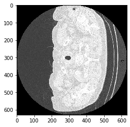
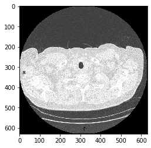
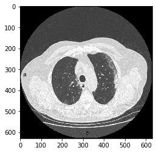
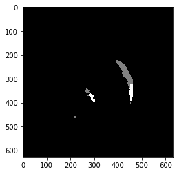
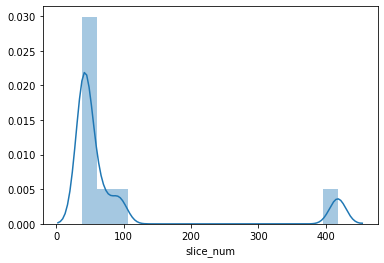

# NifTI画像データ形式であるCT画像の操作 nibabel()

## nibabel

NifTi(neuroimaging Informatics Technology Initiative)をPythonで扱うためのライブラリです。<br>NifTIは、主にMRI画像のデータ形式に使用されています。


```python
import nibabel as nib
```


```python
from glob import glob
import os
from pathlib import Path

import numpy as np
import pandas as pd
import matplotlib.pyplot as plt
%matplotlib inline
import seaborn as sns
from tqdm import tqdm
```

### CT画像データのデータフレームの作成


```python
# 画像データのファイルパスデータフレームを作成
p = Path('../../public-covid-data')
path_folder = []
path_im = []
path_msk = []

filename_im = []
filename_msk = []

for folder in p.iterdir():
    path_folder.append(folder)
    file_head, file_tail = os.path.split(folder)
    
    if file_tail in 'rp_im':
        for im in folder.iterdir():
            # PosixPathの中のstringを取得
            path_im.append(str(im))
            # filenameの作成
            file_head, file_tail = os.path.split(im)
            filename_im.append(str(file_tail))
    elif file_tail in 'rp_msk':
        for im in folder.iterdir():
            # PosixPathの中のstringを取得
            path_msk.append(str(im))

            # filenameの作成
            file_head, file_tail = os.path.split(im)
            filename_msk.append(str(file_tail))
    
print(path_folder[0])
print()
print(path_im[0])
print()
print(path_msk[0])
print()
print(filename_im[0])
print()
print(len(filename_im))
```

    ../../public-covid-data/rp_im
    
    ../../public-covid-data/rp_im/1.nii.gz
    
    ../../public-covid-data/rp_msk/1.nii.gz
    
    1.nii.gz
    
    9


```python
# データフレームを作成
df_im = pd.DataFrame({'path':path_im, 'filename':filename_im})
df_msk = pd.DataFrame({'path':path_msk, 'filename':filename_msk})
```


```python
df_im.head()
```


<div>
<style scoped>
    .dataframe tbody tr th:only-of-type {
        vertical-align: middle;
    }

    .dataframe tbody tr th {
        vertical-align: top;
    }

    .dataframe thead th {
        text-align: right;
    }
</style>
<table border="1" class="dataframe">
  <thead>
    <tr style="text-align: right;">
      <th></th>
      <th>path</th>
      <th>filename</th>
    </tr>
  </thead>
  <tbody>
    <tr>
      <th>0</th>
      <td>../../public-covid-data/rp_im/1.nii.gz</td>
      <td>1.nii.gz</td>
    </tr>
    <tr>
      <th>1</th>
      <td>../../public-covid-data/rp_im/2.nii.gz</td>
      <td>2.nii.gz</td>
    </tr>
    <tr>
      <th>2</th>
      <td>../../public-covid-data/rp_im/3.nii.gz</td>
      <td>3.nii.gz</td>
    </tr>
    <tr>
      <th>3</th>
      <td>../../public-covid-data/rp_im/4.nii.gz</td>
      <td>4.nii.gz</td>
    </tr>
    <tr>
      <th>4</th>
      <td>../../public-covid-data/rp_im/5.nii.gz</td>
      <td>5.nii.gz</td>
    </tr>
  </tbody>
</table>
</div>


```python
# 'filename'をキーにしてマージ
df = df_im.merge(df_msk, on='filename', suffixes=('_im', '_msk'))
df.head()
```


<div>
<style scoped>
    .dataframe tbody tr th:only-of-type {
        vertical-align: middle;
    }

    .dataframe tbody tr th {
        vertical-align: top;
    }

    .dataframe thead th {
        text-align: right;
    }
</style>
<table border="1" class="dataframe">
  <thead>
    <tr style="text-align: right;">
      <th></th>
      <th>path_im</th>
      <th>filename</th>
      <th>path_msk</th>
    </tr>
  </thead>
  <tbody>
    <tr>
      <th>0</th>
      <td>../../public-covid-data/rp_im/1.nii.gz</td>
      <td>1.nii.gz</td>
      <td>../../public-covid-data/rp_msk/1.nii.gz</td>
    </tr>
    <tr>
      <th>1</th>
      <td>../../public-covid-data/rp_im/2.nii.gz</td>
      <td>2.nii.gz</td>
      <td>../../public-covid-data/rp_msk/2.nii.gz</td>
    </tr>
    <tr>
      <th>2</th>
      <td>../../public-covid-data/rp_im/3.nii.gz</td>
      <td>3.nii.gz</td>
      <td>../../public-covid-data/rp_msk/3.nii.gz</td>
    </tr>
    <tr>
      <th>3</th>
      <td>../../public-covid-data/rp_im/4.nii.gz</td>
      <td>4.nii.gz</td>
      <td>../../public-covid-data/rp_msk/4.nii.gz</td>
    </tr>
    <tr>
      <th>4</th>
      <td>../../public-covid-data/rp_im/5.nii.gz</td>
      <td>5.nii.gz</td>
      <td>../../public-covid-data/rp_msk/5.nii.gz</td>
    </tr>
  </tbody>
</table>
</div>


## nib.load()

NifTIファイルのロードを行う関数です。


```python
# CT画像のロード
path_in = df['path_im'].iloc[0]    # path_imの一つ目の画像パスの取得
im_nifti_in = nib.load(path_in)
im_nifti_in
```


    <nibabel.nifti1.Nifti1Image at 0x7f8fa251eed0>


```python
path_msk = df['path_msk'].iloc[0]    # path_imの一つ目の画像パスの取得
im_nifti_msk = nib.load(path_msk)
im_nifti_msk
```


    <nibabel.nifti1.Nifti1Image at 0x7f8f9ef9e5d0>


```python
# 画像のNumpy配列の取得
data_in = im_nifti_in.get_fdata()
data_in.shape
```


    (630, 630, 45)


```python
# Numpy配列の画像の表示
plt.imshow(data_in[:, :, 0], cmap='gray')
```


    <matplotlib.image.AxesImage at 0x7f8fc4d96bd0>





画像が時計回りに90°回転させることで正しい形で表示できそうです。


```python
data_t_in = np.transpose(data_in)
data_t_in.shape
```


    (45, 630, 630)


```python
# transposeして形状が変わったので表示方法が多少変わります
plt.imshow(data_t_in[0, :, :], cmap='gray')
```


    <matplotlib.image.AxesImage at 0x7f8f9cb71310>





```python
# 画像を90°回転させる関数の作成
def load_nifti(path):
    # niftiのロード
    im_nifti = nib.load(path)
    # 画像のNumpy配列の取得
    data = im_nifti.get_fdata()
    # 90°回転
    data =np.transpose(data)
    return data
data_in = load_nifti(path_in)
# 表示テスト
plt.imshow(data_in[0, :, :], cmap='gray')
```


    <matplotlib.image.AxesImage at 0x7f8f9caeb0d0>


```python
# 表示テスト
plt.imshow(data_in[10], cmap='gray')
```


    <matplotlib.image.AxesImage at 0x7f8f9caceb50>





```python
# マスクデータの表示
data_msk = load_nifti(path_msk)
plt.imshow(data_msk[10], cmap='gray')
```


    <matplotlib.image.AxesImage at 0x7f8f9ca3cd10>





```python
# マスクデータのユニーク情報の確認
# アノテーションデータのデータの内訳を確認
np.unique(data_msk)
```


    array([0., 1., 2.])


#### 圧縮ファイルの中のデータ数を確認する

`.gz`の中身のデータ数をそれぞれ確認しデータフレームに`slice_num`として追加します。


```python
print('get data shape {}'.format(df['path_im'].shape))
# 対象データの確認
df.head(2)
```

    get data shape (9,)


<div>
<style scoped>
    .dataframe tbody tr th:only-of-type {
        vertical-align: middle;
    }

    .dataframe tbody tr th {
        vertical-align: top;
    }

    .dataframe thead th {
        text-align: right;
    }
</style>
<table border="1" class="dataframe">
  <thead>
    <tr style="text-align: right;">
      <th></th>
      <th>path_im</th>
      <th>filename</th>
      <th>path_msk</th>
    </tr>
  </thead>
  <tbody>
    <tr>
      <th>0</th>
      <td>../../public-covid-data/rp_im/1.nii.gz</td>
      <td>1.nii.gz</td>
      <td>../../public-covid-data/rp_msk/1.nii.gz</td>
    </tr>
    <tr>
      <th>1</th>
      <td>../../public-covid-data/rp_im/2.nii.gz</td>
      <td>2.nii.gz</td>
      <td>../../public-covid-data/rp_msk/2.nii.gz</td>
    </tr>
  </tbody>
</table>
</div>


```python
# NaNでカラムを初期化作成
df['slice_num'] = np.nan
# 圧縮ファイルの中のデータ数を確認する
for idx, row in tqdm(df.iterrows(), total=len(df)):
    data = load_nifti(row['path_im'])    # path_imから画像データを取得
    # 圧縮ファイルの中のデータ数を取得
    slice_num = int(data.shape[0])
    # df['slice_num']の該当箇所にデータを代入
    df.loc[idx, 'slice_num'] = slice_num
    # float型のdf['slice_num']をint型に変換(NaNがfloat)NaNがある場合は変換不可
    # df.astype({'slice_num': 'int64'})
    # df['slice_num'].astype(int)
df.head()
```

    100%|██████████| 9/9 [00:40<00:00,  4.53s/it]


<div>
<style scoped>
    .dataframe tbody tr th:only-of-type {
        vertical-align: middle;
    }

    .dataframe tbody tr th {
        vertical-align: top;
    }

    .dataframe thead th {
        text-align: right;
    }
</style>
<table border="1" class="dataframe">
  <thead>
    <tr style="text-align: right;">
      <th></th>
      <th>path_im</th>
      <th>filename</th>
      <th>path_msk</th>
      <th>slice_num</th>
    </tr>
  </thead>
  <tbody>
    <tr>
      <th>0</th>
      <td>../../public-covid-data/rp_im/1.nii.gz</td>
      <td>1.nii.gz</td>
      <td>../../public-covid-data/rp_msk/1.nii.gz</td>
      <td>45.0</td>
    </tr>
    <tr>
      <th>1</th>
      <td>../../public-covid-data/rp_im/2.nii.gz</td>
      <td>2.nii.gz</td>
      <td>../../public-covid-data/rp_msk/2.nii.gz</td>
      <td>39.0</td>
    </tr>
    <tr>
      <th>2</th>
      <td>../../public-covid-data/rp_im/3.nii.gz</td>
      <td>3.nii.gz</td>
      <td>../../public-covid-data/rp_msk/3.nii.gz</td>
      <td>418.0</td>
    </tr>
    <tr>
      <th>3</th>
      <td>../../public-covid-data/rp_im/4.nii.gz</td>
      <td>4.nii.gz</td>
      <td>../../public-covid-data/rp_msk/4.nii.gz</td>
      <td>39.0</td>
    </tr>
    <tr>
      <th>4</th>
      <td>../../public-covid-data/rp_im/5.nii.gz</td>
      <td>5.nii.gz</td>
      <td>../../public-covid-data/rp_msk/5.nii.gz</td>
      <td>66.0</td>
    </tr>
  </tbody>
</table>
</div>


```python
# 'slice_num'のカウント数を表示
sns.distplot(df['slice_num'])
```


    <matplotlib.axes._subplots.AxesSubplot at 0x7f8f9c9fc2d0>




