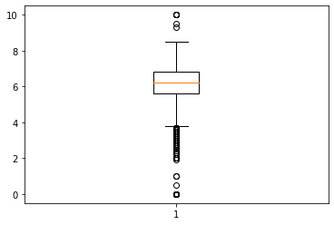

# 箱ひげ図 plt.boxplot()


```python
import numpy as np
import pandas as pd
import matplotlib.pyplot as plt
%matplotlib inline
```


```python
df = pd.read_csv('../../data/138_4508_bundle_archive/tmdb_5000_movies.csv')

# 箱ひげ図 (boxplot)
plt.boxplot(df['vote_average'])
```


    {'whiskers': [<matplotlib.lines.Line2D at 0x7efe97c6c4d0>,
      <matplotlib.lines.Line2D at 0x7efe97c6ca10>],
     'caps': [<matplotlib.lines.Line2D at 0x7efe97c6cf10>,
      <matplotlib.lines.Line2D at 0x7efe97c58850>],
     'boxes': [<matplotlib.lines.Line2D at 0x7efe97c58810>],
     'medians': [<matplotlib.lines.Line2D at 0x7efe97c79990>],
     'fliers': [<matplotlib.lines.Line2D at 0x7efe97c79e90>],
     'means': []}





