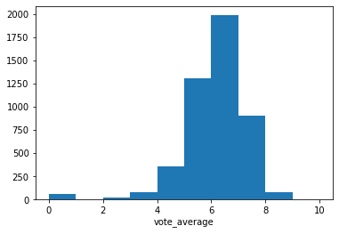
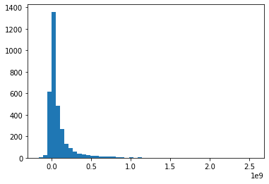
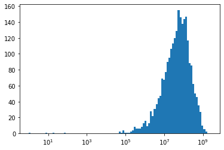
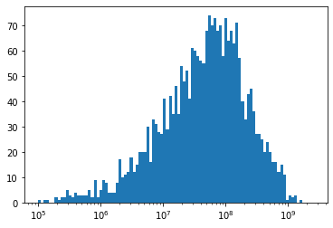
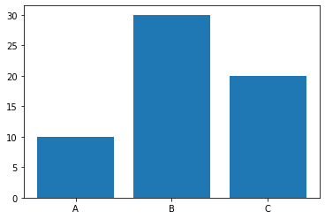
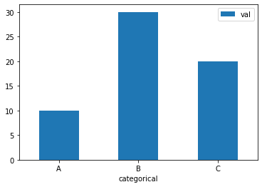
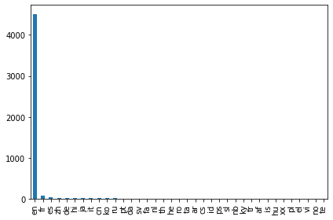

# ヒストグラムと棒グラフ plt.hist() plt.bar()


```python
import numpy as np
import pandas as pd
import matplotlib.pyplot as plt
%matplotlib inline
```

## plt.hist()


```python
# 映画の評価スコアのヒストグラム
df = pd.read_csv('../../data/138_4508_bundle_archive/tmdb_5000_movies.csv')
plt.hist(df['vote_average'], bins=10)
plt.xlabel('vote_average')
```


    Text(0.5, 0, 'vote_average')





```python
# profitのヒストグラム
fig, axes = plt.subplots()
df = df[(df['revenue'] != 0) & (df['budget'] != 0)]
df['profit'] = df.apply(lambda row: row['revenue'] - row['budget'], axis=1)
axes.hist(df['profit'], bins=50)
```


    (array([2.000e+00, 2.600e+01, 6.120e+02, 1.358e+03, 4.850e+02, 2.680e+02,
            1.280e+02, 9.100e+01, 5.800e+01, 3.900e+01, 3.100e+01, 2.700e+01,
            2.000e+01, 1.600e+01, 1.400e+01, 9.000e+00, 9.000e+00, 1.200e+01,
            8.000e+00, 5.000e+00, 1.000e+00, 2.000e+00, 1.000e+00, 2.000e+00,
            0.000e+00, 0.000e+00, 1.000e+00, 1.000e+00, 1.000e+00, 0.000e+00,
            0.000e+00, 0.000e+00, 0.000e+00, 1.000e+00, 0.000e+00, 0.000e+00,
            0.000e+00, 0.000e+00, 0.000e+00, 0.000e+00, 0.000e+00, 0.000e+00,
            0.000e+00, 0.000e+00, 0.000e+00, 0.000e+00, 0.000e+00, 0.000e+00,
            0.000e+00, 1.000e+00]),
     array([-1.65710090e+08, -1.11376586e+08, -5.70430829e+07, -2.70957938e+06,
             5.16239242e+07,  1.05957428e+08,  1.60290931e+08,  2.14624435e+08,
             2.68957938e+08,  3.23291442e+08,  3.77624945e+08,  4.31958449e+08,
             4.86291952e+08,  5.40625456e+08,  5.94958960e+08,  6.49292463e+08,
             7.03625967e+08,  7.57959470e+08,  8.12292974e+08,  8.66626477e+08,
             9.20959981e+08,  9.75293484e+08,  1.02962699e+09,  1.08396049e+09,
             1.13829399e+09,  1.19262750e+09,  1.24696100e+09,  1.30129451e+09,
             1.35562801e+09,  1.40996151e+09,  1.46429502e+09,  1.51862852e+09,
             1.57296202e+09,  1.62729553e+09,  1.68162903e+09,  1.73596253e+09,
             1.79029604e+09,  1.84462954e+09,  1.89896304e+09,  1.95329655e+09,
             2.00763005e+09,  2.06196356e+09,  2.11629706e+09,  2.17063056e+09,
             2.22496407e+09,  2.27929757e+09,  2.33363107e+09,  2.38796458e+09,
             2.44229808e+09,  2.49663158e+09,  2.55096509e+09]),
     <a list of 50 Patch objects>)





値のスケールが違いすぎて小さいスケールの差が分かりません。


```python
# profitのヒストグラム
fig, axes = plt.subplots()
df = df[(df['revenue'] != 0) & (df['budget'] != 0)]
df['profit'] = df.apply(lambda row: row['revenue'] - row['budget'], axis=1)
# x軸をlogスケールにする
logbins = np.logspace(0, np.log10(df['profit'].max()),100)
axes.hist(df['profit'], bins=logbins)
# 表示方法をlogに設定
axes.set_xscale('log')
```





```python
# profitのヒストグラム
fig, axes = plt.subplots()
df = df[(df['revenue'] != 0) & (df['budget'] != 0)]
df['profit'] = df.apply(lambda row: row['revenue'] - row['budget'], axis=1)
# x軸をlogスケールにする
logbins = np.logspace(5, np.log10(df['profit'].max()),100)
axes.hist(df['profit'], bins=logbins)
# 表示方法をlogに設定
axes.set_xscale('log')
```





## plt.bar()


```python
df = pd.DataFrame({'categorical':['A', 'B', 'C'], 'val':[10, 30, 20]})
plt.bar('categorical', 'val', data=df)
```


    <BarContainer object of 3 artists>





## DataFrameのbuilt-in plot


```python
df.plot('categorical', 'val', kind='bar', rot=0)
# df.plot.bar('categorical', 'val', rot=0)
```


    <matplotlib.axes._subplots.AxesSubplot at 0x7f064a297050>





```python
# Seriesにも使える．(value_counts())
df = pd.read_csv('../../data/138_4508_bundle_archive/tmdb_5000_movies.csv')
df['original_language'].value_counts().plot(kind='bar')
plt.tight_layout()
plt.show()
```




