```python
# plt.show()で可視化されない人はこのセルを実行してください。
%matplotlib inline
```

# 様々なグラフを作る

- **[3.1 折れ線グラフ](#3.1-折れ線グラフ)**
    - **[3.1.1 マーカーの種類と色を設定する](#3.1.1-マーカーの種類と色を設定する)**
    - **[3.1.2 線のスタイルと色を設定する](#3.1.2-線のスタイルと色を設定する)**
<br><br>
- **[3.2 棒グラフ](#3.2-棒グラフ)**
    - **[3.2.1 棒グラフを作成する](#3.2.1-棒グラフを作成する)**
    - **[3.2.2 横軸にラベルを設定する](#3.2.2-横軸にラベルを設定する)**
    - **[3.2.3 積み上げ棒グラフを作成する](#3.2.3-積み上げ棒グラフを作成する)**
<br><br>
- **[3.3 ヒストグラム](#3.3-ヒストグラム)**
    - **[3.3.1 ヒストグラムを作成する](#3.3.1-ヒストグラムを作成する)**
    - **[3.3.2 ビン数を設定する](#3.3.2-ビン数を設定する)**
    - **[3.3.3 正規化を行う](#3.3.3-正規化を行う)**
    - **[3.3.4 累積ヒストグラムを作成する](#3.3.4-累積ヒストグラムを作成する)**
<br><br>
- **[3.4 散布図](#3.4-散布図)**
    - **[3.4.1 散布図を作成する](#3.4.1-散布図を作成する)**
    - **[3.4.2 マーカーの種類と色を設定する](#3.4.2-マーカーの種類と色を設定する)**
    - **[3.4.3 値に応じてマーカーの大きさを設定する](#3.4.3-値に応じてマーカーの大きさを設定する)**
    - **[3.4.4 値に応じてマーカーの濃さを設定する](#3.4.4-値に応じてマーカーの濃さを設定する)**
    - **[3.4.5 カラーバーを表示する](#3.4.5-カラーバーを表示する)**
<br><br>
- **[3.5 円グラフ](#3.5-円グラフ)**
    - **[3.5.1 円グラフを作成する](#3.5.1-円グラフを作成する)**
    - **[3.5.2 円グラフにラベルを設定する](#3.5.2-円グラフにラベルを設定する)**
    - **[3.5.3 特定の要素を目立たせる](#3.5.3-特定の要素を目立たせる)**
<br><br>
- **[3.6 3Dグラフ](#3.6-3Dグラフ)**
    - **[3.6.1 3D Axesを作成する](#3.6.1-3D-Axesを作成する)**
    - **[3.6.2 曲面を作成する](#3.6.2-曲面を作成する)**
    - **[3.6.3 3Dヒストグラムを作成する](#3.6.3-3Dヒストグラムを作成する)**
    - **[3.6.4 3D散布図を作成する](#3.6.4-3D散布図を作成する)**
    - **[3.6.5 3Dグラフにカラーマップを適用する](#3.6.5-3Dグラフにカラーマップを適用する)**

***

## 3.1 折れ線グラフ

### 3.1.1 マーカーの種類と色を設定する

<b>折れ線グラフ</b>は`matplotlib.pyplot.plot()`を用いて描画します。<br>
<br>
横軸のデータ`x`、縦軸のデータ`y`に加え、`marker="指定子"`を指定すると<b>マーカーの種類（形）を設定でき</b>、`markerfacecolor="指定子"`を指定すると<b>マーカーの色を設定できます</b>。<br>
```Python
matplotlib.pyplot.plot(x, y, marker="マーカーの種類", markerfacecolor="マーカーの色")
```
以下は指定できるマーカーの種類とその色の一部です。<br>
<br>
<b>マーカー</b>
- `"o"`: 円
- `"s"`: 四角
- `"p"`: 五角形
- `"*"`: 星
- `"+"`: プラス
- `"D"`: ダイアモンド

<b>色</b>
- `"b"` : 青
- `"g"` : 緑
- `"r"` : 赤
- `"c"` : シアン
- `"m"` : マゼンタ
- `"y"` : 黄色
- `"k"` : 黒
- `"w"` : 白

#### 問題

- 赤色の円マーカーを用いて折れ線グラフを作成してください。<br>
x軸に対応するデータは変数`days`、y軸に対応するデータは変数`weight`が用意されています。<br>
赤色は `"r"` で指定してください。


```python
import numpy as np
import matplotlib.pyplot as plt

days = np.arange(1, 11)
weight = np.array([10, 14, 18, 20, 18, 16, 17, 18, 20, 17])

# 表示の設定
plt.ylim([0, weight.max()+1])
plt.xlabel("days")
plt.ylabel("weight")

# 円マーカーを赤色でプロットし折れ線グラフを作成してください
plt.plot(days, weight, marker="o", markerfacecolor="r")

plt.show()
```


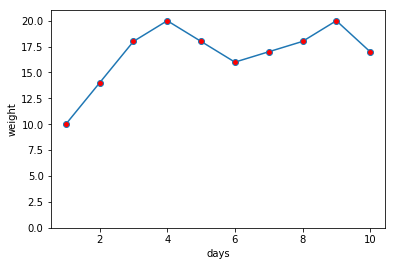


#### ヒント

- `"marker="指定子"`、`markerfacecolor="色指定"`でマーカーの種類と色を設定できます。

#### 解答例


```python
import numpy as np
import matplotlib.pyplot as plt

days = np.arange(1, 11)
weight = np.array([10, 14, 18, 20, 18, 16, 17, 18, 20, 17])

# 表示の設定
plt.ylim([0, weight.max()+1])
plt.xlabel("days")
plt.ylabel("weight")

# 円マーカーを赤色でプロットし折れ線グラフを作成してください
plt.plot(days, weight, marker="o", markerfacecolor="r")

plt.show()
```


***

### 3.1.2 線のスタイルと色を設定する

`matplotlib.pyplot.plot()`に`linestyle="指定子"`を指定すると<b>線のスタイルを設定でき</b>、`color="指定子"`を指定すると<b>線の色を設定できます</b>。<br>
```Python
matplotlib.pyplot.plot(x, y, linestyle="線のスタイル", color="線の色")
```
以下は指定できる線の種類とその色の一部です。<br>
<br>
<b>線のスタイル</b>
- `"-"`: 実線
- `"--"`: 破線
- `"-."`: 破線（点入り）
- `":"`: 点線

<b>色</b>
- `"b"` : 青
- `"g"` : 緑
- `"r"` : 赤
- `"c"` : シアン
- `"m"` : マゼンタ
- `"y"` : 黄色
- `"k"` : 黒
- `"w"` : 白

#### 問題

- 円マーカーを赤色でプロットし、青の破線の折れ線グラフを作成してください。<br>
x軸に対応するデータは変数`days`、y軸に対応するデータは変数`weight`が用意されています。


```python
import numpy as np
import matplotlib.pyplot as plt

days = np.arange(1, 11)
weight = np.array([10, 14, 18, 20, 18, 16, 17, 18, 20, 17])

# 表示の設定
plt.ylim([0, weight.max()+1])
plt.xlabel("days")
plt.ylabel("weight")

# 円マーカーを赤色でプロットし、青の破線の折れ線グラフを作成してください
plt.plot(days, weight, linestyle="--", color="b", marker="o", markerfacecolor="r")

plt.show()
```


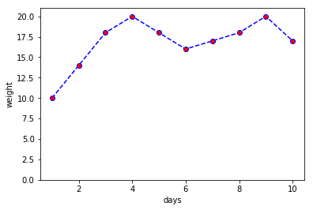


#### ヒント

- `linestyle="指定子"`、`color="指定子"`で線の種類と色を設定できます。

#### 解答例


```python
import numpy as np
import matplotlib.pyplot as plt

days = np.arange(1, 11)
weight = np.array([10, 14, 18, 20, 18, 16, 17, 18, 20, 17])

# 表示の設定
plt.ylim([0, weight.max()+1])
plt.xlabel("days")
plt.ylabel("weight")

# 円マーカーを赤色でプロットし、青の破線の折れ線グラフを作成してください
plt.plot(days, weight, linestyle="--", color="b",marker="o", markerfacecolor="r")

plt.show()
```


***

## 3.2 棒グラフ

### 3.2.1 棒グラフを作成する

<b>棒グラフ</b>は`matplotlib.pyplot.bar()`を用いて描画します。<br>
横軸のデータ`x`とこれに対応する縦軸のデータ`y`を指定します。
```Python
matplotlib.pyplot.bar(x, y)
```

#### 問題

- 横軸に`x`、縦軸に`y`が対応する棒グラフを作成してください。


```python
import numpy as np
import matplotlib.pyplot as plt

x = [1, 2, 3, 4, 5, 6]
y = [12, 41, 32, 36, 21, 17]

# 棒グラフを作成してください
plt.bar(x, y)

plt.show()
```


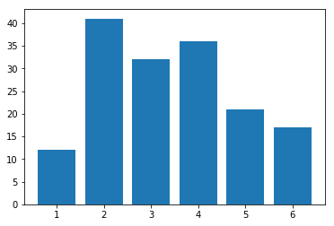


#### ヒント

- 横軸の値とそれに対応する縦軸のデータを`plt.bar()`に渡すことで棒グラフを作成できます。

#### 解答例


```python
import numpy as np
import matplotlib.pyplot as plt

x = [1, 2, 3, 4, 5, 6]
y = [12, 41, 32, 36, 21, 17]

# 棒グラフを作成してください
plt.bar(x, y)

plt.show()
```


***

### 3.2.2 横軸にラベルを設定する

棒グラフの横軸にラベルをつける方法は、折れ線グラフやその他のグラフと異なります。<br>
`matplotlib.pyplot.bar()`に`tick_label=[ラベルのリスト]`を指定すると<b>横軸のラベルを設定できます</b>。
```Python
matplotlib.pyplot.bar(x, y, tick_label=[ラベルのリスト])
```

#### 問題

- 横軸に`x`、縦軸に`y`のデータが対応する棒グラフを作成し、横軸にラベルを設定してください。<br>
ラベルのリストは変数`labels`が用意されています。


```python
import numpy as np
import matplotlib.pyplot as plt

x = [1, 2, 3, 4, 5, 6]
y = [12, 41, 32, 36, 21, 17]
labels = ["Apple", "Orange", "Banana", "Pineapple", "Kiwifruit", "Strawberry"]

# 棒グラフを作成し、横軸にラベルを設定してください
plt.bar(x, y, tick_label=labels)

plt.show()
```


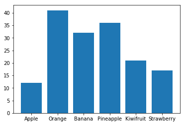


#### ヒント

- `plt.bar()`に`tick_label= ラベルのリスト名` と指定するとラベルを設定できます。

#### 解答例


```python
import numpy as np
import matplotlib.pyplot as plt

x = [1, 2, 3, 4, 5, 6]
y = [12, 41, 32, 36, 21, 17]
labels = ["Apple", "Orange", "Banana", "Pineapple", "Kiwifruit", "Strawberry"]

# 棒グラフを作成し、横軸にラベルを設定してください
plt.bar(x, y, tick_label=labels)

plt.show()
```


***

### 3.2.3 積み上げ棒グラフを作成する

2系列以上のデータを同じ項目について積み上げて表現したグラフを<b style='color: #AA0000'>積み上げ棒グラフ</b>と呼びます。<br>
`matplotlib.pyplot.bar()`に`bottom=[データ列のリスト]`を指定すると、対応するインデックスで<b>下側に余白を設定できます。</b><br>
すなわち、2系列目以降をプロットする際に下に表示したい系列を`bottom`に指定することで積み上げ棒グラフが作成できます。<br>


また、`plt.legend("系列1のラベル", "系列2のラベル")` と指定すると凡例を設定できます。
```Python
matplotlib.pyplot.bar(x, y, bottom=[データ列のリスト])
```

#### 問題

- 横軸に`x`、縦軸に`y1`、`y2`のデータが対応する積み上げ棒グラフを作成し、横軸にラベルを設定してください。<br>
ラベルのリストは 変数`labels`が用意されています。


```python
import numpy as np
import matplotlib.pyplot as plt

x = [1, 2, 3, 4, 5, 6]
y1 = [12, 41, 32, 36, 21, 17]
y2 = [43, 1, 6, 17, 17, 9]
labels = ["Apple", "Orange", "Banana", "Pineapple", "Kiwifruit", "Strawberry"]

# 積み上げ棒グラフを作成し、横軸にラベルを設定してください
plt.bar(x, y1, tick_label=labels)
plt.bar(x, y2, bottom=y1)

# 系列ラベルの設定が可能
plt.legend(("y1", "y2"))

plt.show()
```


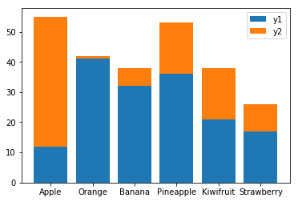


#### ヒント

- `plt.bar()`に`bottom=データ列` と指定すると、対応するインデックスで下側の余白を設定できます。

#### 解答例


```python
import numpy as np
import matplotlib.pyplot as plt

x = [1, 2, 3, 4, 5, 6]
y1 = [12, 41, 32, 36, 21, 17]
y2 = [43, 1, 6, 17, 17, 9]
labels = ["Apple", "Orange", "Banana", "Pineapple", "Kiwifruit", "Strawberry"]

# 積み上げ棒グラフを作成し、横軸にラベルを設定してください
plt.bar(x, y1, tick_label=labels)
plt.bar(x, y2, bottom=y1)

# 系列ラベルの設定が可能
plt.legend(("y1", "y2"))

plt.show()
```


***

## 3.3 ヒストグラム

### 3.3.1 ヒストグラムを作成する

データを扱う際には最初に<b>データの全体的な傾向</b>を掴む事が非常に大切です。<br>

例えば、あるクラスの身長の傾向を把握することを考えてみましょう。各生徒の身長を個々1cm単位で眺めても、全体の傾向は掴めません。身長を10cm単位で区切って各区間の生徒数をカウントすると、全体の傾向を掴めます。<br>
このように、各区間に収まるデータ件数をカウントしたものを<b style='color:#AA0000'>度数分布</b>と呼びます。
<br>

<b style='color: #AA0000'>度数分布</b>を可視化する際には`ヒストグラム`という、<b>縦軸に度数（回数）、横軸に階級（範囲）をとった統計グラフ</b>が多く使われます。<br>
ヒストグラムは`matplotlib.pyplot.hist()`を用いて描画します。

```Python
matplotlib.pyplot.hist(リスト型のデータ配列)
```

#### 問題

- データ列の変数`data`に入っているデータのヒストグラムを作成してください。


```python
import numpy as np
import matplotlib.pyplot as plt

np.random.seed(0)
data = np.random.randn(10000)

# データ列の変数dataのヒストグラムを作成してください
plt.hist(data)

plt.show()
```


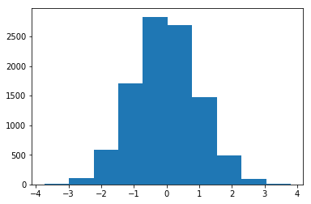


#### ヒント

- `plt.hist(リスト型のデータ列)`でヒストグラムが作成できます。

#### 解答例


```python
import numpy as np
import matplotlib.pyplot as plt

np.random.seed(0)
data = np.random.randn(10000)

# データ列の変数dataのヒストグラムを作成してください
plt.hist(data)

plt.show()
```


***

### 3.3.2 ビン数を設定する

ヒストグラムを作成する際、<b>データをいくつの階級に分けるか</b>が重要になります。<br>
その階級の数を<b style='color: #AA0000'>ビン数</b>と言います。<br>
ビン数を正しく決定することでヒストグラムの特徴を正しく掴むことができます。<br>


`matplotlib.pyplot.hist()`に`bins`を指定すると<b>任意のビン数の階級に分けることができます</b>。`bins="auto"`と指定すると、ビン数が自動で設定されます。
```Python
matplotlib.pyplot.hist(リスト型のデータ列, bins=ビン数)
```

#### 問題

- データ列の変数`data`を用いて、ビン数100のヒストグラムを作成してください。


```python
import numpy as np
import matplotlib.pyplot as plt

np.random.seed(0)
data = np.random.randn(10000)

# ビン数100のヒストグラムを作成してください
plt.hist(data, bins=100)

plt.show()
```


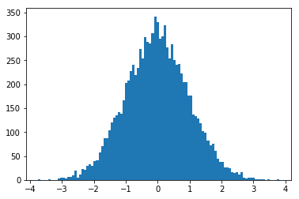


#### ヒント

- `plt.hist()`に`bins=`を指定すると、ビン数を設定できます。

#### 解答例


```python
import numpy as np
import matplotlib.pyplot as plt

np.random.seed(0)
data = np.random.randn(10000)

# ビン数100のヒストグラムを作成してください
plt.hist(data, bins=100)

plt.show()
```


***

### 3.3.3 正規化を行う

偏差値のツリガネ型のグラフを見た事がある方は多いと思います。あのグラフ（正規分布と言います）は平均が0, 分散が1となるように調整されたグラフで、その結果面積が1となり「偏差値60以上の人は上位15.87%である」等の分布の計算が便利になります。<br>
成績や身長など、自然界の多くのデータは正規分布に近い形になる事が知られています。<br>
<br>
ヒストグラムもデータの分布が正規分布であると仮定すると計算が便利になります。ヒストグラムの分布を正規分布と仮定したとき、合計値が1になるようにヒストグラムを操作することを<b style='color: #AA0000'>正規化</b>または<b style='color: #AA0000'>標準化</b>と呼びます。<br>
`matplotlib.pyplot.hist()`に`density=True`を指定すると<b>ヒストグラムの正規化を行えます</b>。
```Python
matplotlib.pyplot.hist(リスト型のデータ列, density=True)
```

#### 問題

- データ列の変数`data`を用いて、正規化されたビン数100のヒストグラムを作成してください。


```python
import numpy as np
import matplotlib.pyplot as plt

np.random.seed(0)
data = np.random.randn(10000)

# 正規化されたビン数100のヒストグラムを作成してください
plt.hist(data, bins=100, density=True)

plt.show()
```


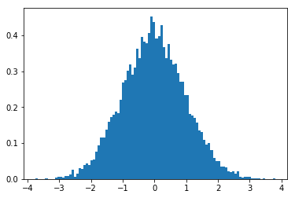


#### ヒント

- `plt.hist()`に`density=True`を指定するとヒストグラムの正規化を行えます。

#### 解答例


```python
import numpy as np
import matplotlib.pyplot as plt

np.random.seed(0)
data = np.random.randn(10000)

# 正規化されたビン数100のヒストグラムを作成してください
plt.hist(data, bins=100, density=True)

plt.show()
```


***

### 3.3.4 累積ヒストグラムを作成する

度数を全体の割合で表したものを<b style='color: #AA0000'>相対度数</b>と言い、その階級までの相対度数の和を<b style='color: #AA0000'>累積相対度数</b>といいます。<br>
累積相対度数は最終的に1となります。<br>
累積相対度数をヒストグラムで表したものを累積ヒストグラムと呼びます。<br>
累積ヒストグラムの増減を調べることによってそれが公平かどうかがわかります。<br>


`matplotlib.pyplot.hist()`に`cumulative=True`を指定すると累積ヒストグラムを作成することができます。

```Python
matplotlib.pyplot.hist(リスト型のデータ列, cumulative=True)
```

#### 問題

- データ列の変数`data`を用いて、正規化されたビン数100の累積ヒストグラムを作成してください。


```python
import numpy as np
import matplotlib.pyplot as plt

np.random.seed(0)
data = np.random.randn(10000)

# 正規化されたビン数100の累積ヒストグラムを作成してください
plt.hist(data, bins=100, density=True, cumulative=True)
plt.show()
```


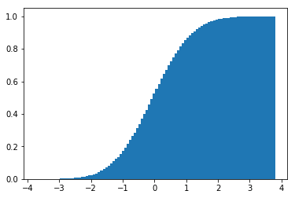


#### ヒント

- `plt.hist()`に`cumulative=True`を指定すると累積ヒストグラムを作成できます。

#### 解答例


```python
import numpy as np
import matplotlib.pyplot as plt

np.random.seed(0)
data = np.random.randn(10000)

# 正規化されたビン数100の累積ヒストグラムを作成してください
plt.hist(data, bins=100, density=True, cumulative=True)

plt.show()
```


***

## 3.4 散布図

### 3.4.1 散布図を作成する

<b style='color: #AA0000'>散布図</b>は`matplotlib.pyplot.scatter()`を用いて描画します。<br>
横軸のデータ`x`とこれに対応する縦軸のデータ`y`を指定します。
```Python
matplotlib.pyplot.scatter(x, y)
```

#### 問題

- リスト型の変数`x`、`y`のデータを平面上のx軸、y軸にそれぞれ対応させた散布図を作成してください。


```python
import numpy as np
import matplotlib.pyplot as plt

np.random.seed(0)
x = np.random.choice(np.arange(100), 100)
y = np.random.choice(np.arange(100), 100)

# 散布図を作成してください
plt.scatter(x, y)

plt.show()
```


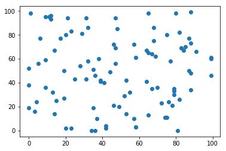


#### ヒント

- `plt.scatter()`にx軸、y軸に対応するデータを指定すると散布図を作成できます。

#### 解答例


```python
import numpy as np
import matplotlib.pyplot as plt

np.random.seed(0)
x = np.random.choice(np.arange(100), 100)
y = np.random.choice(np.arange(100), 100)

# 散布図を作成してください
plt.scatter(x, y)

plt.show()
```


***

### 3.4.2 マーカーの種類と色を設定する

横軸のデータ`x`、縦軸のデータ`y`に加え、`marker="指定子"`を指定すると<b>マーカーの種類（形）を設定でき</b>、`color="指定子"`を指定すると<b>マーカーの色を設定できます</b>。<br>
```Python
matplotlib.pyplot.scatter(x, y, marker="マーカーの種類", color="マーカーの色")
```
以下は指定できるマーカーの種類とその色の一部です。<br>
<br>
<b>マーカー</b>
- `"o"`: 円
- `"s"`: 四角
- `"p"`: 五角形
- `"*"`: 星
- `"+"`: プラス
- `"D"`: ダイアモンド

<b>色</b>
- `"b"` : 青
- `"g"` : 緑
- `"r"` : 赤
- `"c"` : シアン
- `"m"` : マゼンタ
- `"y"` : 黄色
- `"k"` : 黒
- `"w"` : 白

#### 問題

- リスト型の変数`x`、`y`のデータを平面上のx軸、y軸にそれぞれ対応させた散布図を作成してください。<br>
- マーカーの種類を四角、色を赤に設定してプロットしてください。<br>
赤色は `"r"` で指定してください。


```python
import numpy as np
import matplotlib.pyplot as plt

np.random.seed(0)
x = np.random.choice(np.arange(100), 100)
y = np.random.choice(np.arange(100), 100)

# マーカーの種類を四角、色を赤に設定して散布図を作成してください
plt.scatter(x, y, marker="s", color="r")

plt.show()
```


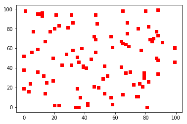


#### ヒント

- `marker="指定子"`でマーカーの種類を設定できます。
- `color="指定子"`でマーカーの色を設定できます。

#### 解答例


```python
import numpy as np
import matplotlib.pyplot as plt

np.random.seed(0)
x = np.random.choice(np.arange(100), 100)
y = np.random.choice(np.arange(100), 100)

# マーカーの種類を四角、色を赤に設定して散布図を作成してください
plt.scatter(x, y, marker="s", color="r")

plt.show()
```


***

### 3.4.3 値に応じてマーカーの大きさを設定する

横軸のデータ`x`、縦軸のデータ`y`に加え、`s=マーカーのサイズ`を指定すると<b>マーカーの大きさを設定できます</b>。デフォルト値は`20`です。<br>
これを応用して、プロットデータに対応するリスト型のデータを`s`に指定します。すると指定した<b>リスト型のデータの値に応じてマーカーの大きさを個々に設定することができます</b>。<br>
```Python
matplotlib.pyplot.scatter(x, y, s=マーカーのサイズ)
```

#### 問題

- 変数`x`、`y`の値を散布図にプロットし、マーカーの大きさを変数`z`に応じた値に設定してください。


```python
import numpy as np
import matplotlib.pyplot as plt

np.random.seed(0)
x = np.random.choice(np.arange(100), 100)
y = np.random.choice(np.arange(100), 100)
z = np.random.choice(np.arange(100), 100)

# マーカーの大きさを変数zに応じた値で個々に変わるようプロットしてください
plt.scatter(x, y, s=z)

plt.show()
```


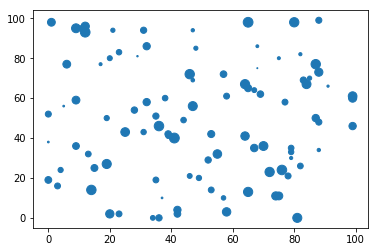


#### ヒント

- `s=マーカーのサイズ`でマーカーの大きさを設定できます。

#### 解答例


```python
import numpy as np
import matplotlib.pyplot as plt

np.random.seed(0)
x = np.random.choice(np.arange(100), 100)
y = np.random.choice(np.arange(100), 100)
z = np.random.choice(np.arange(100), 100)

# マーカーの大きさを変数zに応じた値で個々に変わるようプロットしてください
plt.scatter(x, y, s=z)

plt.show()
```


***

### 3.4.4 値に応じてマーカーの濃さを設定する

プロットデータに応じてマーカーの大きさを変えると、見難くなることがあります。その場合は、プロットデータに応じてマーカーの色の濃さを変えると効果的です。<br>
<br>
横軸のデータ`x`、縦軸のデータ`y`に加え、`c=マーカーの色`を指定すると<b>マーカーの色を設定できます</b>。<br>
また、プロットデータに対応するリスト型のデータを`c`に指定し、さらに`cmap="色系統指定子"`を指定すると、<b>`c`の値に応じた濃さでマーカーをグラデーション表示することができます</b>。<br>
```Python
matplotlib.pyplot.scatter(x, y, c=マーカーの色 または プロットデータに対応するリスト型のデータ, cmap="色系統指定子")
```
以下は使用できる色系統のうちの一部です。<br>
<br>
<b>色系統指定子</b>
- "Reds": 赤
- "Blues": 青
- "Greens": 緑
- "Purples": 紫

#### 問題

- 変数`x`、`y`の値を散布図にプロットし、変数`z`に応じた値で青系統の色でグラデーション表示してください。


```python
import numpy as np
import matplotlib.pyplot as plt

np.random.seed(0)
x = np.random.choice(np.arange(100), 100)
y = np.random.choice(np.arange(100), 100)
z = np.random.choice(np.arange(100), 100)

# 変数zに応じた値で、マーカーの色を青系統のグラデーションで表示してください
plt.scatter(x, y, c=z, cmap="Blues")

plt.show()
```


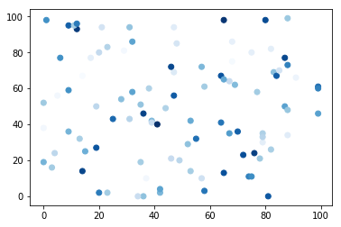


#### ヒント

- `c=マーカーの色`でマーカーの色を設定できます。
- `c=プロットデータに対応するリスト型のデータ`と`cmap="色系統"`でプロットデータをグラデーション表示できます。
- 色系統を青に設定するには"Blues"を指定します。

#### 解答例


```python
import numpy as np
import matplotlib.pyplot as plt

np.random.seed(0)
x = np.random.choice(np.arange(100), 100)
y = np.random.choice(np.arange(100), 100)
z = np.random.choice(np.arange(100), 100)

# 変数zに応じた値で、マーカーの色を青系統のグラデーションで表示してください
plt.scatter(x, y, c=z, cmap="Blues")

plt.show()
```


***

### 3.4.5 カラーバーを表示する

プロットデータの大小に応じてマーカーを着色するだけでは、そのデータの水準や格差が分かりません。そこで、カラーバーを表示するとマーカーの濃さでだいたいの値が分かるようになります。<br>
```Python
matplotlib.pyplot.colorbar()
```

#### 問題

- 変数`x`、`y`の値を散布図にプロットし、変数`z`に応じた値で青系統の色でグラデーション表示してください。
- カラーバーを表示してください。


```python
import numpy as np
import matplotlib.pyplot as plt

np.random.seed(0)
x = np.random.choice(np.arange(100), 100)
y = np.random.choice(np.arange(100), 100)
z = np.random.choice(np.arange(100), 100)

# 変数zに応じた値で、マーカーの色を青系統のグラデーションで表示してください
plt.scatter(x, y, c=z, cmap="Blues")

# カラーバーを表示してください
plt.colorbar()

plt.show()
```


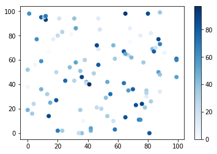


#### ヒント

- `plt.colorbar()`でカラーバーを表示できます。

#### 解答例


```python
import numpy as np
import matplotlib.pyplot as plt

np.random.seed(0)
x = np.random.choice(np.arange(100), 100)
y = np.random.choice(np.arange(100), 100)
z = np.random.choice(np.arange(100), 100)

# 変数zに応じた値で、マーカーの色を青系統のグラデーションで表示してください
plt.scatter(x, y, c=z, cmap="Blues")

# カラーバーを表示してください
plt.colorbar()

plt.show()
```


***

## 3.5 円グラフ

### 3.5.1 円グラフを作成する

<b style='color: #AA0000'>円グラフ</b>は`matplotlib.pyplot.pie()`を用いて描画します。グラフを円形にするには、`matplotlib.pyplot.axis("equal")`が必要です。<b>このコードがないと楕円になって</b>しまいます。<br>
```Python
plt.pie(リスト型のデータ)
plt.axis("equal")
```

#### 問題

- 変数`data`を円グラフで描画してください。


```python
import matplotlib.pyplot as plt

data = [60, 20, 10, 5, 3, 2]

# 変数dataを円グラフで描画してください
plt.pie(data)

# 円グラフを楕円から円形にしてください
plt.axis("equal")

plt.show()
```


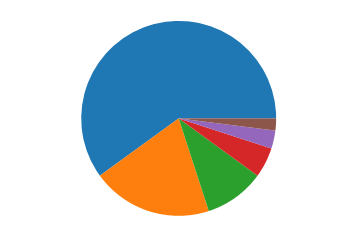


#### ヒント

- `plt.pie()`にリスト型のデータを指定すると円グラフを作成できます。
- グラフを円形にするには、`plt.axis("equal")`が必要です。

#### 解答例


```python
import matplotlib.pyplot as plt

data = [60, 20, 10, 5, 3, 2]

# 変数dataを円グラフで描画してください
plt.pie(data)

# 円グラフを楕円から円形にしてください
plt.axis("equal")

plt.show()
```


***

### 3.5.2 円グラフにラベルを設定する

`matplotlib.pyplot.pie()`に`labels=[ラベルのリスト]`を指定すると<b>ラベルを設定できます</b>。
```Python
matplotlib.pyplot.pie(データ, labels=[ラベルのリスト])
```

#### 問題

- 変数`data`を円グラフで描画してください。
- ラベルとして変数`labels`を設定してください。


```python
import matplotlib.pyplot as plt

data = [60, 20, 10, 5, 3, 2]
labels = ["Apple", "Orange", "Banana", "Pineapple", "Kiwifruit", "Strawberry"]

# 変数dataを円グラフで描画してください。ラベルは変数labelsです
plt.pie(data, labels=labels)

plt.axis("equal")
plt.show()
```


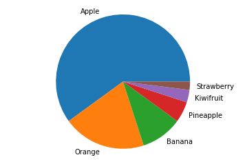


#### ヒント

- `labels=ラベルのリスト型データ`でラベルを設定できます。

#### 解答例


```python
import matplotlib.pyplot as plt

data = [60, 20, 10, 5, 3, 2]
labels = ["Apple", "Orange", "Banana", "Pineapple", "Kiwifruit", "Strawberry"]

# 変数dataを円グラフで描画してください。ラベルは変数labelsです
plt.pie(data, labels=labels)

plt.axis("equal")
plt.show()
```


***

### 3.5.3 特定の要素を目立たせる

円グラフの特徴的な要素だけを切り離して目立たせたい場合があります。
`matplotlib.pyplot.pie()`に`explode=[目立たせ度合いのリスト]`を指定すると<b>任意の要素を切り離して表示できます</b>。<br>
「目立たせ度合い」には0から1の値をリスト型のデータで指定します。
```Python
matplotlib.pyplot.pie(データ, explode=[目立たせ度合いのリスト])
```

#### 問題

- 変数`data`を円グラフで描画してください。
- ラベルとして変数`labels`を設定してください。
- 「目立たせ度合い」のリスト型のデータは変数`explode`です。


```python
import matplotlib.pyplot as plt

data = [60, 20, 10, 5, 3, 2]
labels = ["Apple", "Orange", "Banana", "Pineapple", "Kiwifruit", "Strawberry"]
explode = [0, 0, 0.1, 0, 0, 0]

# 変数dataに変数labelsのラベルを指定し、Bananaを目立たせた円グラフを描画してください
plt.pie(data, labels=labels, explode=explode)

plt.axis("equal")
plt.show()
```


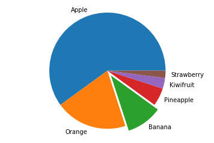


#### ヒント

- `explode=目立たせ度合い(0から1の値)のリスト型データ`でラベルを設定できます。

#### 解答例


```python
import matplotlib.pyplot as plt

data = [60, 20, 10, 5, 3, 2]
labels = ["Apple", "Orange", "Banana", "Pineapple", "Kiwifruit", "Strawberry"]
explode = [0, 0, 0.1, 0, 0, 0]

# 変数dataに変数labelsのラベルを指定し、Bananaを目立たせた円グラフを描画してください
plt.pie(data, labels=labels, explode=explode)

plt.axis("equal")
plt.show()
```


***

## 3.6 3Dグラフ

### 3.6.1 3D Axesを作成する

このセクションでは<b>3Dグラフの描画</b>について学びます。<br>
<br>
3Dグラフを描画するには、<b>3D描画機能を持ったサブプロット</b>を作成する必要があり、サブプロットを作成する際に`projection="3d"`と指定します。
```Python
import matplotlib
matplotlib.pyplot.figure().add_subplot(1, 1, 1, projection="3d")
```

#### 問題

- 用意された変数`fig`を用いて、3D描画機能を持ったサブプロット`ax`を追加してください。追加する際、図は分割しないでください。


```python
import numpy as np
import matplotlib.pyplot as plt

# 3D描画を行うために必要なライブラリ
from mpl_toolkits.mplot3d import Axes3D

t = np.linspace(-2*np.pi, 2*np.pi)
X, Y = np.meshgrid(t, t)
R = np.sqrt(X**2 + Y**2)
Z = np.sin(R)

# Figureオブジェクトを作成
fig = plt.figure(figsize=(6, 6))

# 3D描画機能を持ったサブプロットaxを追加してください
ax =plt.figure().add_subplot(1, 1, 1, projection="3d")

# プロットして表示
ax.plot_surface(X, Y, Z)
plt.show()
```


    <Figure size 432x432 with 0 Axes>


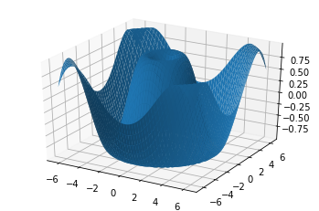


#### ヒント

- `add_subplot()`に`projection="3d"`を指定すると、3D描画が可能なサブプロットを追加できます。

#### 解答例


```python
import numpy as np
import matplotlib.pyplot as plt

# 3D描画を行うために必要なライブラリ
from mpl_toolkits.mplot3d import Axes3D

t = np.linspace(-2*np.pi, 2*np.pi)
X, Y = np.meshgrid(t, t)
R = np.sqrt(X**2 + Y**2)
Z = np.sin(R)

# Figureオブジェクトを作成
fig = plt.figure(figsize=(6, 6))

# 3D描画機能を持ったサブプロットaxを追加してください
ax = fig.add_subplot(1, 1, 1, projection="3d")

# プロットして表示
ax.plot_surface(X, Y, Z)
plt.show()
```


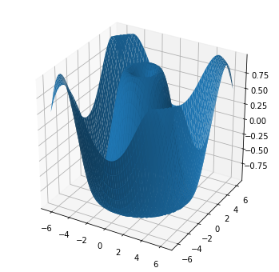


***

### 3.6.2 曲面を作成する

できるだけ真に近い見た目のグラフを描画したい場合、`plot_surface()` にx軸、y軸、z軸に対応するデータを指定して<b>曲面を描画</b>します。

```Python
# サブプロットが変数`ax`の場合
ax.plot_surface(X, Y, Z)
```
描画したグラフは`matplotlib.pyplot.show()`を用いて画面に出力します。

#### 問題

- 変数`X`,`Y`,`Z`のデータをそれぞれx軸、y軸、z軸に対応させて曲面をグラフに描画してください。


```python
import numpy as np
import matplotlib.pyplot as plt

# 3D描画を行うために必要なライブラリ
from mpl_toolkits.mplot3d import Axes3D

x = y = np.linspace(-5, 5)
X, Y = np.meshgrid(x, y)
Z = np.exp(-(X**2 + Y**2)/2) / (2*np.pi)

# Figureオブジェクトを作成
fig = plt.figure(figsize=(6, 6))
# 3D描画機能を持ったサブプロットaxを追加
ax = fig.add_subplot(1, 1, 1, projection="3d")

# 曲面を描画して表示してください
ax.plot_surface(X, Y, Z)

plt.show()
```


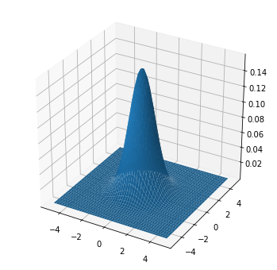


#### ヒント

- `plot_surface()`に軸に対応したデータを指定すると、曲面の描画が可能です。

#### 解答例


```python
import numpy as np
import matplotlib.pyplot as plt

# 3D描画を行うために必要なライブラリ
from mpl_toolkits.mplot3d import Axes3D

x = y = np.linspace(-5, 5)
X, Y = np.meshgrid(x, y)
Z = np.exp(-(X**2 + Y**2)/2) / (2*np.pi)

# Figureオブジェクトを作成
fig = plt.figure(figsize=(6, 6))
# 3D描画機能を持ったサブプロットaxを追加
ax = fig.add_subplot(1, 1, 1, projection="3d")

# 曲面を描画して表示してください
ax.plot_surface(X, Y, Z)

plt.show()
```


***

### 3.6.3 3Dヒストグラムを作成する

<b>3次元のヒストグラムや棒グラフ</b>は2つの要素の関係性を見出すのに有効な手法で、データセットの各要素をそれぞれx軸とy軸に対応させ、z軸方向に積み上げて表現します。<br>
`bar3d()`にx軸、y軸、z軸の位置と変化量に対応するデータを指定します。
```Python
# サブプロットが変数`ax`の場合
ax.bar3d(xpos, ypos, zpos, dx, dy, dz)
```

#### 問題

3Dヒストグラムを作成してください。<br>
- x軸, y軸, z軸に対応する位置データはそれぞれ変数xpos, ypos, zpos です。
- 増加量は変数dx, dy, dz です。


```python
import matplotlib.pyplot as plt
import numpy as np

# 3D描画を行うために必要なライブラリ
from mpl_toolkits.mplot3d import Axes3D

# Figureオブジェクトを作成
fig = plt.figure(figsize=(5, 5))
# サブプロットaxを追加
ax = fig.add_subplot(111, projection="3d")

# x, y, zの位置を決める
xpos = [i for i in range(10)]
ypos = [i for i in range(10)]
zpos = np.zeros(10)

# x, y, zの変化量を決める
dx = np.ones(10)
dy = np.ones(10)
dz = [i for i in range(10)]

# 3次元のbarを作成してください
ax.bar3d(xpos, ypos, zpos, dx, dy, dz)

plt.show()
```


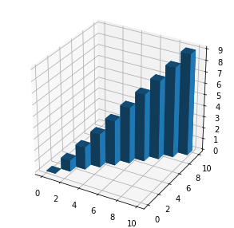


#### ヒント

- `bar3d()`に軸の位置データと値の変化量データを指定すると、3Dヒストグラムや棒グラフの描画が可能です。

#### 解答例


```python
import matplotlib.pyplot as plt
import numpy as np

# 3D描画を行うために必要なライブラリ
from mpl_toolkits.mplot3d import Axes3D

# Figureオブジェクトを作成
fig = plt.figure(figsize=(5, 5))
# サブプロットaxを追加
ax = fig.add_subplot(111, projection="3d")

# x, y, zの位置を決める
xpos = [i for i in range(10)]
ypos = [i for i in range(10)]
zpos = np.zeros(10)

# x, y, zの変化量を決める
dx = np.ones(10)
dy = np.ones(10)
dz = [i for i in range(10)]

# 3次元のbarを作成してください
ax.bar3d(xpos, ypos, zpos, dx, dy, dz)

plt.show()
```


***

### 3.6.4 3D散布図を作成する

<b>3次元の散布図</b>は互いに関係を持っている（または持っていると思われる）3種類のデータを3次元の空間上にプロットすることで<b>データの傾向を視覚的に予測するのに有効</b>です。<br>
`scatter3D()`にx軸、y軸、z軸に対応するデータを指定します。ただし、指定するデータは1次元でなければならないため、1次元のデータではない場合あらかじめ`np.ravel()`を用いてデータを変換します。
```Python
x = np.ravel(X)
# サブプロットが変数`ax`の場合
ax.scatter3D(x, y, z)
```

#### 問題

変数`X`, `Y`, `Z`ついてあらかじめ`np.ravel()`を用いて、それぞれ変数`x`, `y`, `z`に一次元に変換したデータをおいています。
- 3D散布図を作成してください。x軸, y軸, z軸に対応するデータはそれぞれ変数`x`, `y`, `z`です。


```python
import numpy as np
import matplotlib.pyplot as plt

# 3D描画を行うために必要なライブラリ
from mpl_toolkits.mplot3d import Axes3D

np.random.seed(0)
X = np.random.randn(1000)
Y = np.random.randn(1000)
Z = np.random.randn(1000)

# Figureオブジェクトを作成
fig = plt.figure(figsize=(6, 6))
# サブプロットaxを追加
ax = fig.add_subplot(111, projection="3d")

# 3D散布図を作成してください
ax.scatter3D(X, Y, Z)

plt.show()
```


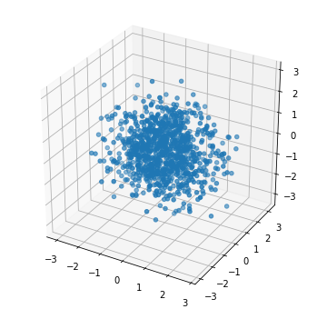


#### ヒント

- `scatter3D()`に軸のデータを指定すると、3D散布図の描画が可能です。

#### 解答例


```python
import numpy as np
import matplotlib.pyplot as plt

# 3D描画を行うために必要なライブラリ
from mpl_toolkits.mplot3d import Axes3D

np.random.seed(0)
X = np.random.randn(1000)
Y = np.random.randn(1000)
Z = np.random.randn(1000)

# Figureオブジェクトを作成
fig = plt.figure(figsize=(6, 6))
# サブプロットaxを追加
ax = fig.add_subplot(111, projection="3d")

# 3D散布図を作成してください
ax.scatter3D(X, Y, Z)

plt.show()
```


***

### 3.6.5 3Dグラフにカラーマップを適用する

色が単調な3Dグラフは凹凸が多い部分など見にくい場合があります。その場合は<b>グラフの点がとる座標に応じて表示する色を変える機能</b>を使用して見やすくすることができます。<br>
あらかじめ`matplotlib`から`cm`を`import`しておきます。データをプロットする際、`plot_surface()`に`cmap=cm.coolwarm`を指定すると、<b>z軸の値にカラーマップを適用できます</b>。
```Python
import matplotlib.cm as cm
# サブプロットが変数`ax`の場合
ax.plot_surface(X, Y, Z, cmap=cm.coolwarm)
```

#### 問題

変数`X`, `Y`, `Z` にはそれぞれx軸、y軸、z軸に対応したデータが用意されています。<br>
- サブプロットax にX, Y, Z をプロットし、z軸の値にカラーマップを適用してください。


```python
import numpy as np
import matplotlib.pyplot as plt

# 3D描画を行うために必要なライブラリ
from mpl_toolkits.mplot3d import Axes3D
# カラーマップを表示するためのライブラリ
from matplotlib import cm

t = np.linspace(-2*np.pi, 2*np.pi)
X, Y = np.meshgrid(t, t)
R = np.sqrt(X**2 + Y**2)
Z = np.sin(R)

# Figureオブジェクトを作成
fig = plt.figure(figsize=(6, 6))
# サブプロットaxを追加
ax = fig.add_subplot(111, projection="3d")

# サブプロットaxにzの値にカラーマップを適用してください
ax.plot_surface(X, Y, Z, cmap="coolwarm")

plt.show()
```


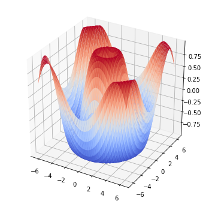


#### ヒント

- プロット時に`plot_surface()`に`cmap=cm.coolwarm`を指定すると、z軸の値にカラーマップを適用できます。

#### 解答例


```python
import numpy as np
import matplotlib.pyplot as plt

# 3D描画を行うために必要なライブラリ
from mpl_toolkits.mplot3d import Axes3D
# カラーマップを表示するためのライブラリ
from matplotlib import cm

t = np.linspace(-2*np.pi, 2*np.pi)
X, Y = np.meshgrid(t, t)
R = np.sqrt(X**2 + Y**2)
Z = np.sin(R)

# Figureオブジェクトを作成
fig = plt.figure(figsize=(6, 6))
# サブプロットaxを追加
ax = fig.add_subplot(111, projection="3d")

# サブプロットaxにzの値にカラーマップを適用してください
ax.plot_surface(X, Y, Z, cmap=cm.coolwarm)

plt.show()
```


***

## まとめ問題(提出不要)

 　このまとめ問題(提出不要)では、セトサ(setosa)、バーシクル(versicolor)、バージニカ(virginica)という3種類のあやめの4個の計測値(がく片長(Sepal Length)、がく片幅(Sepal Width)、花びら長(Petal Length)、花びら幅(Petal Width)と種(Species)からなる。)を用います。データを取得するには以下のコードが必要になります。
```python
import pandas as pd
# url元からirisデータを取得
df_iris = pd.read_csv("http://archive.ics.uci.edu/ml/machine-learning-databases/iris/iris.data", header=None)
df_iris.columns = ["sepal length", "sepal width", "petal length", "petal width", "class"]
```
　df_irisは150行5列からなるデータとなっており、0行目から50行目はセトサ、51行目から100行目まではバーシクル、101行目から150行目まではバージニカとなっています。

#### 問題

- irisデータを読み込み、変数x、yの値をそれぞれsepal length, sepal widthとしてプロットしてください。この作業を、setosa, versicolor, virginicaごとに行ってください。プロットの色はsetosaは赤、versicolorは青、virginicaは緑に対応させてください。それぞれへのラベルづけもしてください。図の体裁も指示にしたがって整えてください。


```python
import matplotlib.pyplot as plt
import pandas as pd
# irisデータを取得
df_iris = pd.read_csv(
    "http://archive.ics.uci.edu/ml/machine-learning-databases/iris/iris.data", header=None)
df_iris.columns = ["sepal length", "sepal width",
                   "petal length", "petal width", "class"]

# setosa, versicolor, verginicaに分割
df_setosa = df_iris.iloc[:50, :]
df_versicolor = df_iris.iloc[50:100, :]
df_verginica = df_iris.iloc[100: 150, :]

# 図のサイズを指定
fig = plt.figure(figsize=(10, 10))

# setosa の sepal length - sepal width の関係図を描いてください。
# ラベルをsetosa、色はredを指定してください。
plt.scatter(df_setosa["sepal length"], df_setosa["sepal width"], label="setosa", color="r")

# versicolor の sepal length - sepal width の関係図を描いてください。
# ラベルをversicolor、色はblueを指定してください。
plt.scatter(df_verginica["sepal length"], df_verginica["sepal width"], label="verginica", color="b")


# virginica の sepal length - sepal width の関係図を描いてください。
# ラベルをvirginica、色はgreenを指定してください。
plt.scatter(df_virginica["sepal length"], df_verginica["sepal width"], label="virginica", color="b")


# x軸名を sepal length にしてください。

# y軸名を sepal width にしてください。


# 図の表示をする。
plt.legend(loc="best")
plt.grid(True)
plt.show()
```


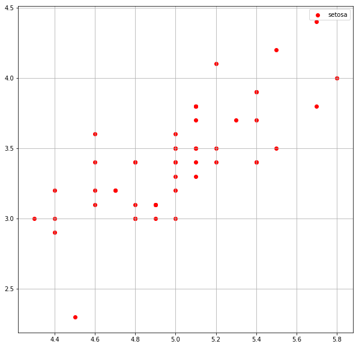


#### ヒント

- 例えば、`pandas.DataFrame`型である`df`という変数の`"sepal length"`というカラムを抜き出したい時は`df["sepal length"]`とすればできます。


#### 解答例


```python
import matplotlib.pyplot as plt
import pandas as pd
# irisデータを取得
df_iris = pd.read_csv(
    "http://archive.ics.uci.edu/ml/machine-learning-databases/iris/iris.data", header=None)
df_iris.columns = ["sepal length", "sepal width",
                   "petal length", "petal width", "class"]

# setosa, versicolor, verginicaに分割
df_setosa = df_iris.iloc[:50, :]
df_versicolor = df_iris.iloc[50:100, :]
df_verginica = df_iris.iloc[100: 150, :]

# 図のサイズを指定
fig = plt.figure(figsize=(10, 10))

# setosa の sepal length - sepal width の関係図を描いてください。
# ラベルをsetosa、色はredを指定してください。
plt.scatter(df_setosa["sepal length"], df_setosa["sepal width"],  label="setosa", color="r")

# versicolor の sepal length - sepal width の関係図を描いてください。
# ラベルをversicolor、色はblueを指定してください。
plt.scatter(df_versicolor["sepal length"], df_versicolor["sepal width"], label="versicolor", color="b")

# virginica の sepal length - sepal width の関係図を描いてください。
# ラベルをvirginica、色はgreenを指定してください。
plt.scatter(df_verginica["sepal length"], df_verginica["sepal width"], label="virginica", color="g")

# x軸名を sepal length にしてください。
plt.xlabel("sepal length")
# y軸名を sepal width にしてください。
plt.ylabel("sepal width")

# 図の表示をする。
plt.legend(loc="best")
plt.grid(True)
plt.show()
```


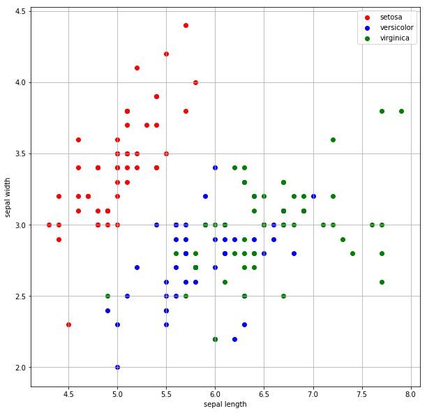


***
