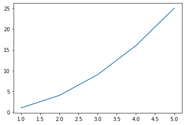
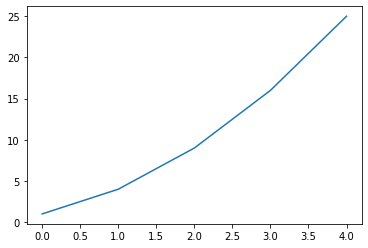
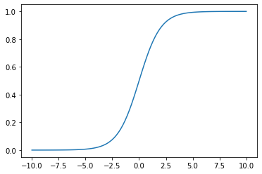
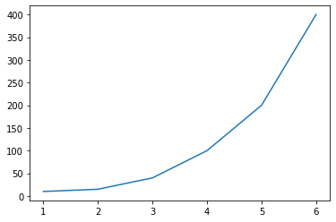
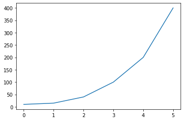
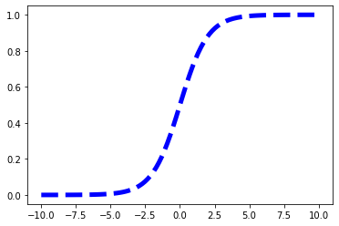
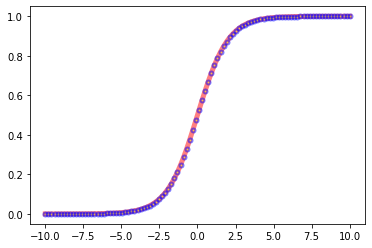
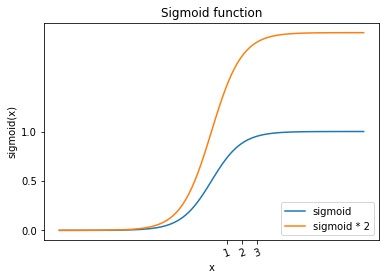
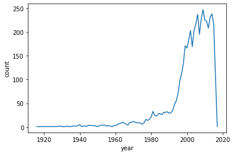
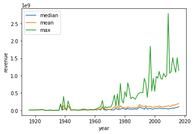

# プロット plt.plot()


```python
import numpy as np
import pandas as pd
import matplotlib.pyplot as plt
# magic commandでjupyterに図が描画されるようにする
%matplotlib inline
```


```python
# x, yのリストを指定し描画
x = [1, 2, 3, 4, 5]
# y = [1, 4, 8, 16, 25]
y = np.array(x)**2
plt.plot(x, y)
```


    [<matplotlib.lines.Line2D at 0x7fdd284ea550>]





```python
# xを省略すると，indexの0, 1, 2... がx軸(横軸)の値になる
plt.plot(y)
```


    [<matplotlib.lines.Line2D at 0x7fdd23702dd0>]





```python
# シグモイド関数
x = np.linspace(-10, 10, 100)
z = 1 / (1+np.exp(-x))
plt.plot(x, z)
```


    [<matplotlib.lines.Line2D at 0x7fdd229ea410>]





```python
# DataFrameを使う
df = pd.DataFrame({'a': [1, 2, 3, 4, 5, 6],
     'b': [10, 15, 40, 100, 200, 400]})
# 'b'はmatplotlibのパラメータで使える文字列なのでWarningがでる
plt.plot('a', 'b', data=df)
```

    /opt/anaconda3/lib/python3.7/site-packages/ipykernel_launcher.py:5: RuntimeWarning: Second argument 'b' is ambiguous: could be a color spec but is in data; using as data.  Either rename the entry in data or use three arguments to plot.
      """


    [<matplotlib.lines.Line2D at 0x7fdd284a45d0>]





```python
# Seriesを入れたら，indexがxの値になる
plt.plot(df['b'])
```


    [<matplotlib.lines.Line2D at 0x7fdd21ce9290>]





### 装飾

- color: b, r, g, y
- style: -, --, *, o
- lenght: linewidth引数で指定


```python
plt.plot(x, z, 'b--', linewidth=5)
```


    [<matplotlib.lines.Line2D at 0x7fdd21d5b650>]





- color : グラフの線の色　⇨　’red’や’green’のように色の名前を指定します．’r’や’g’のように頭文字でもOKです．
- lw (line width) : 線の太さ　⇨　数字です．好みの大きさにしてください
- ls (line style) : 線の種類　⇨　’-‘や’--‘のように指定します．よく使うのはこの二つのどちらかです．
- marker : マーカーの種類　⇨　’o’や’x’ように指定します．マーカーの形が変わります．
- markersize : マーカーの大きさ　⇨　数字です．好みの大きさにしてください
- markerfacecolor : マーカーの色　⇨　’red’や’green’のように色の名前を指定します．’r’や’g’のように頭文字でもOKです．
- markeredgecolor : マーカーの枠に色　⇨　’red’や’green’のように色の名前を指定します．’r’や’g’のように頭文字でもOKです．
- markeredgewidth : マーカーの枠の太さ　⇨　数字です．好みの大きさにしてください
- alpha : plotの透明度　⇨　0から1の間をfloatで指定します．0に近い程透明度が上がります．


```python
plt.plot(x, z,
         color='red',
         lw=5,
         ls='-',
         marker='o',
         markersize=2,
         markerfacecolor='yellow',
         markeredgecolor='blue',
         markeredgewidth=4,
         alpha=0.5
        )
```


    [<matplotlib.lines.Line2D at 0x7fdd22382f10>]





## 付属情報の追加

- plt.xlabel()でx軸にラベルをつける
- plt.ylabel()でy軸にラベルをつける
- plt.title()で図にタイトルをつける
- plt.plot(label=’ラベル’)でplotにラベルをつけ, plt.legend()で凡例をつける
- plt.xticks()でx軸に任意のticksをつける
- plt.yticks()でy軸に任意のticksをつける
- plt.axis(‘off’)で軸を消す


```python
plt.plot(x, z, label='sigmoid')
# ２つのグラフを表示する場合はもう１つplt.plotを作ればOK
plt.plot(x, 2*z, label='sigmoid * 2')
plt.xlabel('x')
plt.ylabel('sigmoid(x)')
plt.title('Sigmoid function')
plt.legend(loc=4)
plt.xticks([1, 2, 3], rotation=20)
plt.yticks([0, 0.5, 1])
```


    ([<matplotlib.axis.YTick at 0x7fdd22036910>,
      <matplotlib.axis.YTick at 0x7fdd21d26ed0>,
      <matplotlib.axis.YTick at 0x7fdd21d43f50>],
     <a list of 3 Text yticklabel objects>)





```python
# 年代別のrevenueの平均推移のグラフを描画
df = pd.read_csv('../../data/138_4508_bundle_archive/tmdb_5000_movies.csv')
# yeah項目をrelease_dateから作成
df = df.dropna(subset=['release_date'])
df['year'] = df['release_date'].apply(lambda x: int(x[:4]))
```


```python
# レコード数の年代推移
df = df.sort_values('year')
plt.plot(df.groupby('year').count()['id'])
plt.xlabel('year')
plt.ylabel('count')
```


    Text(0, 0.5, 'count')





```python
# revenueの年代の推移を見てみる
df = df[df['revenue']!=0]
plt.plot(df.groupby('year').median()['revenue'], label='median')
plt.plot(df.groupby('year').mean()['revenue'], label='mean')
plt.plot(df.groupby('year')['revenue'].max(), label='max')
plt.legend()
plt.xlabel('year')
plt.ylabel('revenue')
```


    Text(0, 0.5, 'revenue')




