# pltの保存 png pdf


```python
import numpy as np
import pandas as pd
import matplotlib.pyplot as plt
%matplotlib inline
```

## png保存


```python
df = pd.read_csv('../../data/138_4508_bundle_archive/tmdb_5000_movies.csv')

# png形式で保存
plt.scatter('runtime', 'budget', data=df, alpha=0.3)
plt.xlabel('runtime')
plt.ylabel('budget')
plt.savefig('runtim_budget_scatter.png')
```


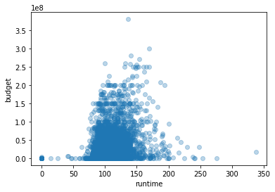


```python
# オブジェクト指向ではfig.savefig('パス')
fig, axes = plt.subplots(2, 1, figsize=(10, 3))
x = np.linspace(-3, 3, 100)
# cosine
axes[0].set_title('cosine')
axes[0].plot(x, np.cos(x))
# sine
axes[1].set_title('sine')
axes[1].plot(x, np.sin(x))
fig.tight_layout()
fig.savefig('cos_sin.png')
```


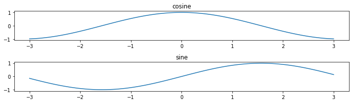


## pdf保存


```python
# PdfPagesをimport
from matplotlib.backends.backend_pdf import PdfPages
# pdfインスタンス作成
pdf = PdfPages('pdf_file.pdf')
fig, axes = plt.subplots()
axes.plot(x, x**2)
pdf.savefig(fig)
# pdfを閉じて保存を完了します
pdf.close()
```


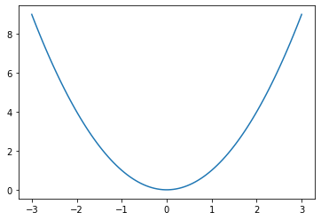


```python
# 複数の図をpdfに保存する
pdf = PdfPages('savemultifig_sample.pdf')
for i in range(0, 10):
    #------グラフ作成--------
    fig, axes = plt.subplots()
    #グラフの形状が徐々にかわるように適当に設計
    axes.plot(x, x**i)
    #タイトル．pdfで文字検索が可能なので便利
    axes.set_title('x^{}'.format(i))
    #-----------------------
 
    #forループのなかで保存
    pdf.savefig(fig)
# close処理
pdf.close()
```


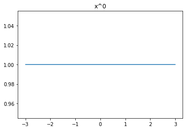


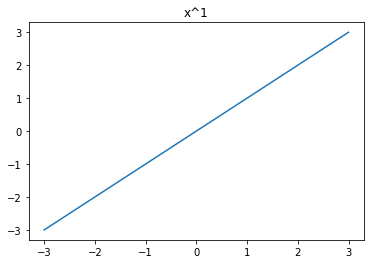


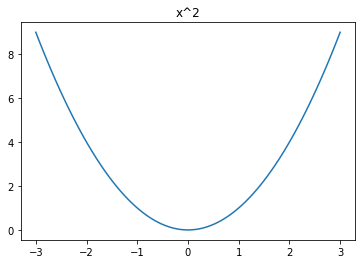


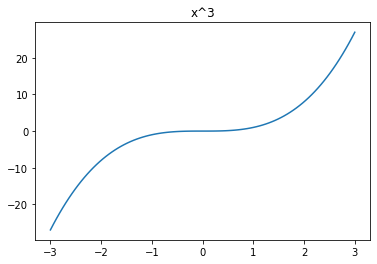


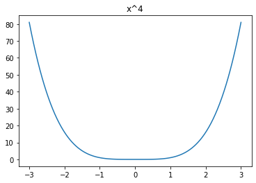


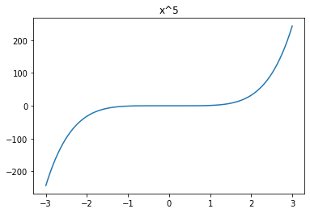


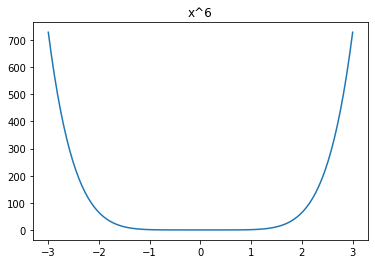


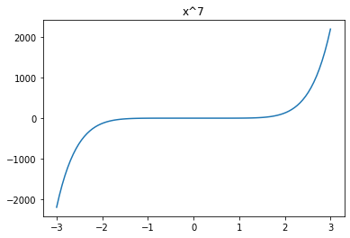


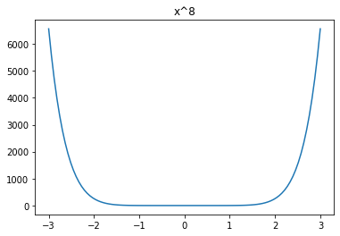


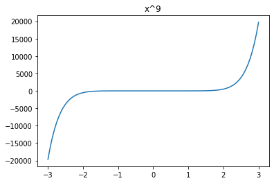


```python

```
