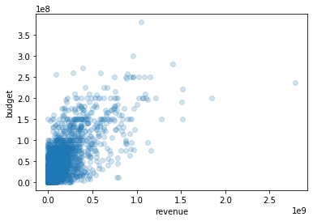
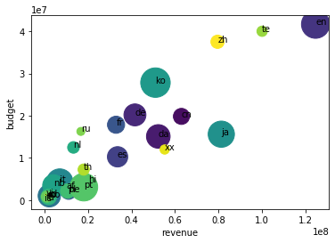

# 散布図 plt.scatter()


```python
import numpy as np
import pandas as pd
import matplotlib.pyplot as plt
%matplotlib inline
```


```python
df = pd.read_csv('../../data/138_4508_bundle_archive/tmdb_5000_movies.csv')
# revenueとbudgetの散布図
plt.scatter(df['revenue'], df['budget'], alpha=0.2)
# data引数を使ってもOK
# plt.scatter('revenue', 'budget', data=df, alpha=0.2)
plt.xlabel('revenue')
plt.ylabel('budget')
```


    Text(0, 0.5, 'budget')




`alpha`を設定することでデータの重なりを見えるようにできます。

```python
# マーカーのサイズに意味を持たせることも
df = df[(df['revenue'] != 0) & (df['budget'] != 0)]
# 'original_language'でグループ化された'revenue', 'budget', 'vote_count'を取得
lang_group_df = df.groupby('original_language').mean()[['revenue', 'budget', 'vote_count']]
c = np.arange(len(lang_group_df))
plt.scatter('revenue', 'budget',c=c, s='vote_count' ,data=lang_group_df)
# 各マーカーにtextをいれる
for idx, row in lang_group_df.iterrows():
    plt.annotate(idx, (row['revenue'], row['budget']))
plt.xlabel('revenue')
plt.ylabel('budget')
```


    Text(0, 0.5, 'budget')



