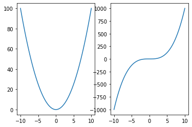
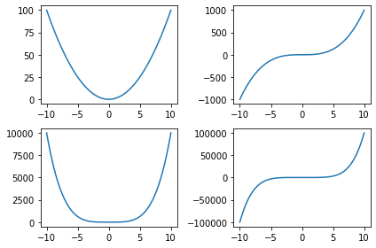
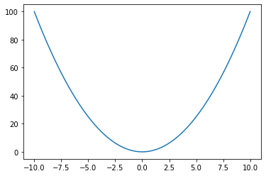
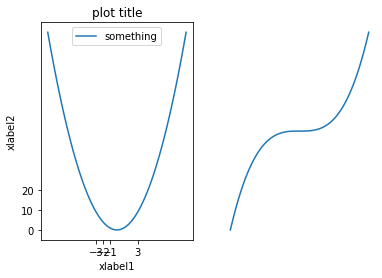

# 複数のグラフを描画する plt.subplot() plt.figure axes.set_xx()


```python
import numpy as np
import pandas as pd
import matplotlib.pyplot as plt
# magic commandでjupyterに図が描画されるようにする
%matplotlib inline
```

## plt.subplot(nrows, ncols, index)


```python
x = np.linspace(-10, 10, 100)

# 1行2列の図示、indexは1から
plt.subplot(1, 2, 1)
# plt.subplot(121) #この書き方も可能
plt.plot(x, x**2)

plt.subplot(1, 2, 2)
plt.plot(x, x**3)
```


    [<matplotlib.lines.Line2D at 0x7f51ae23c990>]





## plt.figureオブジェクト


```python
fig = plt.figure()
type(fig)
```


    matplotlib.figure.Figure


    <Figure size 432x288 with 0 Axes>


```python
fig = plt.figure()
# subplotを足していくイメージ．axesオブジェクトを作っていく
ax1 = fig.add_subplot(1, 2, 1)
ax2 = fig.add_subplot(1, 2, 2)

ax1.plot(x, x**2)
ax2.plot(x, x**3)
```


    [<matplotlib.lines.Line2D at 0x7f51ac560dd0>]


```python
# 複数行列を作る
fig, axes = plt.subplots(nrows=2, ncols=2)
# [行, 列]でindexingする
axes[0, 0].plot(x, x**2)
axes[0, 1].plot(x, x**3)
axes[1, 0].plot(x, x**4)
axes[1, 1].plot(x, x**5)
# 軸のラベル等が被ってみにくい時は
fig.tight_layout()
```





```python
#１つの場合でも使える
fig, axes = plt.subplots() #デフォルトはnros=1, ncols=1
axes.plot(x, x**2)
```


    [<matplotlib.lines.Line2D at 0x7f51ac4aa810>]





## 付属情報(axes.set_xx())


```python
fig, axes = plt.subplots(nrows=1, ncols=2)
axes[0].plot(x, x**2, label='something')
axes[1].plot(x, x**3)
axes[0].set_xlabel('xlabel1')
axes[0].set_ylabel('xlabel2')
axes[0].set_title('plot title')
axes[0].set_xticks([-3, -2, -1, 3])
axes[0].set_yticks([0, 10, 20])
axes[0].legend()
axes[1].axis('off')
```


    (-11.0, 11.0, -1100.0, 1100.0)




