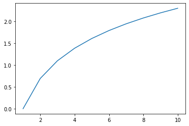
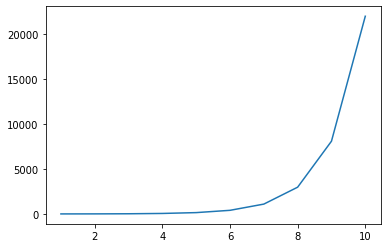

# 数学で使用できる関数


```python
import numpy as np
```

## 平方根


```python
# 平方根 (square root)
np.sqrt([1, 2, 3, 4])
```


    array([1.        , 1.41421356, 1.73205081, 2.        ])


## Log


```python
ndarray = np.linspace(1, 10, 10)
print(ndarray)
# Log関数 (logarithm)
# 底はe(ネイピア数)
logndarray = np.log(ndarray)
print(logndarray)
```

    [ 1.  2.  3.  4.  5.  6.  7.  8.  9. 10.]
    [0.         0.69314718 1.09861229 1.38629436 1.60943791 1.79175947
     1.94591015 2.07944154 2.19722458 2.30258509]


```python
#グラフ描画用ライブラリのimport
import matplotlib.pyplot as plt
%matplotlib inline
plt.plot(ndarray, logndarray)
```


    [<matplotlib.lines.Line2D at 0x7ff37df35690>]





## 指数関数


```python
# 指数関数(Exponential function)
# 底はe(ネイピア数)
expndarray = np.exp(ndarray)
print(expndarray)
```

    [2.71828183e+00 7.38905610e+00 2.00855369e+01 5.45981500e+01
     1.48413159e+02 4.03428793e+02 1.09663316e+03 2.98095799e+03
     8.10308393e+03 2.20264658e+04]


```python
plt.plot(ndarray, expndarray)
```


    [<matplotlib.lines.Line2D at 0x7ff37d04ed50>]





## ネイピア数


```python
#ネイピア数
np.e
```


    2.718281828459045


## 合計 np.sum()


```python
array = np.arange(1, 11)
print(array)
```

    [ 1  2  3  4  5  6  7  8  9 10]


```python
# 要素の総和 (summation)
np.sum(array)
```


    55


```python
array = array.reshape(2, 5)
array
```


    array([[ 1,  2,  3,  4,  5],
           [ 6,  7,  8,  9, 10]])


```python
# axis引数で行，列別に計算できる
# 列ごとの合計
np.sum(array, axis=0)
```


    array([ 7,  9, 11, 13, 15])


```python
# 行ごとの合計
np.sum(array, axis=1)
```


    array([15, 40])


## 絶対値 np.abs()


```python
array = np.arange(-10, 0)
array
```


    array([-10,  -9,  -8,  -7,  -6,  -5,  -4,  -3,  -2,  -1])


```python
#　絶対値 (absolute value)
np.abs(array)
```


    array([10,  9,  8,  7,  6,  5,  4,  3,  2,  1])


