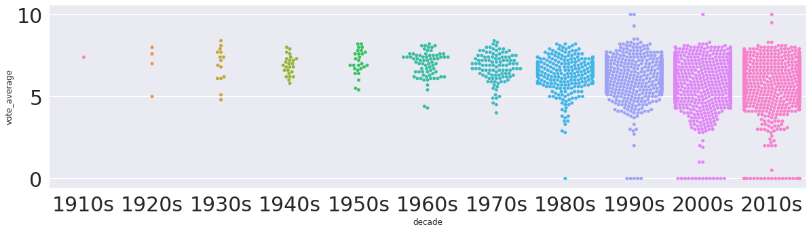

# Categorical Plot


```python
# seabornはsnsとしてインポート
import seaborn as sns
%matplotlib inline
import numpy as np
import pandas as pd
import matplotlib.pyplot as plt
sns.set()
```


```python
df = pd.read_csv('../../data/138_4508_bundle_archive/tmdb_5000_movies.csv')
```


```python
# vote averageが下位50%だったらlow, 上位50%だったらhigh
df['evaluation'] = df['vote_average'].apply(lambda x: 'high' if df['vote_average'].median() > x else 'low')
```

## sns.barplot()


```python
sns.barplot(x='evaluation', y='revenue', data=df)
```


    <matplotlib.axes._subplots.AxesSubplot at 0x7f3b38873090>


棒グラフの他に<br>`evaluation`ごとのグループの平均値を見ることができます。<br>また、95％信頼区間でのエラーバーを表示することができます。


```python
# 中央値の棒グラフを表示
sns.barplot(x='evaluation', y='revenue', data=df, estimator=np.median)

```


    <matplotlib.axes._subplots.AxesSubplot at 0x7f3b380321d0>


## sns.countplot()

カテゴリー別にカウント行う関数です。


```python
# yeah項目をrelease_dateから作成
df = df.dropna(subset=['release_date'])
df['year'] = df['release_date'].apply(lambda x: x[:4])
```


```python
# 西暦別のカウント
# countplotの戻り値はmatplotlibのaxes
ax = sns.countplot(x='year', data=df, hue='evaluation')
# 90°回転してlabelsizeを小さくして表示
ax.tick_params(rotation=90, labelsize=6)
```


```python
# 年代カラム（10年ごとのカラムを作成）
df['decade'] = df['release_date'].apply(lambda x: x[:3] + '0s')
sns.countplot(x='decade', data=df.sort_values('decade'), hue='evaluation')
```


    <matplotlib.axes._subplots.AxesSubplot at 0x7f3b37334ed0>


昔の物が評価が高いことが分かります。

## sns.boxplot()


```python
sns.boxplot(x='decade', y='vote_average', data=df.sort_values('decade'))
```


    <matplotlib.axes._subplots.AxesSubplot at 0x7f3b37da3bd0>


年代が上がるにしたがって評価が下がっていることが分かります。<br>データの分布は確認することができません。<br>データの分布も確認したい場合は`sns.violinplot()`を使用します。

## sns.violinplot()


```python
sns.violinplot(x='decade', y='vote_average', data=df.sort_values('decade'))
```


    <matplotlib.axes._subplots.AxesSubplot at 0x7f3b37de40d0>


ボックスプロットと比べてデータの分布が分かるような分布図になっています。

## sns.swarmplot()

データ数の違うデータ同士を見比べたいときに使用します。


```python
sns.swarmplot(x='decade', y='vote_average', data=df.sort_values('decade'))
```


    <matplotlib.axes._subplots.AxesSubplot at 0x7f3b3664cad0>


実行に時間がかかりますが、実際のデータ分布を表示してくれます。<br>ただし、データ数が増えるとデータが重なり違いが分かり難くなります。


```python
# 図の大きさを変更する
fig, ax = plt.subplots(figsize=(20, 5))
# ラベルの文字の大きさを変更する
ax.tick_params(labelsize=30)
sns.swarmplot(ax=ax, x='decade', y='vote_average', data=df.sort_values('decade'))
```


    <matplotlib.axes._subplots.AxesSubplot at 0x7f3b35d0d5d0>





だいたいのデータの分布が分かります。
