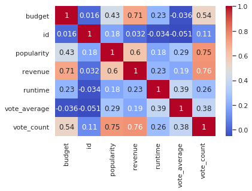
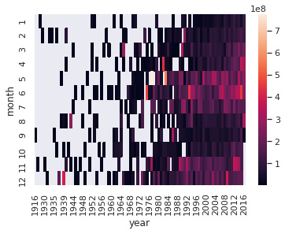

# Heatmap sns.heatmap()


```python
import seaborn as sns
%matplotlib inline
import numpy as np
import pandas as pd
import matplotlib.pyplot as plt
sns.set()
```


```python
df = pd.read_csv('../../data/138_4508_bundle_archive/tmdb_5000_movies.csv')
```


```python
# 相関表 (Correlation Matrix)
# 値が0を含むrow（行）を除く
df = df[(df!=0).all(axis=1)]
# 相関表
corr = df.corr()
corr
```


<div>
<style scoped>
    .dataframe tbody tr th:only-of-type {
        vertical-align: middle;
    }

    .dataframe tbody tr th {
        vertical-align: top;
    }

    .dataframe thead th {
        text-align: right;
    }
</style>
<table border="1" class="dataframe">
  <thead>
    <tr style="text-align: right;">
      <th></th>
      <th>budget</th>
      <th>id</th>
      <th>popularity</th>
      <th>revenue</th>
      <th>runtime</th>
      <th>vote_average</th>
      <th>vote_count</th>
    </tr>
  </thead>
  <tbody>
    <tr>
      <th>budget</th>
      <td>1.000000</td>
      <td>0.015819</td>
      <td>0.431744</td>
      <td>0.705306</td>
      <td>0.229712</td>
      <td>-0.035757</td>
      <td>0.539997</td>
    </tr>
    <tr>
      <th>id</th>
      <td>0.015819</td>
      <td>1.000000</td>
      <td>0.180645</td>
      <td>0.031826</td>
      <td>-0.034371</td>
      <td>-0.050815</td>
      <td>0.109066</td>
    </tr>
    <tr>
      <th>popularity</th>
      <td>0.431744</td>
      <td>0.180645</td>
      <td>1.000000</td>
      <td>0.602122</td>
      <td>0.182388</td>
      <td>0.288189</td>
      <td>0.749005</td>
    </tr>
    <tr>
      <th>revenue</th>
      <td>0.705306</td>
      <td>0.031826</td>
      <td>0.602122</td>
      <td>1.000000</td>
      <td>0.233236</td>
      <td>0.188014</td>
      <td>0.756143</td>
    </tr>
    <tr>
      <th>runtime</th>
      <td>0.229712</td>
      <td>-0.034371</td>
      <td>0.182388</td>
      <td>0.233236</td>
      <td>1.000000</td>
      <td>0.386199</td>
      <td>0.258101</td>
    </tr>
    <tr>
      <th>vote_average</th>
      <td>-0.035757</td>
      <td>-0.050815</td>
      <td>0.288189</td>
      <td>0.188014</td>
      <td>0.386199</td>
      <td>1.000000</td>
      <td>0.380825</td>
    </tr>
    <tr>
      <th>vote_count</th>
      <td>0.539997</td>
      <td>0.109066</td>
      <td>0.749005</td>
      <td>0.756143</td>
      <td>0.258101</td>
      <td>0.380825</td>
      <td>1.000000</td>
    </tr>
  </tbody>
</table>
</div>


```python
# 相関表の図示
# annot=Trueで数値を表示
# cmapでカラー表示を変更できます
sns.heatmap(corr, annot=True, cmap='coolwarm')
```


    <matplotlib.axes._subplots.AxesSubplot at 0x7fb71f7d5610>





```python
df['year'] = df['release_date'].apply(lambda x: int(x[:4]))
df['month'] = df['release_date'].apply(lambda x: int(x[5:7]))
```


```python
# ヒートマップのためにデータフレームで受け取りたいのでリストで渡します
# revenue_df = 
df.pivot_table
revenue_df = df.groupby(['year', 'month']).mean()[['revenue']].pivot_table(index='month', columns='year', values='revenue')
sns.heatmap(revenue_df)
```


    <matplotlib.axes._subplots.AxesSubplot at 0x7fb71cbece90>





このデータを見る限りデータはmonthに影響を受けそうです。
