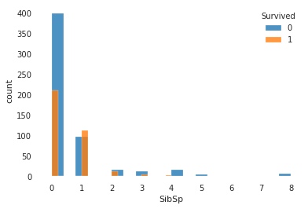
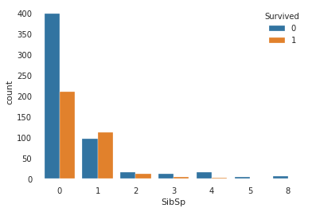
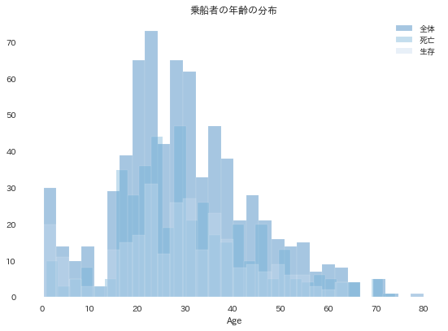

# ヒストグラムの表示

```python
# SibSp配偶者の数と目的変数との関係
plt.hist(train.loc[train['Survived'] == 0, 'SibSp'].dropna(), bins=20, alpha=0.8, label='0')
plt.hist(train.loc[train['Survived'] == 1, 'SibSp'].dropna(), bins=20, alpha=0.8, label='1')
plt.xlabel('SibSp')
plt.ylabel('count')
plt.legend(title='Survived')
plt.show()
```


```python
sns.countplot(x='SibSp', hue='Survived', data=train)
plt.legend(loc='upper right', title='Survived')
```



```python
import pandas as pd

# トレーニングデータ、テストデータを読み込み
train = pd.read_csv('../input/titanic/train.csv')
test = pd.read_csv('../input/titanic/test.csv')

import matplotlib as mpl
import matplotlib.pyplot as plt
import seaborn as sns
import japanize_matplotlib

# 全体のヒストグラム
sns.distplot(train['Age'].dropna(), kde=False, bins=30 ,label='全体')

# 死亡者のヒストグラム
sns.distplot(train[train['Survived'] == 0].Age.dropna(), kde=False, bins=30, label='死亡')

# 生存者のヒストグラム
sns.distplot(train[train['Survived'] == 1].Age.dropna(), kde=False, bins=30, label='生存')

plt.title('乗船者の年齢の分布') # タイトル
plt.legend(); # 凡例を表示
plt.tight_layout()
plt.show()
```

### 書式

	sns.distplot(train['Age'].dropna(), kde=False, bins=30 ,label='全体')

### 例

```python
import pandas as pd

# トレーニングデータ、テストデータを読み込み
train = pd.read_csv('../input/titanic/train.csv')
test = pd.read_csv('../input/titanic/test.csv')

import matplotlib as mpl
import matplotlib.pyplot as plt
import seaborn as sns
import japanize_matplotlib

# 全体のヒストグラム
sns.distplot(train['Age'].dropna(), kde=False, bins=30 ,label='全体')

# 死亡者のヒストグラム
sns.distplot(train[train['Survived'] == 0].Age.dropna(), kde=False, bins=30, label='死亡')

# 生存者のヒストグラム
sns.distplot(train[train['Survived'] == 1].Age.dropna(), kde=False, bins=30, label='生存')

plt.title('乗船者の年齢の分布') # タイトル
plt.legend(); # 凡例を表示
plt.show()


# 年齢を８等分し、CategoricalAgeという変数を作成
train['CategoricalAge'] = pd.cut(train['Age'], 8)
​
# CategoricalAgeとSurvivedをクロス集計する
display(pd.crosstab(train['CategoricalAge'], train['Survived']))
​
# クロス集計しCategoricalAgeごとに正規化する
display(pd.crosstab(train['CategoricalAge'], train['Survived'], normalize='index'))

```



```
Survived	0	1
CategoricalAge		
(0.34, 10.368]	26	38
(10.368, 20.315]	71	44
(20.315, 30.263]	146	84
(30.263, 40.21]	86	69
(40.21, 50.158]	53	33
(50.158, 60.105]	25	17
(60.105, 70.052]	13	4
(70.052, 80.0]	4	1


Survived	0	1
CategoricalAge		
(0.34, 10.368]	0.406250	0.593750
(10.368, 20.315]	0.617391	0.382609
(20.315, 30.263]	0.634783	0.365217
(30.263, 40.21]	0.554839	0.445161
(40.21, 50.158]	0.616279	0.383721
(50.158, 60.105]	0.595238	0.404762
(60.105, 70.052]	0.764706	0.235294
(70.052, 80.0]	0.800000	0.200000
```

### 説明

