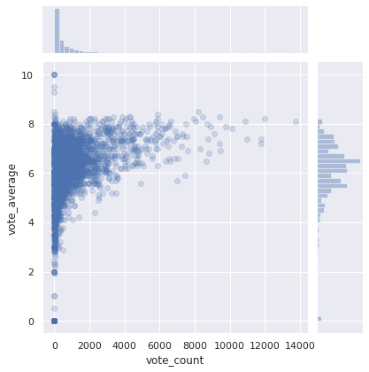
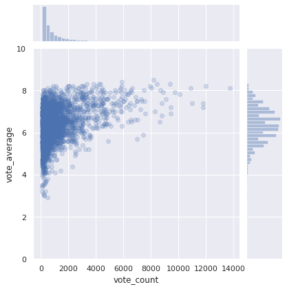
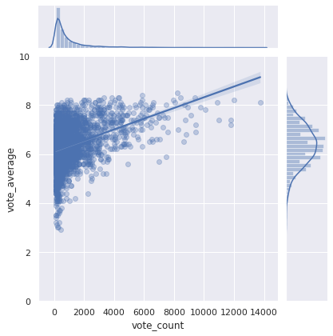
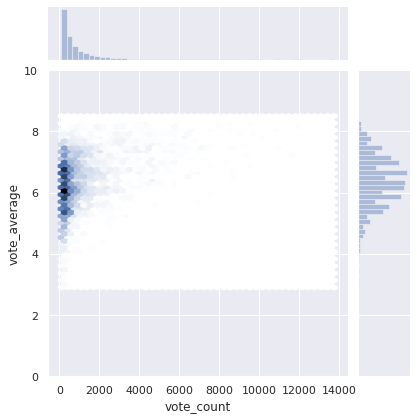
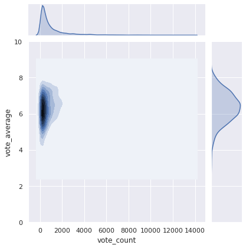
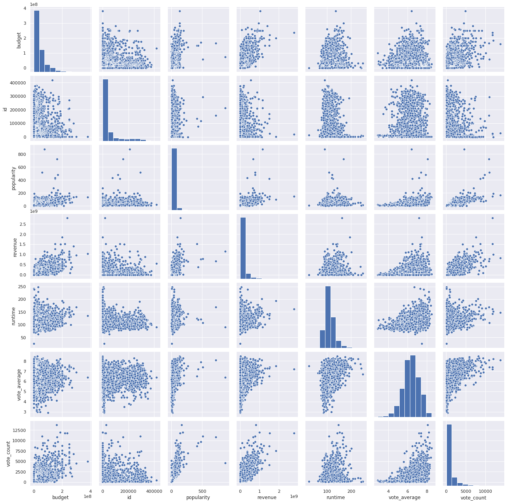
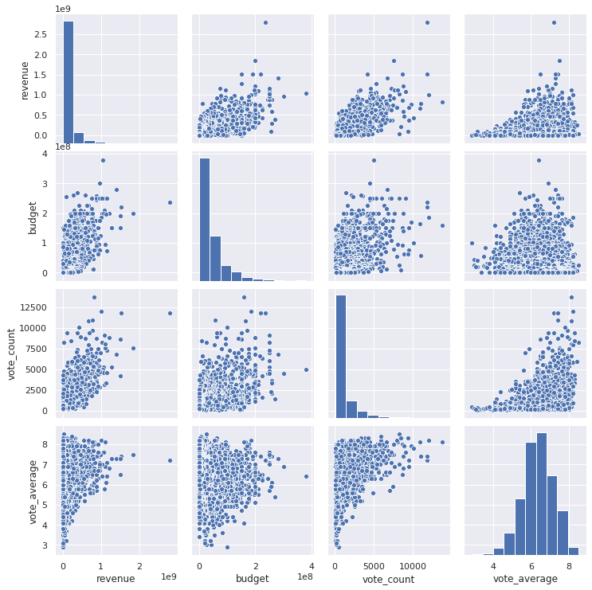
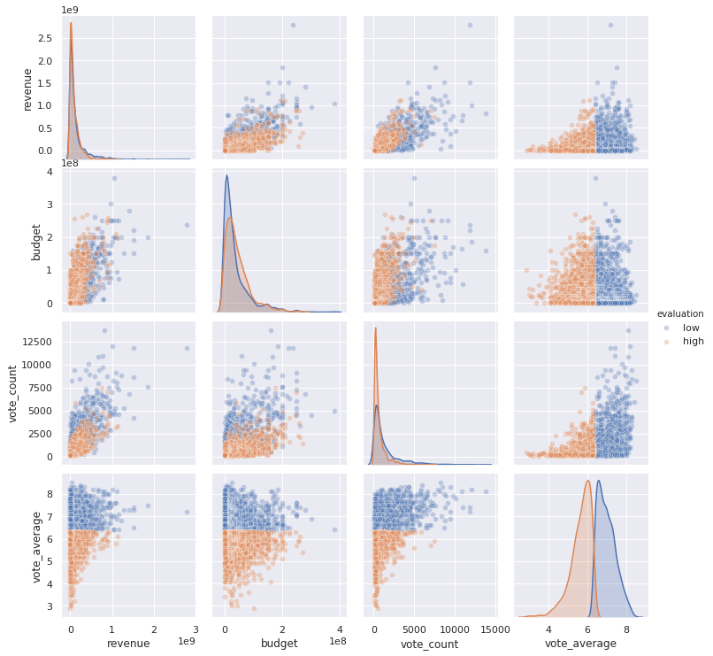

# 散布図+ヒストグラム sns.jointplot()


```python
# seabornはsnsとしてインポート
import seaborn as sns
%matplotlib inline
import numpy as np
import pandas as pd
import matplotlib.pyplot as plt
sns.set()
```


```python
df = pd.read_csv('../../data/138_4508_bundle_archive/tmdb_5000_movies.csv')
```


```python
# 散布図+ヒストグラム
sns.jointplot(x='vote_count', y='vote_average', data=df, alpha=0.2)
```


    <seaborn.axisgrid.JointGrid at 0x7f132c482f10>





散布図と合わせてヒストグラムを見ることで`vote_count`にかなり偏りがあることが分かります。


```python
# 極端にvote_countの少ない信ぴょう性の低いデータは除去
df = pd.read_csv('../../data/138_4508_bundle_archive/tmdb_5000_movies.csv')
df = df[df['vote_count'] > 100]

sns.jointplot(x='vote_count', y='vote_average', data=df, alpha=0.2)
plt.ylim(0, 10)
```


    (0, 10)





`kind='reg'`を指定することで関係性を表示することができます。<br>alphaを指定したいときは、`joint_kws={'scatter_kws': {'alpha':0.3}}`を指定します。


```python
# 極端にvote_countの少ない信ぴょう性の低いデータは除去
df = pd.read_csv('../../data/138_4508_bundle_archive/tmdb_5000_movies.csv')
df = df[df['vote_count'] > 100]

sns.jointplot(x='vote_count', y='vote_average', data=df, kind='reg', joint_kws={'scatter_kws': {'alpha':0.3}})
plt.ylim(0, 10)
```


    (0, 10)





`kind=hex`を指定することで値の多いところの濃淡を濃く示してくれます。


```python
sns.jointplot(x='vote_count', y='vote_average', data=df, kind='hex')
plt.ylim(0, 10)
```


    (0, 10)





`kind=hkde`を指定することでそれぞれの確率密度関数を重ねた表示をしてくれます。


```python
sns.jointplot(x='vote_count', y='vote_average', data=df, kind='kde')
plt.ylim(0, 10)
```


    (0, 10)





# sns.pasirplot()


```python
# DataFrameの全ての数値カラムでpairplotを作る
sns.pairplot(df)
```


    <seaborn.axisgrid.PairGrid at 0x7f132b981ed0>





```python
# 必要なカラムだけpairplot
sns.pairplot(df[['revenue', 'budget', 'vote_count', 'vote_average']])
```


    <seaborn.axisgrid.PairGrid at 0x7f132a344f90>





カテゴリごとに色分けを行う場合


```python
# vote averageが下位50%だったらlow, 上位50%だったらhigh
df['evaluation'] = df['vote_average'].apply(lambda x: 'high' if df['vote_average'].median() > x else 'low')
sns.pairplot(df[['revenue', 'budget', 'vote_count', 'vote_average', 'evaluation']],
             hue='evaluation',
             plot_kws={'alpha':0.3},
             # diag_kind='hist'
            )
```


    <seaborn.axisgrid.PairGrid at 0x7f132b968610>





評価が高かったものと低かったもので色分けができました。
