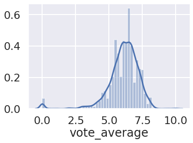
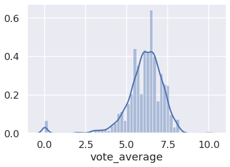
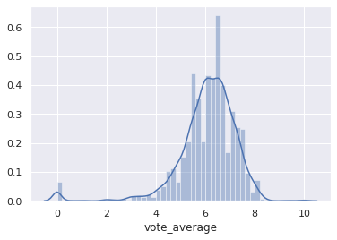
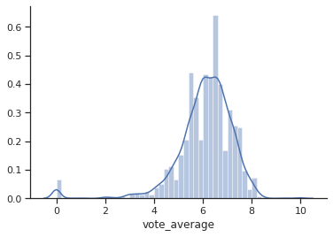
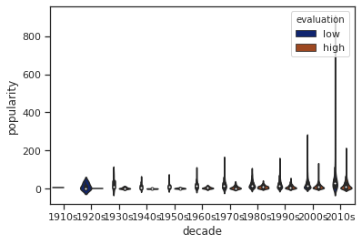
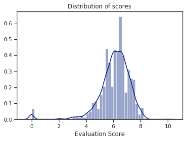
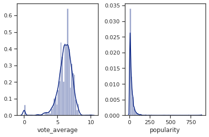

# スタイル変更 sns.set()

- `cnotext`引数:’paper’, ‘notebook’, ‘talk’, ‘poster’<br>seabornで表示する全体のスタイルを変更します。

- `style`引数：‘darkgrid’, ‘whitegrid’, ‘dark’, ‘white’, ‘ticks’<br>図字する際の背景の状態を設定します。
- `palette`引数: deep, muted, bright, pastel, dark, colorblind<br>参考：[https://matplotlib.org/3.1.3/tutorials/colors/colormaps.html](https://matplotlib.org/3.1.3/tutorials/colors/colormaps.html)<br>カラーマップのを設定


```python
import seaborn as sns
%matplotlib inline
import numpy as np
import pandas as pd
import matplotlib.pyplot as plt
```


```python
df = pd.read_csv('../../data/138_4508_bundle_archive/tmdb_5000_movies.csv')
```

### cnotext引数


```python
# 全体的に文字が大きくポスタ－で使用するのに適した形にします
sns.set(context='poster')
# sns.set_context('poster')    # これでもsns.set(context='poster')と同じように動作します
```


```python
sns.distplot(df['vote_average'])
```


    <matplotlib.axes._subplots.AxesSubplot at 0x7f013dff7810>





```python
sns.set(context='talk')
sns.distplot(df['vote_average'])
```


    <matplotlib.axes._subplots.AxesSubplot at 0x7f013c83e050>





### style引数


```python
sns.set(context='notebook', style='whitegrid')
sns.distplot(df['vote_average'])
```


    <matplotlib.axes._subplots.AxesSubplot at 0x7f013c73a750>


```python
sns.set(context='notebook', style='darkgrid')
sns.distplot(df['vote_average'])
```


    <matplotlib.axes._subplots.AxesSubplot at 0x7f013c655ed0>





```python
sns.set(context='notebook', style='ticks')
sns.distplot(df['vote_average'])
# 指定した軸を消す設定
sns.despine()
```





### palette引数


```python
# seabornのpalette:deep, muted, bright, pastel, dark, colorblind
sns.set(context='notebook', style='ticks', palette='dark')
```


```python
# 年代のdecade、df['vote_average'].median()より上か下かを判定した評価evaluationを使用したviolinplotの作成

# nanの削除 nanのレコードを除いたデータフレームを作成
df = df[~df['release_date'].isna()]

df['decade'] = df['release_date'].apply(lambda x: x[:3] + '0s')
df['evaluation'] = df['vote_average'].apply(lambda x: 'high' if df['vote_average'].median() > x else 'low')
sns.violinplot(x='decade', y='popularity', data=df.sort_values('decade'), hue='evaluation')
```


    <matplotlib.axes._subplots.AxesSubplot at 0x7f013c122e10>





### 付属情報の追加

snsは内部でpltを使っているので，matplotlibの装飾も同様に可能です。


```python
sns.distplot(df['vote_average'])
plt.xlabel('Evaluation Score')
plt.title('Distribution of scores')
plt.savefig('saved_seaborn.png')
```





```python
fig, axes = plt.subplots(1, 2)

sns.distplot(df['vote_average'], ax=axes[0]) 
sns.distplot(df['popularity'], ax=axes[1]) 
plt.tight_layout()
```




