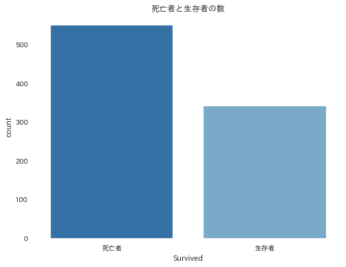
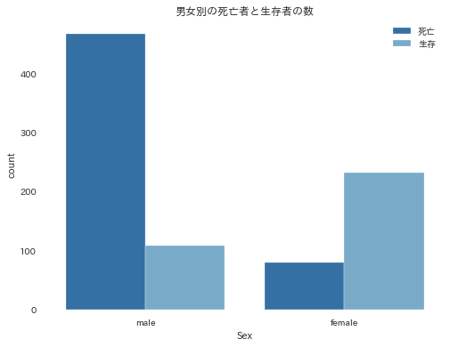

# 集計表の表示

```python
import pandas as pd

# トレーニングデータ、テストデータを読み込み
train = pd.read_csv('../input/titanic/train.csv')
test = pd.read_csv('../input/titanic/test.csv')

import matplotlib as mpl
import matplotlib.pyplot as plt
import seaborn as sns
import japanize_matplotlib

# 本文と同様に青３色の色にする場合
# sns.set_palette("Blues_r", 3) # 青３色のスタイル

# fontsizeの設定
plt.rcParams["font.size"] = 18

# サイズの設定
plt.rcParams['figure.figsize'] = (8.0, 6.0)

sns.countplot(x='Survived', data=train)
plt.title('死亡者と生存者の数')
plt.xticks([0,1],['死亡者', '生存者'])
plt.show()
```

### 書式

	sns.countplot(x=x軸, hue=y軸, data=使用するデータフレーム)

### 例

```python
import pandas as pd

# トレーニングデータ、テストデータを読み込み
train = pd.read_csv('../input/titanic/train.csv')
test = pd.read_csv('../input/titanic/test.csv')

import matplotlib as mpl
import matplotlib.pyplot as plt
import seaborn as sns
import japanize_matplotlib

# 本文と同様に青３色の色にする場合
# sns.set_palette("Blues_r", 3) # 青３色のスタイル

# fontsizeの設定
plt.rcParams["font.size"] = 18

# サイズの設定
plt.rcParams['figure.figsize'] = (8.0, 6.0)

sns.countplot(x='Survived', data=train)
plt.title('死亡者と生存者の数')
plt.xticks([0,1],['死亡者', '生存者'])
plt.show()

# 死亡者と生存者数を表示する
display(train['Survived'].value_counts())

# 死亡者と生存者割合を表示する
display(train['Survived'].value_counts()/len(train['Survived']))
```



```
0    549
1    342
Name: Survived, dtype: int64

0    0.616162
1    0.383838
Name: Survived, dtype: float64
```

### 例2

```python
# 男女別の生存者数を可視化
sns.countplot(x='Sex', hue='Survived', data=train)
plt.title('男女別の死亡者と生存者の数')
plt.legend(['死亡','生存'])
plt.show()

# SexとSurvivedをクロス集計する
display(pd.crosstab(train['Sex'], train['Survived']))

# クロス集計しSexごとに正規化する
display(pd.crosstab(train['Sex'], train['Survived'], normalize = 'index'))
```


```

Survived	0	1
Sex		
female	81	233
male	468	109

Survived	0	1
Sex		
female	0.257962	0.742038
male	0.811092	0.188908
```

### 説明

