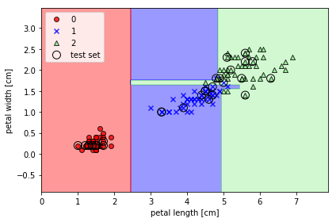

# 多クラス分類表示

```python
# 訓練データとテストデータの特徴量を行方向に結合
X_combined = np.vstack((X_train, X_test))
# 訓練データとテストデータのクラスラベルを結合
# 水平方向に(horizontal)連結
y_combined = np.hstack((y_train, y_test))

# 訓練データとテストデータ結合後の変数の中からtestデータの開始地点と終了地点を取得
test_str_pt = np.bincount(y).sum() - np.bincount(y_test).sum()
test_fin_pt = np.bincount(y).sum()

# 決定境界のプロット
plot_decision_regions(
    X=X_combined,
    y=y_combined,
    classifier=model,
    test_idx=range(test_str_pt, test_fin_pt)
)
```

### 書式

	X : shape = [n_samples, n_features]
        訓練データ、説明変数
    y : shape = [n_samples]
        目的変数
    test_idx : shape = [n_samples, n_features]
        テストデータの指定があるとき、他よりも目立たせて表示
    resolution : float
        表示解像度
    戻り値 : なし
### 例

```python
import matplotlib.pyplot as plt

from matplotlib.colors 
import ListedColormap

import numpy as np
import pandas as pd

# 訓練データとテストデータに分割する
from sklearn.model_selection import train_test_split
# 全体の20%をテストデータとして分割
X_train, X_test, y_train, y_test = train_test_split(
    X,
    y,
    test_size=0.2,
    random_state=42,
    stratify=y        # 層化抽出:均等に分割させたいデータの指定
)

from sklearn import tree
# 分類器モデルの構築
model = tree.DecisionTreeClassifier(random_state=42)
# 学習の実施
tree_model = model.fit(X_train,y_train)

# 上の階層のcommonディレクトリにあるclassifier_plot.pyファイルをインポートする
import sys
# ファイルを検索する対象に上の階層も追加する
sys.path.append("../")
# 分類描画関数plot_decision_regions()のインポート
from common.classifier_plot import plot_decision_regions

# 訓練データとテストデータの特徴量を行方向に結合
X_combined = np.vstack((X_train, X_test))
# 訓練データとテストデータのクラスラベルを結合
# 水平方向に(horizontal)連結
y_combined = np.hstack((y_train, y_test))

# 訓練データとテストデータ結合後の変数の中からtestデータの開始地点と終了地点を取得
test_str_pt = np.bincount(y).sum() - np.bincount(y_test).sum()
test_fin_pt = np.bincount(y).sum()

'''ここ'''

# 決定境界のプロット
plot_decision_regions(X=X_combined, y=y_combined, classifier=tree_model, test_idx=range(test_str_pt, test_fin_pt))

'''ここ'''

# 軸のラベルの設定
# 花びらの長さ
plt.xlabel("petal length [cm]")
# 花びらの幅
plt.ylabel("petal width [cm]")

# 凡例の設定(左上に配置)
plt.legend(loc="upper left")

# グラフを表示
plt.tight_layout()
plt.show()
```



### 説明

クラス分類後の表示を確認する。


### 関数の内容

```python
'''
決定境界の可視化関数
'''
import numpy as np
import matplotlib.pyplot as plt
from matplotlib.colors import ListedColormap

def plot_decision_regions(X, y, classifier, test_idx=None, resolution=0.02):
    '''
    パラメータ
    X : shape = [n_samples, n_features]
        訓練データ、説明変数
    y : shape = [n_samples]
        目的変数
    test_idx : shape = [n_samples, n_features]
        テストデータの指定があるとき、他よりも目立たせて表示
    resolution : float
        表示解像度
    戻り値 : なし
    '''
    # マーカーとカラーマップの準備
    markers = ("o", "x", "^", "s", "v")
    colors = ("red", "blue", "lightgreen", "gray", "cyan")
    cmap = ListedColormap(colors[:len(np.unique(y))])        # （分類した説明変数の数だけ）カラーマップの作成.unique()で出現頻度を取得

    # 決定領域の取得
    # 特徴量の最大値と最小値を取得
    x1_min, x1_max = X[:, 0].min() - 1, X[:, 0].max() + 1
    x2_min, x2_max = X[:, 1].min() - 1, X[:, 1].max() + 1

    # グリッド配列を作成（参考：https://deepage.net/features/numpy-meshgrid.html）
    # 訓練データと同じ個数のカラムを持つ行列を作成する
    xx1, xx2 = np.meshgrid(np.arange(x1_min, x1_max, resolution),
                           np.arange(x2_min, x2_max, resolution))

    # モデルの予測を実行する。そのままで予測ができない（モデルが2次元の特徴量で学習している）ため各特徴量を.ravel()で一次元に変換する
    Z = classifier.predict(np.array([xx1.ravel(), xx2.ravel()]).T)
    # 予測結果をグラフ表示のために元のデータサイズに再変換
    Z = Z.reshape(xx1.shape)

    # meshgrid で作ったxx1とxx2、そして高さZを等高線contourに渡す
    plt.contourf(xx1, xx2, Z, alpha=0.4, cmap=cmap)
    # 軸の範囲設定
    plt.xlim(xx1.min(), xx1.max())
    plt.ylim(xx2.min(), xx2.max())

    # クラスごとにサンプルを表示（.unique()で出現頻度を取得し、enumerate()でそのインデックス番号と要素を取得）
    for idx, cl in enumerate(np.unique(y)):
        plt.scatter(
            x=X[y == cl, 0],
            y=X[y == cl, 1],
            alpha=0.8,
            c=cmap(idx),
            marker=markers[idx],
            label=cl,
            edgecolors="black"
        )

    # もしテストデータの指定があればを他より目立たせる(点を○表示)
    if test_idx:
        # すべてのサンプルをプロット
        X_test, y_test = X[test_idx, :], y[test_idx]
        plt.scatter(
            X_test[:, 0], X_test[:, 1],
            c='',
            edgecolor='black',
            alpha=1.0,
            linewidth=1,
            marker='o',
            s=100,
            label='test set'
        )
```
