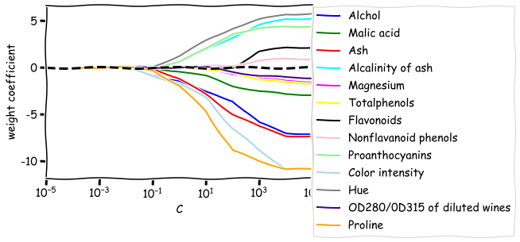
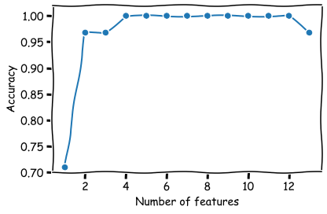
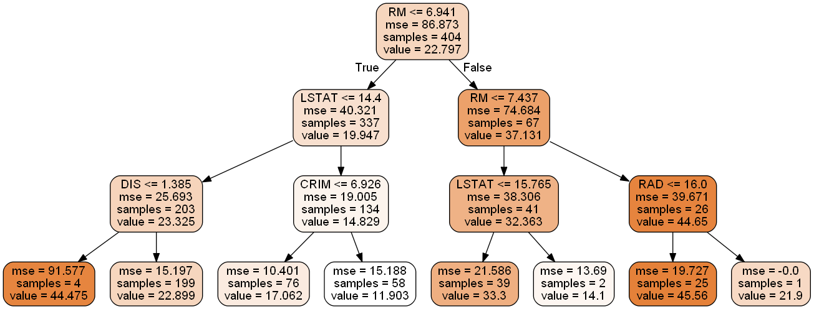
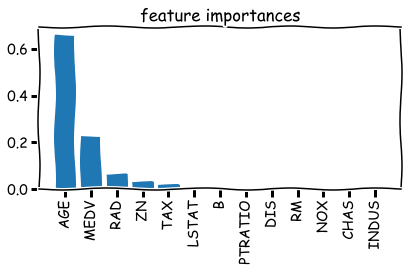
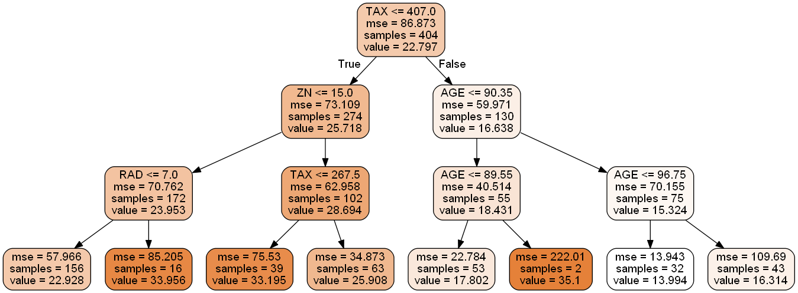

# データ前処理


```python
%matplotlib inline
```


```python
# 表形式のデータで欠損値を特定する
import pandas as pd
from io import StringIO

# サンプルデータを作成
csv_data = '''A,B,C,D
              1.0,2.0,3.0,4.0
              5.0,6.0,,8.0
              10.0,11.0,12.0,'''

# サンプルデータを読み込む
df = pd.read_csv(StringIO(csv_data))
df.head()
```


<div>
<style scoped>
    .dataframe tbody tr th:only-of-type {
        vertical-align: middle;
    }

    .dataframe tbody tr th {
        vertical-align: top;
    }

    .dataframe thead th {
        text-align: right;
    }
</style>
<table border="1" class="dataframe">
  <thead>
    <tr style="text-align: right;">
      <th></th>
      <th>A</th>
      <th>B</th>
      <th>C</th>
      <th>D</th>
    </tr>
  </thead>
  <tbody>
    <tr>
      <td>0</td>
      <td>1.0</td>
      <td>2.0</td>
      <td>3.0</td>
      <td>4.0</td>
    </tr>
    <tr>
      <td>1</td>
      <td>5.0</td>
      <td>6.0</td>
      <td>NaN</td>
      <td>8.0</td>
    </tr>
    <tr>
      <td>2</td>
      <td>10.0</td>
      <td>11.0</td>
      <td>12.0</td>
      <td>NaN</td>
    </tr>
  </tbody>
</table>
</div>


## 欠損値

### 欠損値のカウント


```python
# 各特徴量の欠損値をカウント
df.isnull().sum()
```


    A    0
    B    0
    C    1
    D    1
    dtype: int64


### 欠損値の除去

#### 欠損値を含む行を削除


```python
df.dropna()
```


<div>
<style scoped>
    .dataframe tbody tr th:only-of-type {
        vertical-align: middle;
    }

    .dataframe tbody tr th {
        vertical-align: top;
    }

    .dataframe thead th {
        text-align: right;
    }
</style>
<table border="1" class="dataframe">
  <thead>
    <tr style="text-align: right;">
      <th></th>
      <th>A</th>
      <th>B</th>
      <th>C</th>
      <th>D</th>
    </tr>
  </thead>
  <tbody>
    <tr>
      <td>0</td>
      <td>1.0</td>
      <td>2.0</td>
      <td>3.0</td>
      <td>4.0</td>
    </tr>
  </tbody>
</table>
</div>


#### 欠損値を含む列を削除


```python
df.dropna(axis=1)
```


<div>
<style scoped>
    .dataframe tbody tr th:only-of-type {
        vertical-align: middle;
    }

    .dataframe tbody tr th {
        vertical-align: top;
    }

    .dataframe thead th {
        text-align: right;
    }
</style>
<table border="1" class="dataframe">
  <thead>
    <tr style="text-align: right;">
      <th></th>
      <th>A</th>
      <th>B</th>
    </tr>
  </thead>
  <tbody>
    <tr>
      <td>0</td>
      <td>1.0</td>
      <td>2.0</td>
    </tr>
    <tr>
      <td>1</td>
      <td>5.0</td>
      <td>6.0</td>
    </tr>
    <tr>
      <td>2</td>
      <td>10.0</td>
      <td>11.0</td>
    </tr>
  </tbody>
</table>
</div>


```python
# すべての列がNaNである行だけを削除
# (すべての値がNaNである行はないため、配列全体が返される)
df.dropna(how='all')
```


<div>
<style scoped>
    .dataframe tbody tr th:only-of-type {
        vertical-align: middle;
    }

    .dataframe tbody tr th {
        vertical-align: top;
    }

    .dataframe thead th {
        text-align: right;
    }
</style>
<table border="1" class="dataframe">
  <thead>
    <tr style="text-align: right;">
      <th></th>
      <th>A</th>
      <th>B</th>
      <th>C</th>
      <th>D</th>
    </tr>
  </thead>
  <tbody>
    <tr>
      <td>0</td>
      <td>1.0</td>
      <td>2.0</td>
      <td>3.0</td>
      <td>4.0</td>
    </tr>
    <tr>
      <td>1</td>
      <td>5.0</td>
      <td>6.0</td>
      <td>NaN</td>
      <td>8.0</td>
    </tr>
    <tr>
      <td>2</td>
      <td>10.0</td>
      <td>11.0</td>
      <td>12.0</td>
      <td>NaN</td>
    </tr>
  </tbody>
</table>
</div>


```python
# 非NaN値が4つ未満の行を削除
df.dropna(thresh=4)
```


<div>
<style scoped>
    .dataframe tbody tr th:only-of-type {
        vertical-align: middle;
    }

    .dataframe tbody tr th {
        vertical-align: top;
    }

    .dataframe thead th {
        text-align: right;
    }
</style>
<table border="1" class="dataframe">
  <thead>
    <tr style="text-align: right;">
      <th></th>
      <th>A</th>
      <th>B</th>
      <th>C</th>
      <th>D</th>
    </tr>
  </thead>
  <tbody>
    <tr>
      <td>0</td>
      <td>1.0</td>
      <td>2.0</td>
      <td>3.0</td>
      <td>4.0</td>
    </tr>
  </tbody>
</table>
</div>


```python
# 特定の列(この場合は'C')にNaNが含まれている行だけを削除
df.dropna(subset=['C'])
```


<div>
<style scoped>
    .dataframe tbody tr th:only-of-type {
        vertical-align: middle;
    }

    .dataframe tbody tr th {
        vertical-align: top;
    }

    .dataframe thead th {
        text-align: right;
    }
</style>
<table border="1" class="dataframe">
  <thead>
    <tr style="text-align: right;">
      <th></th>
      <th>A</th>
      <th>B</th>
      <th>C</th>
      <th>D</th>
    </tr>
  </thead>
  <tbody>
    <tr>
      <td>0</td>
      <td>1.0</td>
      <td>2.0</td>
      <td>3.0</td>
      <td>4.0</td>
    </tr>
    <tr>
      <td>2</td>
      <td>10.0</td>
      <td>11.0</td>
      <td>12.0</td>
      <td>NaN</td>
    </tr>
  </tbody>
</table>
</div>


### 欠損値の補完

#### 平均値補完


```python
from sklearn.preprocessing import Imputer
# 欠損値補完のインスタンスの生成（列ごとの特徴量の平均補完）
imr = Imputer(missing_values='NaN', strategy='mean', axis=0)
# データを結合
imr = imr.fit(df.values)
# 補完を実行
imuputer_data = imr.transform(df.values)
imuputer_data
```

    C:\Users\Akahane Shuhei\Anaconda3\lib\site-packages\sklearn\utils\deprecation.py:66: DeprecationWarning: Class Imputer is deprecated; Imputer was deprecated in version 0.20 and will be removed in 0.22. Import impute.SimpleImputer from sklearn instead.
      warnings.warn(msg, category=DeprecationWarning)
    


    array([[ 1. ,  2. ,  3. ,  4. ],
           [ 5. ,  6. ,  7.5,  8. ],
           [10. , 11. , 12. ,  6. ]])


```python
# 平均補完
df.fillna(df.mean())
```


<div>
<style scoped>
    .dataframe tbody tr th:only-of-type {
        vertical-align: middle;
    }

    .dataframe tbody tr th {
        vertical-align: top;
    }

    .dataframe thead th {
        text-align: right;
    }
</style>
<table border="1" class="dataframe">
  <thead>
    <tr style="text-align: right;">
      <th></th>
      <th>A</th>
      <th>B</th>
      <th>C</th>
      <th>D</th>
    </tr>
  </thead>
  <tbody>
    <tr>
      <td>0</td>
      <td>1.0</td>
      <td>2.0</td>
      <td>3.0</td>
      <td>4.0</td>
    </tr>
    <tr>
      <td>1</td>
      <td>5.0</td>
      <td>6.0</td>
      <td>7.5</td>
      <td>8.0</td>
    </tr>
    <tr>
      <td>2</td>
      <td>10.0</td>
      <td>11.0</td>
      <td>12.0</td>
      <td>6.0</td>
    </tr>
  </tbody>
</table>
</div>


```python
# 特定の行の欠損値補完
df['C'].fillna(df['C'].mean())
```


    0     3.0
    1     7.5
    2    12.0
    Name: C, dtype: float64


```python
import pandas as pd
# サンプルデータを生成(Tシャツの色・サイズ・価格・クラスラベル)
df = pd.DataFrame([
    ['green', 'M', 10.1, 'class1'],
    ['red', 'L', 13.5, 'class2'],
    ['blue', 'XL', 15.3, 'class1'],
])
# 列名の設定
df.columns = ['color', 'size', 'price', 'classlabel']
df
```


<div>
<style scoped>
    .dataframe tbody tr th:only-of-type {
        vertical-align: middle;
    }

    .dataframe tbody tr th {
        vertical-align: top;
    }

    .dataframe thead th {
        text-align: right;
    }
</style>
<table border="1" class="dataframe">
  <thead>
    <tr style="text-align: right;">
      <th></th>
      <th>color</th>
      <th>size</th>
      <th>price</th>
      <th>classlabel</th>
    </tr>
  </thead>
  <tbody>
    <tr>
      <td>0</td>
      <td>green</td>
      <td>M</td>
      <td>10.1</td>
      <td>class1</td>
    </tr>
    <tr>
      <td>1</td>
      <td>red</td>
      <td>L</td>
      <td>13.5</td>
      <td>class2</td>
    </tr>
    <tr>
      <td>2</td>
      <td>blue</td>
      <td>XL</td>
      <td>15.3</td>
      <td>class1</td>
    </tr>
  </tbody>
</table>
</div>


### 順序特徴量のマッピング（整数変換）


```python
# Tシャツのサイズと整数を対応させるディクショナリを生成
size_mapping = {
    'XL':3,
    'L':2,
    'M':1
}
# Tシャツのサイズを整数に変換
df['size'] = df['size'].map(size_mapping)
df
```


<div>
<style scoped>
    .dataframe tbody tr th:only-of-type {
        vertical-align: middle;
    }

    .dataframe tbody tr th {
        vertical-align: top;
    }

    .dataframe thead th {
        text-align: right;
    }
</style>
<table border="1" class="dataframe">
  <thead>
    <tr style="text-align: right;">
      <th></th>
      <th>color</th>
      <th>size</th>
      <th>price</th>
      <th>classlabel</th>
    </tr>
  </thead>
  <tbody>
    <tr>
      <td>0</td>
      <td>green</td>
      <td>1</td>
      <td>10.1</td>
      <td>class1</td>
    </tr>
    <tr>
      <td>1</td>
      <td>red</td>
      <td>2</td>
      <td>13.5</td>
      <td>class2</td>
    </tr>
    <tr>
      <td>2</td>
      <td>blue</td>
      <td>3</td>
      <td>15.3</td>
      <td>class1</td>
    </tr>
  </tbody>
</table>
</div>


### クラスラベルのエンコーディング（名義尺度の整数変換）


```python
import numpy as np
# クラスラベルと整数を対応させるディクショナリを生成
class_mapping = {label:idx for idx, label in
                enumerate(np.unique(df['classlabel']))}
class_mapping
```


    {'class1': 0, 'class2': 1}


```python
df['classlabel'].map(class_mapping)
```


    0    0
    1    1
    2    0
    Name: classlabel, dtype: int64


```python
from sklearn.preprocessing import LabelEncoder

class_le = LabelEncoder()
y = class_le.fit_transform(df['classlabel'].values)
print(y)

# クラスラベルを文字列に戻す
print(class_le.inverse_transform(y))
```

    [0 1 0]
    ['class1' 'class2' 'class1']
    


```python
class_le = LabelEncoder()
df['classlabel'] = class_le.fit_transform(df['classlabel'].values)
df
```


<div>
<style scoped>
    .dataframe tbody tr th:only-of-type {
        vertical-align: middle;
    }

    .dataframe tbody tr th {
        vertical-align: top;
    }

    .dataframe thead th {
        text-align: right;
    }
</style>
<table border="1" class="dataframe">
  <thead>
    <tr style="text-align: right;">
      <th></th>
      <th>color</th>
      <th>size</th>
      <th>price</th>
      <th>classlabel</th>
    </tr>
  </thead>
  <tbody>
    <tr>
      <td>0</td>
      <td>green</td>
      <td>1</td>
      <td>10.1</td>
      <td>0</td>
    </tr>
    <tr>
      <td>1</td>
      <td>red</td>
      <td>2</td>
      <td>13.5</td>
      <td>1</td>
    </tr>
    <tr>
      <td>2</td>
      <td>blue</td>
      <td>3</td>
      <td>15.3</td>
      <td>0</td>
    </tr>
  </tbody>
</table>
</div>


```python
# LabelEncoder
from sklearn.preprocessing import LabelEncoder

# Tシャツの色、サイズ、価格を抽出
X = df[['color', 'size', 'price']].values
color_le = LabelEncoder()
X[:, 0] = color_le.fit_transform(X[:, 0])
X
```


    array([[1, 1, 10.1],
           [2, 2, 13.5],
           [0, 3, 15.3]], dtype=object)


```python
X = df.values
color_le = LabelEncoder()
X[:, 0] = color_le.fit_transform(X[:, 0])
X
```


    array([[1, 1, 10.1, 0],
           [2, 2, 13.5, 1],
           [0, 3, 15.3, 0]], dtype=object)


## One-hotエンコーディング（ダミー特徴量の作成）


```python
from sklearn.preprocessing import OneHotEncoder
# one-hotエンコーダの生成（変換した変数の列）
ohe = OneHotEncoder(categorical_features=[0])
# one-hotエンコーディングを実行
ohe.fit_transform(X).toarray()
```


    array([[ 0. ,  1. ,  0. ,  1. , 10.1,  0. ],
           [ 0. ,  0. ,  1. ,  2. , 13.5,  1. ],
           [ 1. ,  0. ,  0. ,  3. , 15.3,  0. ]])


```python
# one-hotエンコーディングを実行
pd.get_dummies(df[['price', 'color', 'size']])
```


<div>
<style scoped>
    .dataframe tbody tr th:only-of-type {
        vertical-align: middle;
    }

    .dataframe tbody tr th {
        vertical-align: top;
    }

    .dataframe thead th {
        text-align: right;
    }
</style>
<table border="1" class="dataframe">
  <thead>
    <tr style="text-align: right;">
      <th></th>
      <th>price</th>
      <th>size</th>
      <th>color_blue</th>
      <th>color_green</th>
      <th>color_red</th>
    </tr>
  </thead>
  <tbody>
    <tr>
      <td>0</td>
      <td>10.1</td>
      <td>1</td>
      <td>0</td>
      <td>1</td>
      <td>0</td>
    </tr>
    <tr>
      <td>1</td>
      <td>13.5</td>
      <td>2</td>
      <td>0</td>
      <td>0</td>
      <td>1</td>
    </tr>
    <tr>
      <td>2</td>
      <td>15.3</td>
      <td>3</td>
      <td>1</td>
      <td>0</td>
      <td>0</td>
    </tr>
  </tbody>
</table>
</div>


```python

```


```python
# wineデータセットを読み込む
'''
# ネットワークを使用してデータを取得する場合
# df_wine = pd.read_csv('https://archive.ics.uci.edu/ml/machine-learning-databases/wine/wine.data', header=None)
'''
df_wine = pd.read_csv('../data/wine.data', header=None)

# 列名を設定
df_wine.columns = ['Class label', 'Alchol', 'Malic acid', 'Ash', 
                   'Alcalinity of ash', 'Magnesium', 'Totalphenols', 'Flavonoids',
                   'Nonflavanoid phenols', 'Proanthocyanins', 'Color intensity', 'Hue',
                  'OD280/0D315 of diluted wines', 'Proline']

# クラスラベルを表示
print('Class labels', np.unique(df_wine['Class label']))

# wineデータセットの先頭5行を表示
df_wine.head()
```

    Class labels [1 2 3]
    


<div>
<style scoped>
    .dataframe tbody tr th:only-of-type {
        vertical-align: middle;
    }

    .dataframe tbody tr th {
        vertical-align: top;
    }

    .dataframe thead th {
        text-align: right;
    }
</style>
<table border="1" class="dataframe">
  <thead>
    <tr style="text-align: right;">
      <th></th>
      <th>Class label</th>
      <th>Alchol</th>
      <th>Malic acid</th>
      <th>Ash</th>
      <th>Alcalinity of ash</th>
      <th>Magnesium</th>
      <th>Totalphenols</th>
      <th>Flavonoids</th>
      <th>Nonflavanoid phenols</th>
      <th>Proanthocyanins</th>
      <th>Color intensity</th>
      <th>Hue</th>
      <th>OD280/0D315 of diluted wines</th>
      <th>Proline</th>
    </tr>
  </thead>
  <tbody>
    <tr>
      <td>0</td>
      <td>1</td>
      <td>14.23</td>
      <td>1.71</td>
      <td>2.43</td>
      <td>15.6</td>
      <td>127</td>
      <td>2.80</td>
      <td>3.06</td>
      <td>0.28</td>
      <td>2.29</td>
      <td>5.64</td>
      <td>1.04</td>
      <td>3.92</td>
      <td>1065</td>
    </tr>
    <tr>
      <td>1</td>
      <td>1</td>
      <td>13.20</td>
      <td>1.78</td>
      <td>2.14</td>
      <td>11.2</td>
      <td>100</td>
      <td>2.65</td>
      <td>2.76</td>
      <td>0.26</td>
      <td>1.28</td>
      <td>4.38</td>
      <td>1.05</td>
      <td>3.40</td>
      <td>1050</td>
    </tr>
    <tr>
      <td>2</td>
      <td>1</td>
      <td>13.16</td>
      <td>2.36</td>
      <td>2.67</td>
      <td>18.6</td>
      <td>101</td>
      <td>2.80</td>
      <td>3.24</td>
      <td>0.30</td>
      <td>2.81</td>
      <td>5.68</td>
      <td>1.03</td>
      <td>3.17</td>
      <td>1185</td>
    </tr>
    <tr>
      <td>3</td>
      <td>1</td>
      <td>14.37</td>
      <td>1.95</td>
      <td>2.50</td>
      <td>16.8</td>
      <td>113</td>
      <td>3.85</td>
      <td>3.49</td>
      <td>0.24</td>
      <td>2.18</td>
      <td>7.80</td>
      <td>0.86</td>
      <td>3.45</td>
      <td>1480</td>
    </tr>
    <tr>
      <td>4</td>
      <td>1</td>
      <td>13.24</td>
      <td>2.59</td>
      <td>2.87</td>
      <td>21.0</td>
      <td>118</td>
      <td>2.80</td>
      <td>2.69</td>
      <td>0.39</td>
      <td>1.82</td>
      <td>4.32</td>
      <td>1.04</td>
      <td>2.93</td>
      <td>735</td>
    </tr>
  </tbody>
</table>
</div>


## データの分割


```python
from sklearn.model_selection import train_test_split

# 特徴量とクラスラベル（1列目）を別々に抽出
X, y = df_wine.iloc[:, 1:].values, df_wine.iloc[:, 0].values

# データの分割
X_train, X_test, y_train, y_test = train_test_split(X, y, test_size=0.3, random_state=42, stratify=y)
# 分割後のデータ数の出現件数を取得
# 全体の30%をテストデータにする
print("Labels counts in y       :", np.bincount(y))
print("Labels counts in y_train :", np.bincount(y_train))
print("Labels counts in y_test  :", np.bincount(y_test))
```

    Labels counts in y       : [ 0 59 71 48]
    Labels counts in y_train : [ 0 41 50 33]
    Labels counts in y_test  : [ 0 18 21 15]
    

## 正規化（0-1変換）


```python
from sklearn.preprocessing import MinMaxScaler
# min-maxスケーリングのインスタンスを生成
mms = MinMaxScaler()
# 訓練データをスケーリング
X_train_norm = mms.fit_transform(X_train)
X_test_norm = mms.fit_transform(X_test)
print(X_train[5])
print()
print(X_train_norm[5])
```

    [1.483e+01 1.640e+00 2.170e+00 1.400e+01 9.700e+01 2.800e+00 2.980e+00
     2.900e-01 1.980e+00 5.200e+00 1.080e+00 2.850e+00 1.045e+03]
    
    [1.         0.17786561 0.43548387 0.17525773 0.29347826 0.62758621
     0.77647059 0.32       0.49367089 0.33447099 0.48780488 0.59622642
     0.6200485 ]
    

## 標準化


```python
from sklearn.preprocessing import StandardScaler

# 標準化インスタンスを生成
stdac = StandardScaler()
X_train_std = stdac.fit_transform(X_train)
X_test_std = stdac.fit_transform(X_test)
```

## l1正則化


```python
from sklearn.linear_model import LogisticRegression
# L1正則化ロジスティック回帰のインスタンスを生成
lr = LogisticRegression(penalty='l1', C=1.0)

# 訓練データに適合する
lr.fit(X_train_std, y_train)
# 正解率の表示
print('Test accuracy', lr.score(X_test_std, y_test))
```

    Test accuracy 0.9814814814814815
 

```python
# 切片の表示
lr.intercept_
```


    array([-1.38411837, -0.94539792, -2.34809394])


```python
# 重みの係数の表示
lr.coef_
```


    array([[ 1.42657279,  0.14070448,  0.70978898, -1.2607388 ,  0.        ,
             0.        ,  1.38283892,  0.        , -0.05576593,  0.        ,
             0.        ,  0.43329962,  1.97964582],
           [-1.46174176, -0.43997828, -1.21197041,  0.61598668,  0.        ,
             0.        ,  0.        ,  0.        ,  0.64837692, -1.70729423,
             1.22646164,  0.        , -1.98226913],
           [ 0.        ,  0.39759517,  0.32778162,  0.        ,  0.        ,
             0.        , -2.25713919,  0.        , -0.06869244,  1.71442793,
            -1.08895792, -0.15581418,  0.        ]])


```python
import matplotlib.pyplot as plt
plt.xkcd()
# 描画の準備
fig = plt.figure()
ax = plt.subplot(111)

# 各係数の色リスト
colors = ['blue', 'green', 'red', 'cyan', 'magenta', 'yellow', 'black', 'pink', 'lightgreen', 'lightblue', 'gray', 'indigo', 'orange']

# 空のリストを生成(重み係数、逆正則化パラメータ)
weights, params = [], []

# 逆正則化パラメータの値ごとに処理
for c in np.arange(-4., 6.):
    lr = LogisticRegression(penalty='l1', C=10.**c, random_state=0)
    lr.fit(X_train_std, y_train)
    weights.append(lr.coef_[1])
    params.append(10**c)
    
# 重み係数をNumPy配列に変換
weights = np.array(weights)

# 各重み係数をプロット
for column, color in zip(range(weights.shape[1]), colors):
    # 横軸を逆正則化パラメータ、縦軸を重み係数とした折れ線グラフ
    plt.plot(
        params,
        weights[:, column],
        label=df_wine.columns[column+1],
        color=color
    )
    
# y=0に黒い波線を引く
plt.axhline(0, color='black', linestyle='--', linewidth=3)

# 横軸の範囲の設定
plt.xlim([10**(-5), 10**5])

# 軸のラベルの設定
plt.ylabel('weight coefficient')
plt.xlabel('C')

# 横軸を対数スケールに設定
plt.xscale('log')
plt.legend(loc='upper left')
ax.legend(loc='upper center', bbox_to_anchor=(1.38, 1.03), ncol=1, fancybox=True)
plt.show()
```




## 逐次特徴選択アルゴリズム


```python
from sklearn.base import clone
from itertools import combinations
import numpy as np
from sklearn.metrics import accuracy_score

class SBS():
    """
    逐次後退選択(sequential backward selection)を実行するクラス
    特徴量を減らしながら評価を行い、その最大値がkの特徴量の個数に等しくなった時に処理を終了する
    """
    
    def __init__(self, estimator, k_features, scoring=accuracy_score,
                test_size=0.25, random_state=1):
        self.scoring = scoring                  # 特徴量を評価する指標
        self.estimator = clone(estimator)       # 推定器
        self.k_features = k_features            # 選択する特徴量の個数
        self.test_size = test_size              # テストデータの割合
        self.random_state = random_state        # 乱数数を固定するrandom_state
        
    def fit(self, X, y):
        # トレーニングデータとテストデータに分割
        X_train, X_test, y_train, y_test = train_test_split(X, y, test_size=self.test_size,
                                                           random_state=self.random_state)
        # すべての特徴量の個数、列インデックス
        dim = X_train.shape[1]
        
        self.indices_ = tuple(range(dim))
        self.subsets_ = [self.indices_]
        
        # すべての特徴量を用いてスコアを算出
        score = self._calc_score(X_train, y_train, X_test, y_test, self.indices_)
        
        # スコアを格納
        self.scores_ = [score]
        
        # 指定した特徴量の個数になるまで処理を反復
        while dim > self.k_features:
            # 空のリストの生成(スコア、列インデックス)
            scores = []
            subsets = []
            
            # 特徴量の部分集合を表す列インデックスの組み合わせごとに処理を反復
            for p in combinations(self.indices_, r=dim - 1):
                # スコアを算出して格納
                score = self._calc_score(X_train, y_train, X_test, y_test, p)
                scores.append(score)
                # 特徴量の部分集合を表す列インデックスのリストを格納
                subsets.append(p)
                
            # 最良のスコアのインデックスを抽出
            best = np.argmax(scores)
            # 最良のスコアとなる列インデックスを抽出して格納
            self.indices_ = subsets[best]
            self.subsets_.append(self.indices_)
            # 特徴量の個数を1つだけ減らして次のステップへ
            dim -= 1
            
            # スコアを格納
            self.scores_.append(scores[best])
            
        # 最後に格納したスコア
        self.k_score_ = self.scores_[-1]
        
        return self
    
    def transform(self, X):
        # 抽出した特徴量を返す
        return X[:, self.indices_]
    
    def _calc_score(self, X_train, y_train, X_test, y_test, indices):
        # 指定された列番号indicesの特徴量を抽出してモデルを適合
        self.estimator.fit(X_train[:, indices], y_train)
        # テストデータを用いてクラスラベルを予測
        y_pred = self.estimator.predict(X_test[:, indices])
        # 真のクラスラベルと予測値を用いてスコア算出
        score = self.scoring(y_test, y_pred)
        return score
```


```python
from sklearn.neighbors import KNeighborsClassifier
import matplotlib.pyplot as plt

# k近傍法分類機のインスタンスを生成(近傍点数=5)
knn = KNeighborsClassifier(n_neighbors=5)

# 逐次後退選択のインスタンスを生成(特徴量の個数が1になるまで特徴量を選択)
sbs = SBS(knn, k_features=1)

# 逐次後退選択を実行
sbs.fit(X_train_std, y_train)
```


    <__main__.SBS at 0x1dca7651108>


```python
# 特徴量の個数のリスト
k_feat = [len(k) for k in sbs.subsets_]

# 横軸を特徴量の個数、縦軸をスコアとした折れ線グラフのプロット
plt.plot(k_feat, sbs.scores_, marker='o')
plt.ylim([0.7, 1.02])
plt.ylabel('Accuracy')
plt.xlabel('Number of features')
plt.grid()
plt.tight_layout()
plt.show()
```





```python
# 減らしたうえで正解率の高い特徴量5つが何なのかを確認する
# 属性の8番目の位置から5つの特徴量～なる部分集合の列のインデックスを取得する
k5 = list(sbs.subsets_[8])
print(df_wine.columns[1:][k5])
```

    Index(['Alchol', 'Ash', 'Alcalinity of ash', 'Flavonoids', 'Hue'], dtype='object')
    


```python
# 13個すべての特徴量を用いてモデルを適合
knn.fit(X_train_std, y_train)

# 結果の正解率を出力
print('Training accuracy:', knn.score(X_train_std, y_train))

# テストの正解率を出力
print('Test accuracy:', knn.score(X_test_std, y_test))
```

    Training accuracy: 0.9838709677419355
    Test accuracy: 0.9629629629629629
    


```python
# 5つの特徴量を用いてモデルを適合
knn.fit(X_train_std[:, k5], y_train)

# 結果の正解率を出力
print('Training accuracy:', knn.score(X_train_std[:, k5], y_train))

# テストの正解率を出力
print('Test accuracy:%.3f' % knn.score(X_test_std[:, k5], y_test))
```

    Training accuracy: 0.9919354838709677
    Test accuracy:0.926
    

Test accuracy: 0.926と予測性能が少し低下したがデータセットのサイズを小さくするとデータ収集ステップでコストがかかりがちな現実のアプリケーションで役立つ可能性がある。また、特徴量の数を減らすことで解釈しやすい単純なモデルが得られる

# ボストンデータを使用して回帰木による重要な特徴量の抽出

```python
# データの読み込み
import pandas as pd

# ネットワークを使用してデータを取得する場合（中身はpd.read_csvのデータと同じです）
df = pd.read_csv(
    'https://archive.ics.uci.edu/ml/machine-learning-databases/housing/housing.data',
    header=None,
    sep='\s+')
# MEDV以外の特徴量を抽出
X = df.iloc[:, :-1]
y = df['MEDV']

# 訓練データとテストデータに分割する
from sklearn.model_selection import train_test_split

# 全体の20%をテストデータとして分割
X_train, X_test, y_train, y_test = train_test_split(
    X, y, test_size=0.2, random_state=42)
from sklearn.tree import DecisionTreeRegressor

# 分類器モデルの構築
tree = DecisionTreeRegressor(max_depth=3, random_state=42)
# モデルを適合
tree.fit(X_train, y_train)

y_test_pred = tree.predict(X_test)

## 学習結果の可視化
from pydotplus import graph_from_dot_data

from sklearn.tree import export_graphviz
dot_data = export_graphviz(
    tree, 
    feature_names=['CRIM', 'ZN', 'INDUS', 'CHAS', 
              'NOX', 'RM', 'AGE', 'DIS', 'RAD', 
              'TAX', 'PTRATIO', 'B', 'LSTAT'],
    class_names=['MEDV'],
    filled=True, # Trueにすると、分岐の際にどちらのノードに多く分類されたのか色で示してくれる
    rounded=True, # Trueにすると、ノードの角を丸く描画する。
    impurity=True, # Trueにすると、不純度を表示する。
    out_file=None # .dotファイルを作成する場合は'ファイル名.dot'でファイルを保存する
)

graph = graph_from_dot_data(dot_data)
graph.write_png('tree.png')
```
```
from IPython.display import Image
# 保存したpngファイルを表示
Image(filename='./tree.png', width=1000)
```


## 交差検証

```
from sklearn.model_selection import KFold, cross_val_score

kfold = KFold(n_splits=5, shuffle=True, random_state=42)

tree_score = cross_val_score(tree, X, y, cv=kfold)

print(tree_score)
print(tree_score.mean())
```
```
[0.7713664  0.71609755 0.60195171 0.85365453 0.62164243]
0.7129425229506589
```


## 回帰木で特徴量の重要度にアクセスする
```
# 各特徴量の重要度を可視化
# (どの特徴量がどれくらい分割に寄与したのかを確認する)

# データの特徴量の名称をクラスラベルは除いて取得（列名の取得）
feat_labels = df.columns[1:]

# 特徴量の重要度を抽出
importances = tree.feature_importances_

# 重要度の降順で特徴量のインデックスを抽出
indices = np.argsort(importances)[::-1]

# 重要度の降順で特徴量の名称、重要度を表示
for f in range(X_train.shape[1]):
    print("%2d) %-*s %f" % (f+1, 30, feat_labels[indices[f]], 
                           importances[indices[f]]))
    
# 可視化
plt.title('feature importances')
plt.bar(range(X_train.shape[1]), importances[indices], align='center')
plt.xticks(range(X_train.shape[1]), feat_labels[indices], rotation=90)
plt.xlim([-1, X_train.shape[1]])
plt.tight_layout()
plt.show()
```

```
 1) AGE                            0.659397
 2) MEDV                           0.227641
 3) RAD                            0.063661
 4) ZN                             0.030528
 5) TAX                            0.018773
 6) LSTAT                          0.000000
 7) B                              0.000000
 8) PTRATIO                        0.000000
 9) DIS                            0.000000
10) RM                             0.000000
11) NOX                            0.000000
12) CHAS                           0.000000
13) INDUS                          0.000000
```



## 特徴量の重要度から抽出


```python
from sklearn.feature_selection import SelectFromModel

# 特徴選択オブジェクトを生成(重要度のしきい値を0.01に設定)
sfm = SelectFromModel(tree, threshold=0.01, prefit=True)

# 特徴量を抽出
X_selected = sfm.transform(X_train)
print('Number of features that meet this threshold criterion:', X_selected.shape[1])

# 重要度の降順で特徴量のインデックスを抽出
indices = np.argsort(importances)[::-1]
feature_list = []
for f in range(X_selected.shape[1]):
    feature_list.append(feat_labels[indices[f]])
    print("%2d) %-*s %f" % (f + 1, 30,
                           feat_labels[indices[f]],
                           importances[indices[f]])
         )
```
```
Number of features that meet this threshold criterion: 5
 1) AGE                            0.659397
 2) MEDV                           0.227641
 3) RAD                            0.063661
 4) ZN                             0.030528
 5) TAX                            0.018773
```
```python
# 抽出するデータの確認
# X_train.loc[:, feature_list].head()
X_train.reindex(feature_list, axis=1).head()    # 上の処理はバージョンアップ使用できなくなるという警告が出たので
```
```
	AGE	MEDV	RAD	ZN	TAX
477	97.3	NaN	24	0.0	666.0
15	56.5	NaN	4	0.0	307.0
332	23.3	NaN	1	35.0	304.0
423	85.1	NaN	24	0.0	666.0
19	69.5	NaN	4	0.0	307.0
```

```python
# データの抽出
X_train_new = X_train.loc[:, feature_list]
```

```python
# 欠損値の確認
X_train_new.isnull().sum()
```
```
AGE       0
MEDV    404
RAD       0
ZN        0
TAX       0
dtype: int64
```
```python
# 欠損値の行の除外
X_train_new = X_train_new.dropna(how='all', axis=1)
X_train_new.head()
```
```
        AGE	RAD	ZN	TAX
477	97.3	24	0.0	666.0
15	56.5	4	0.0	307.0
332	23.3	1	35.0	304.0
423	85.1	24	0.0	666.0
19	69.5	4	0.0	307.0
```

```python
# データの抽出
X_test_new = X_test.reindex(feature_list, axis=1).dropna(how='all', axis=1)

# 分類器モデルの構築
tree_feature = DecisionTreeRegressor(max_depth=3, random_state=42)

# モデルを適合
tree_feature.fit(X_train_new, y_train)

from pydotplus import graph_from_dot_data
from sklearn.tree import export_graphviz

dot_data = export_graphviz(
    tree_feature,
    feature_names=X_train_new.columns,
    class_names=['MEDV'],
    filled=True, # Trueにすると、分岐の際にどちらのノードに多く分類されたのか色で示してくれる
    rounded=True, # Trueにすると、ノードの角を丸く描画する。
    impurity=True, # Trueにすると、不純度を表示する。
    out_file=None # .dotファイルを作成する場合は'ファイル名.dot'でファイルを保存する
)

graph = graph_from_dot_data(dot_data)
graph.write_png('tree_feature.png')

from IPython.display import Image
# 保存したpngファイルを表示
Image(filename='./tree_feature.png', width=1000)
```




