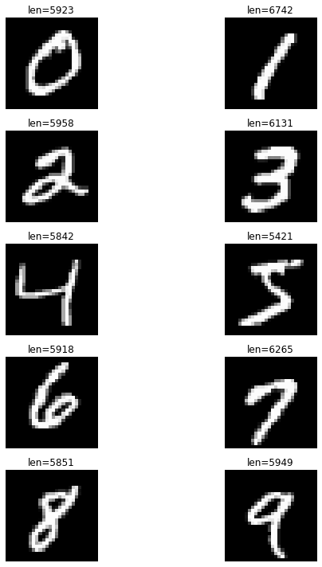
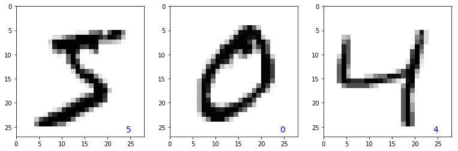
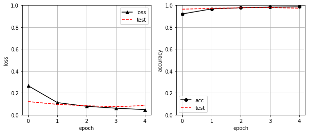

```python
# MINISTデータセットをインポート
from keras.datasets import mnist
# MNISTデータセットの読み込み
(X_train, y_train), (X_test, y_test) = mnist.load_data()
```


```python
# データ数を確認する
print('X_train is ', X_train.shape)
print('y_train is ', y_train.shape)
print('X_test  is ', X_test.shape)
print('y_test  is ', y_test.shape)
```

    X_train is  (60000, 28, 28)
    y_train is  (60000,)
    X_test  is  (10000, 28, 28)
    y_test  is  (10000,)
    


```python
# データの表示
import matplotlib.pyplot as plt
%matplotlib inline

# 文字画像表示
plt.figure(figsize=(10,10))

# MNISTの0から9の画像をそれぞれ表示
for i in range(10):
    data = [(x,t) for x, t in zip(X_train, y_train) if t == i]
    x, y = data[0]

    plt.subplot(5,2, i+1)
    # plt.title()はタイトルを表示する。ここでは画像枚数を表示
    plt.title("len={}".format(len(data)))
    # 画像を見やすいように座標軸を非表示
    plt.axis("off")
    # 画像を表示
    plt.imshow(x, cmap='gray')

plt.tight_layout()
plt.show()
```



```python
"""
  データの表示確認
"""
# グラフエリアのサイズを3×3にする
plt.figure(figsize=(13, 4))
plt.tight_layout()    # 文字配置をいい感じに
plt.gray()            # グレースケール
for id in range(3):
    plt.subplot(1, 3, id+1)
    # 784個のRGB値を28*28おｎ行列に変換する
    img = X_train[id, :, :].reshape(28, 28)
    # 色相を反転させて黒でプロット
    plt.pcolor(255 - img)
    # 画像の正解値をプロット
    plt.text(24, 26, '%d' % y_train[id],
             color='b', fontsize=14)
    plt.ylim(27, 0)
```



```python
# 正解ラベルの内容の確認
print(y_train)
```

    [5 0 4 ... 5 6 8]
    


```python
"""
  データの前処理
"""
from keras.utils import np_utils
# 訓練データ
# 60000*28*28の2次元配列を60000*784の行列に変換
X_train = X_train.reshape(60000, 784)
# 訓練データを浮動小数点型に変換
X_train = X_train.astype('float32')
# シグモイド関数が出力できる範囲にするため、データを255で割り0から1の範囲に変換
X_train = X_train / 255

correct = 10             # 正解ラベルの数

# 正解ラベルをワンホット表現に変換
y_train = np_utils.to_categorical(y_train, correct)

# テストデータ
# 10000*28*28の2次元配列を60000*784の行列に変換
X_test = X_test.reshape(10000, 784)
# テストデータを浮動小数点型に変換
X_test = X_test.astype('float32')
# シグモイド関数が出力できる範囲にするため、データを255で割り0から1の範囲に変換
X_test = X_test / 255
# 正解ラベルをワンホット表現に変換
y_test = np_utils.to_categorical(y_test, correct)
```


```python
"""
  ネットワークの構築
"""
"""
  ニューラルネットワークの構築
"""
from keras.models import Sequential
from keras.layers import Dense, Activation
from keras.optimizers import SGD

model = Sequential()                 # Sequentialオブジェクトの生成
"""
  隠れ層
"""
model.add(
    Dense(
        200,                         # 隠れ層のニューロン数 200
        input_dim=784,               # 入力層のニューロン数 784
        activation='relu'            # 活性化関数はReLU
    )
)
"""
  出力層
"""
model.add(
    Dense(
        10,                           # 出力層のニューロン数は10
        activation='softmax'          # 活性化関数は'softmax'            
    )
)
"""
  モデルのコンパイル
"""
learning_rate = 0.5                   # 学習率
model.compile(                        # オブジェクトのコンパイル
    loss='categorical_crossentropy',  # 損失の基準は交差エントロピー誤差
    optimizer=SGD(lr=learning_rate),  # 学習方法をSGDにする
    metrics=['accuracy']              # 学習評価として正解率を指定
)

model.summary()                       # ニューラルネットワークのサマリーの出力
```

    _________________________________________________________________
    Layer (type)                 Output Shape              Param #   
    =================================================================
    dense_3 (Dense)              (None, 200)               157000    
    _________________________________________________________________
    dense_4 (Dense)              (None, 10)                2010      
    =================================================================
    Total params: 159,010
    Trainable params: 159,010
    Non-trainable params: 0
    _________________________________________________________________
    

dense_3は隠れ層、Param157000は重みとして、<br>$入力層のニューロン784*隠れ層のニューロン数200=156800$<br>にバイアスの<br>$バイアス*隠れ層のニューロン数200=200$<br>を加えることで、合計157000個のパラメータが用意されたことを示しています。<br>dense_4の出力層のParam2010は、出力層の重みとして、<br>$隠れ層のニューロン200*出力層のニューロン数10=2000$<br>にバイアスの<br>$バイアス*出力層のニューロン数10=10$<br>を加えることで合計2010個のパラメータが容易されたことを示しています。


```python
"""
  学習を行い結果を出力する
"""
history = model.fit(
    X_train,
    y_train,
    epochs=5,                   # 学習回数
    batch_size=100,             # 勾配計算に用いるミニバッチの数
    verbose=1,                  # 学習の進捗状況を出力する
    validation_data=(
        X_test, y_test          # テストデータの指定
    )
)
```

    Train on 60000 samples, validate on 10000 samples
    Epoch 1/5
    60000/60000 [==============================] - 2s 27us/step - loss: 0.2652 - acc: 0.9207 - val_loss: 0.1203 - val_acc: 0.9640
    Epoch 2/5
    60000/60000 [==============================] - 1s 23us/step - loss: 0.1110 - acc: 0.9663 - val_loss: 0.0949 - val_acc: 0.9713
    Epoch 3/5
    60000/60000 [==============================] - 2s 31us/step - loss: 0.0772 - acc: 0.9773 - val_loss: 0.0821 - val_acc: 0.9764
    Epoch 4/5
    60000/60000 [==============================] - 1s 22us/step - loss: 0.0598 - acc: 0.9822 - val_loss: 0.0732 - val_acc: 0.9782
    Epoch 5/5
    60000/60000 [==============================] - 1s 24us/step - loss: 0.0469 - acc: 0.9858 - val_loss: 0.0844 - val_acc: 0.9735
    


```python
"""
  正解率と損失をグラフにする
"""
plt.figure(figsize=(10, 4))    # 図のサイズ
plt.tight_layout()             # 良い感じに間隔を開ける

# 1*2のグリッドの左の領域に損失
plt.subplot(1, 2, 1)
# 損失のプロット

# 訓練データの損失（誤り率）をプロット
plt.plot(history.history['loss'], label='loss', color='black', ls='-', marker='^')
# テストデータの損失（誤り率）をプロット
plt.plot(history.history['val_loss'], label='test', color='red', ls='--')
plt.ylim(0, 1)
plt.ylabel('loss')
plt.xlabel('epoch')
plt.legend(loc='best')
plt.grid()

# 1*2のグリッドの右の領域に正解率
plt.subplot(1, 2, 2)
# 訓練データの正解率のプロット
plt.plot(history.history['acc'], label='acc', color='black', ls='-', marker='o')
# テストデータの正解率のプロット
plt.plot(history.history['val_acc'], label='test', color='red', ls='--')
plt.ylim(0, 1)
plt.ylabel('accuracy')
plt.xlabel('epoch')
plt.legend(loc='best')
plt.grid()

```





```python
"""
  テストデータでモデルの評価を行う
"""
score = model.evaluate(X_test, y_test, verbose=True)
print('evalute loss: ', score[0])
print('evaluate acc: ', score[1])
```

    10000/10000 [==============================] - 0s 22us/step
    evalute loss:  0.08444515519719571
    evaluate acc:  0.9735
    


```python
"""
  モデルの保存
"""
model.save('MNIST.h5')
```

モデルによる予測
**`predictメソッド`** を使って、入力データの予測値を取得します。<br>
```python
predict(self, x, batch_size=None, verbose=0, steps=None)
```
**引数**<br>
- x: 入力データ。Numpy配列の形式。
- batch_size: 整数。デフォルトは32。
- verbose: 進行状況メッセージ出力モード。0または1。
- steps: 評価ラウンド終了を宣言するまでの総ステップ数（サンプルのバッチ）。None（デフォルト値）の場合は無視されます。

**戻り値**<br>
- 予測値を格納したNumpy 配列<br>

例えば `X_test` の画像2枚の数字を予測する場合、下記のようになります。<br>

```python
import numpy as np
# 学習済みのモデルを用意する。
model = ...

# 予測する
pred = np.argmax(model.predict(X_test[0:2]))
print("予測値 :" + str(pred))
```

なお、`predict` は複数枚の画像を想定しているため、1枚のみの予測は次元に注意する必要があります。もし1枚だけを予測したい場合は、引数を `X_test[0].reshape(1,-1)` といったように記述する工夫が必要です。

MNISTでは `predictメソッド` の出力は10次元なので、配列の最大値のインデックスを返す `argmax関数` を使用して一番大きい値を返すニューロンの場所を取得します。

```python
import numpy as np
x = np.array([[0, 1, 2], [-1, 1000, 1]])
print(np.argmax(x)) # 4を返します。
print(np.argmax(x, axis=0)) # [0, 1, 0]を返します。
print(np.argmax(x, axis=1)) # [2, 1]を返します。
```

`argmax関数`はオプション引数 `axis` で軸を指定し、第一引数で与えられた配列に対して最大値のインデックスを調べます。また、`axis`を指定しない場合は配列を一次元に `reshape` したときの最大値のインデックスを返します。

```python
import numpy as np
# X_testの最初の10枚の予測されたラベルを表示
pred = np.argmax(model.predict(X_test[0:10]), axis=1)
print(pred)
```
    [7 2 1 0 4 1 4 9 6 9]

```python
np.argmax(y_test[0:10], axis=1)
```
    array([7, 2, 1, 0, 4, 1, 4, 9, 5, 9], dtype=int64)

```python
"""
  モデルをロード
"""
from keras.models import load_model

# 学習済モデルをロード
model = load_model('MNIST.h5')

# 学習実行
hist = model.fit(X_train, y_train, batch_size=200, verbose=1, 
                 epochs=10, validation_split=0.1)

# 評価
score = model.evaluate(X_test, y_test, verbose=1)
print('正解率(acc)：', score[1])

# モデルを保存
model.save('MNIST.h5')

```

```python
"""
  モデルをロード
"""
from keras.models import load_model

# 学習済モデルをロード
model = load_model('MNIST.h5')

"""
  テストデータでモデルの評価を行う
"""
score = model.evaluate(X_test, y_test, verbose=True)
print('evalute loss: ', score[0])
print('evaluate acc: ', score[1])
```
  10000/10000 [==============================] - 1s 50us/step
  evalute loss:  0.08444515519719571
  evaluate acc:  0.9735
```python
# 学習実行
hist = model.fit(X_train, y_train, batch_size=200, verbose=1, 
                 epochs=10, validation_split=0.1)

# 評価
score = model.evaluate(X_test, y_test, verbose=1)
print('正解率(acc)：', score[1])

# モデルを保存
model.save('MNIST.h5')
```


```python
"""
  モデルをロード
"""
from keras.models import load_model
from keras.utils import np_utils
# 学習済モデルをロード
model = load_model('MNIST.h5')

"""
  モデルで予測を行う
  用意した画像を28×28サイズに加工しつつ、numpy配列に変換し
  前処理を実施
"""

# 予測したい画像の保存先
Xt = []
img = cv2.imread("capture.jpg", 0)
img = cv2.resize(img,(28, 28), cv2.INTER_CUBIC)

Xt.append(img)
Xt = np.array(Xt)

# 1*28*28の2次元配列を1*784の行列に変換
Xt = Xt.reshape(1, 784)
# テストデータを浮動小数点型に変換
Xt = Xt.astype('float32')
# シグモイド関数が出力できる範囲にするため、データを255で割り0から1の範囲に変換
Xt = Xt / 255

result = model.predict_classes(Xt)
print(result[0])
```

`predict_classes()`を使用する事で、予測結果をクラス名で取得します。
MNISTの場合クラス名=回答なのでそのまま使っています。