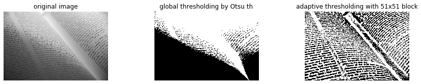

# 二値化・大津のしきい値と適応的二値化

```python
im = rgb2gray(imread('text.jpg'))


@interact(block_size=(1, 500, 10))
def g(block_size=51):
   
    fig = plt.figure(figsize=(15, 2.5))

    ax = fig.add_subplot(1, 3, 1)
    imshow(im)
    plt.axis('off')
    plt.title('original image')
    
    ax = fig.add_subplot(1, 3, 2)
    # 大津の閾値
    global_th = threshold_otsu(im)
    # 閾値で二値化
    binary_global = im > global_th
    imshow(binary_global)
    plt.axis('off')
    plt.title('global thresholding by Otsu th')


    ax = fig.add_subplot(1, 3, 3)
    # 局所的な閾値の決定
    adaptive_th = threshold_local(im, block_size)
    binary_adaptive = im > adaptive_th
    imshow(binary_adaptive)
    plt.title('adaptive thresholding with {0}x{0} block'.format(block_size))
    plt.axis('off')


    plt.show()
```

