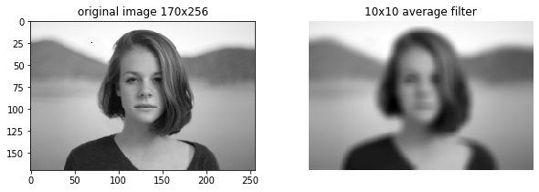

# 平均値フィルター

```python
import numpy as np

import matplotlib.pyplot as plt
%matplotlib inline
plt.gray();
from matplotlib.pyplot import imshow

import skimage
from skimage.io import imread, imsave
from skimage.transform import rotate, resize
from skimage.filters import gaussian
from skimage.transform import AffineTransform, ProjectiveTransform, warp

from ipywidgets import interact, interactive, fixed, RadioButtons
import ipywidgets as widgets
from IPython.display import display
```

```python
im = rgb2gray(imread('girl.jpg'))
# 計算の短縮のためフィルタサイズを縮小
im = resize(im, (im.shape[0]//5, im.shape[1]//5))

# フィルタ結果の検証のためフィルタ画像にノイズを追加
im[25, 70] = 0

# フィルターサイズの設定
vals = (val_start, val_end, val_step) = 1, 21, 2

val_default = 10

@interact(N=vals)
def g(N=val_default):
    
    fig = plt.figure(figsize=(10, 3))

    ax = fig.add_subplot(1, 2, 1)
    imshow(im)
#     plt.axis('off')
    plt.title('original image {0}x{1}'.format(im.shape[0], im.shape[1]))

    ax = fig.add_subplot(1, 2, 2)
    # 3×3のフィルタなら9が敷き詰められた配列を作製
    w = np.ones((N, N)) / (N ** 2)  # N×N平滑化フィルタ
    # 畳み込み計算結果の表示をscipy.ndimage.convolveで畳み込み計算して表示
    imshow(ndimage.convolve(im, w))
    plt.axis('off')
    plt.title('{0}x{0} average filter'.format(N))
    
    plt.show()
```



平均値フィルターの周波数特性は悪いことが分かります。
フィルタサイズを大きくなるとボックスが見えるようになります。

フィルタサイズが小さい場合にも、小さいノイズに対して処理を行うとフィルター形状が見えてしまいます。
