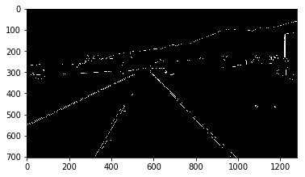

# Canny法によるエッジ検出

[参考リンク:Canny法によるエッジ検出](http://labs.eecs.tottori-u.ac.jp/sd/Member/oyamada/OpenCV/html/py_tutorials/py_imgproc/py_canny/py_canny.html)

```python
import cv2

img = cv2.imread('messi5.jpg',0)
edges = cv2.Canny(img,100,200)
```

### 例

```python
import cv2

image = cv2.imread('./data/test_image.jpg')

# グレースケール
gray = cv2.cvtColor(image, cv2.COLOR_RGB2GRAY)
# ガウシアンフィルタ
blur = cv2.GaussianBlur(gray, (5, 5), 0)
# Canny法
canny = cv2.Canny(blur, 50, 150)

import matplotlib.pyplot as plt
%matplotlib inline

plt.imshow(cv2.cvtColor(canny, cv2.COLOR_BGR2RGB))
```




```python
cv2.imshow('result', canny)
cv2.waitKey(0)
```


```python
def canny(image):
    # グレースケール
    gray = cv2.cvtColor(image, cv2.COLOR_RGB2GRAY)
    # ガウシアンフィルタ
    blur = cv2.GaussianBlur(gray, (5, 5), 0)
    # Canny法
    canny = cv2.Canny(blur, 50, 150)
    return canny
```
