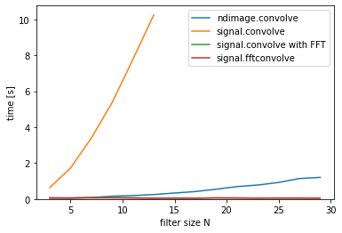
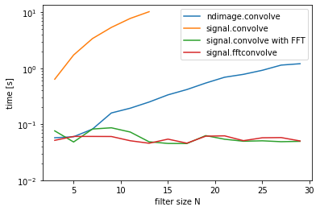

# FFTと通常のフィルタリングの計算量の比較

```python
from scipy import ndimage
from scipy import signal
from scipy.misc import derivative


import skimage
from skimage.color import rgb2gray
from skimage.feature import canny
from skimage.filters import gaussian, gabor_kernel, sobel, sobel_h, sobel_v, prewitt, prewitt_h, prewitt_v, roberts, median
from skimage.io import imread, imsave
from skimage.restoration import denoise_bilateral, denoise_nl_means
from skimage.transform import rotate, resize
from skimage.morphology import square


import matplotlib.pyplot as plt
%matplotlib inline
plt.gray();
from matplotlib.pyplot import imshow
import matplotlib.mlab as mlab
import matplotlib.colors as colors

import numpy as np
from numpy.fft import fft

import wave

from time import time


import ipywidgets as widgets
from IPython.display import display
from ipywidgets import interact, interactive, fixed, RadioButtons

from tqdm.notebook import tqdm
```

```python
im = rgb2gray(imread('girl.jpg'))

time_ndconv = []
time_sigconv = []
time_sigconvfft = []
time_fftconv = []

N_range = range(3, 31, 2)

for N in N_range:
    w = np.ones((N, N)) / (N ** 2)  # N×N平均値フィルタ
    print(w.shape)    # サイズの表示

    st = time()
    # FFTを使用しない畳み込みの方法
    ndimage.convolve(im, w)
    time_ndconv.append(time() - st)

    # フィルタのサイズが15以下の時だけ実行（時間がかかるため）
    if N < 15:
        st = time()
        # 畳み込みの方法を選べる関数を使用
        # 'direct'空間領域で畳み込みを無理やり実行する方法を実施
        signal.convolve(im, w, method='direct', mode='same')
        time_sigconv.append(time() - st)
    
    st = time()
    # FFTを使用した畳み込み
    signal.convolve(im, w, method='fft', mode='same')
    time_sigconvfft.append(time() - st)
    
    st = time()
    # FFTを使用した畳み込み
    signal.fftconvolve(im, w, mode='same')
    time_fftconv.append(time() - st)
```
    (3, 3)
    (5, 5)
    (7, 7)
    (9, 9)
    (11, 11)
    (13, 13)
    (15, 15)
    (17, 17)
    (19, 19)
    (21, 21)
    (23, 23)
    (25, 25)
    (27, 27)
    (29, 29)

```python
for yscale,ymin in [('linear', 0), ('log', 0.01)]:
    plt.plot(N_range, time_ndconv, label='ndimage.convolve')
    plt.plot(N_range[:len(time_sigconv)], time_sigconv, label='signal.convolve')
    plt.plot(N_range, time_sigconvfft, label='signal.convolve with FFT')
    plt.plot(N_range, time_fftconv, label='signal.fftconvolve')
    plt.legend()
    plt.ylabel('time [s]')
    plt.xlabel('filter size N')
    plt.yscale(yscale)
    plt.ylim(ymin)
    plt.show()
```
scipyには、FFTを使ったフィルタリングか、空間領域で畳み込みを行うのかは種類ごとに異なります。




ただ、畳み込みをするだけの計算結果を図示するとフィルタサイズが増えると急激に畳み込みの時間が増えています。

対してFFTを使用するとフィルタサイズによる時間の増加は見られません。
FFTを使用した畳み込み計算に対して対数を取った下図を見るとフィルタサイズ7を超えるとFFTを使用したものの時間が短縮できています。
