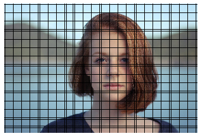
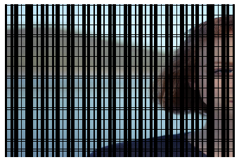
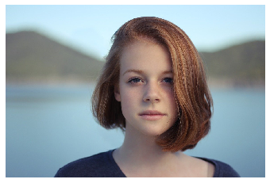
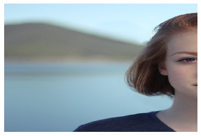

# 順変換と逆変換

scikit-image使わずに変換を実装します。

## 順変換

```python
import numpy as np

import matplotlib.pyplot as plt
%matplotlib inline
plt.gray();
from matplotlib.pyplot import imshow

import skimage
from skimage.io import imread, imsave
from skimage.transform import rotate, resize
from skimage.filters import gaussian
from skimage.transform import AffineTransform, ProjectiveTransform, warp

from ipywidgets import interact, interactive, fixed, RadioButtons
import ipywidgets as widgets
from IPython.display import display
```


```python
im1 = imread('girl.jpg')

h,w,c = im1.shape
im2 = np.zeros(im1.shape, dtype=np.uint8)

@interact(sx=(0.5, 2.0, 0.1),
          sy=(0.5, 2.0, 0.1))

def g(sx=1.1, sy=1.1):

    im2 = np.zeros(im1.shape, dtype=np.uint8)

    for y in range(h):
        for x in range(w):
            pix_val = im1[y][x]

            xp = sx * x  # x' = s_x x
            yp = sy * y  # y' = s_y y

            # 値を四捨五入してint型に変換
            xp = int(xp + 0.5)
            yp = int(yp + 0.5)

            # 画面の中に入っているか判定
            if xp >= 0 and xp < w and yp >= 0 and yp < h:
                # 変換後の画像を埋める
                im2[yp][xp] = pix_val

    imshow(im2)
    plt.axis('off')
    plt.show()
    
g(sx=2.1, sy=1.1)
```







四捨五入の部分で変換後の座標が飛び穴あきの画像になることがあります。

## 逆変換

同じことを逆方向から行い、変換後の画像で変換の計算を行うようにします。

```python

im1 = imread('girl.jpg')

h,w,c = im1.shape

@interact(sx=(0.5, 2.0, 0.1),
          sy=(0.5, 2.0, 0.1))
def g(sx=1.1, sy=1.1):

    im2 = np.zeros(im1.shape, dtype=np.uint8)

    # 変換後の画像の座標でループ
    for yp in range(h):
        for xp in range(w):
            # 逆変換の実行
            x = xp / sx  # x = (1/s_x) x'
            y = yp / sy  # y = (1/s_y) y'
            # 四捨五入して一番近い座標を割り当てます。
            # 最近傍補間
            x = int(x + 0.5)
            y = int(y + 0.5)

            if x >= 0 and x < w and y >= 0 and y < h:
                # 画像の座標を取得し、変換後の座標に代入
                pix_val = im1[y][x]
                im2[yp][xp] = pix_val

    imshow(im2)
    plt.axis('off')
    plt.show()

g(sx=2.1, sy=1.1)
```







画像のぬけがなくなりました。
