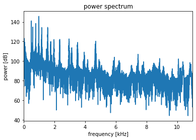

# 音声データのフーリエ変換


```python
from scipy import ndimage
from scipy import signal
from scipy.misc import derivative


import skimage
from skimage.color import rgb2gray
from skimage.feature import canny
from skimage.filters import gaussian, gabor_kernel, sobel, sobel_h, sobel_v, prewitt, prewitt_h, prewitt_v, roberts, median
from skimage.io import imread, imsave
from skimage.restoration import denoise_bilateral, denoise_nl_means
from skimage.transform import rotate, resize
from skimage.morphology import square


import matplotlib.pyplot as plt
%matplotlib inline
plt.gray();
from matplotlib.pyplot import imshow
import matplotlib.mlab as mlab
import matplotlib.colors as colors

import numpy as np
from numpy.fft import fft

import wave

from time import time


import ipywidgets as widgets
from IPython.display import display
from ipywidgets import interact, interactive, fixed, RadioButtons

from tqdm.notebook import tqdm
```

```python
def wavread(file, dtype=np.int16):
    chunk_size = 1024 * 8

    with wave.open(file, 'rb') as f:
        nchannels = f.getnchannels()
        audio_data = []
        while True:
            chunk = f.readframes(chunk_size)
            audio_data.append(chunk)
            if chunk == b'': break

    audio_data = b''.join(audio_data)
    audio_data = np.frombuffer(audio_data, dtype=dtype)
    audio_data = audio_data.reshape((-1, nchannels)).transpose()

    return audio_data
```
```python
audio_data = wavread('start.wav') # 22kHz, 2 channels stereo, 16 bits/sample
sr = 22000 # sampling rate

plt.plot(audio_data[0], label='L channel')
plt.plot(audio_data[1], label='R channel')
plt.title('wave file')
plt.xlabel('time [sec]')
plt.legend()
# 横軸を時間に変換
idx = np.arange(0, audio_data.shape[1], sr * 0.25) # 1/22000 sec per sample, tick every 0.25 sec
plt.xticks(idx, idx / sr)
plt.show()


plt.plot(audio_data[0, :1000], label='L channel')
plt.plot(audio_data[1, :1000], label='R channel')
plt.title('first 1000 sampling points')
plt.xlabel('time [sec]')
plt.legend()
idx = np.arange(0, audio_data.shape[1], sr * 0.01) # 1/22000 sec per sample, tick every 0.01 sec
plt.xticks(idx, idx / sr)
plt.xlim(0, 1000)
plt.show()
```


音声画像を表示しています。

```python
# FFTを左チャネルの信号に対してFFTをして絶対値を取る
power_spec = np.abs(fft(audio_data[0])) # FFT power spectrum (absolute value of complex spectrum)
# デシベルの変換
db_power_spec = np.log10(power_spec) * 20 # in dB
```
```python
fps = sr / len(db_power_spec) # frequency per sample
tick_idx = np.arange(0, len(db_power_spec), 2000 / fps) # tick every 2000 Hz
tick_label = np.ceil(tick_idx * fps / 1000).astype(int) # in kHz
```
```python
plt.plot(db_power_spec)
plt.title('power spectrum')
plt.xlabel('frequency [kHz]')
plt.ylabel('power [dB]')
plt.xticks(tick_idx, tick_label)
plt.show()
```


今回使用しているサンプル音源は22kHzです。
つまりナイキスト周波数は11kHzまでしか値が有効ではないです。


```python
plt.plot(db_power_spec[:len(db_power_spec)//2])
plt.title('power spectrum')
plt.xlabel('frequency [kHz]')
plt.ylabel('power [dB]')
plt.xticks(tick_idx, tick_label)
plt.xlim(0, len(db_power_spec)//2)
plt.show()
```



フーリエ変換の結果は、ナイキスト周波数は11kHzまでなのでこれが結果になります。
低周波から高周波まで均等に密に並んでいるようです。

