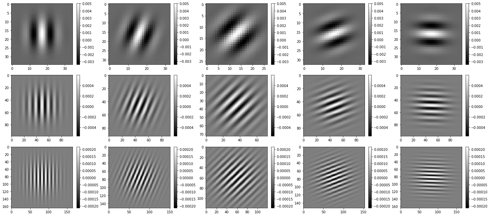

# ガボールフィルター

```python
import numpy as np

import matplotlib.pyplot as plt
%matplotlib inline
plt.gray();
from matplotlib.pyplot import imshow

import skimage
from skimage.io import imread, imsave
from skimage.transform import rotate, resize
from skimage.filters import gaussian
from skimage.transform import AffineTransform, ProjectiveTransform, warp

from ipywidgets import interact, interactive, fixed, RadioButtons
import ipywidgets as widgets
from IPython.display import display
```

```python
fig = plt.figure(figsize=(20,9))

for j in tqdm(range(3)):
    for i in tqdm(range(5), leave=False):
        ax = fig.add_subplot(3, 5, i+1 + j*5)
        # .realで実部のみ表示
        imshow(gabor_kernel(frequency=0.1, bandwidth=1/(2*j+1), theta=0.4 * i).real, cmap="gray")
        plt.tight_layout()
        plt.colorbar()
plt.show()
```
    HBox(children=(FloatProgress(value=0.0, max=3.0), HTML(value='')))
    HBox(children=(FloatProgress(value=0.0, max=5.0), HTML(value='')))
    HBox(children=(FloatProgress(value=0.0, max=5.0), HTML(value='')))
    HBox(children=(FloatProgress(value=0.0, max=5.0), HTML(value='')))



```python
im = rgb2gray(imread('girl.jpg'))
# 計算の短縮のためフィルタサイズを縮小
im = resize(im, (im.shape[0]//5, im.shape[1]//5))

fig = plt.figure(figsize=(20,9))

for j in tqdm(range(3)):
    for i in tqdm(range(5), leave=False):
        ax = fig.add_subplot(3, 5, i+1 + j*5)
        gabor = gabor_kernel(frequency=0.1, bandwidth=1/(2*j+1), theta=0.4 * i).real
        # FFT畳み込みを行う形で実行
        im_gabor = signal.fftconvolve(im, gabor, mode='same') # use FFT for convolution
        imshow(im_gabor, cmap="gray")
        plt.tight_layout()
        plt.colorbar()
plt.plot()
```

    HBox(children=(FloatProgress(value=0.0, max=3.0), HTML(value='')))
    HBox(children=(FloatProgress(value=0.0, max=5.0), HTML(value='')))
    HBox(children=(FloatProgress(value=0.0, max=5.0), HTML(value='')))
    HBox(children=(FloatProgress(value=0.0, max=5.0), HTML(value='')))


がボールフィルターを適用した形のエッジが取れているのが分かります。
また、画像は下へ行くごとに高周波成分が取れています。
