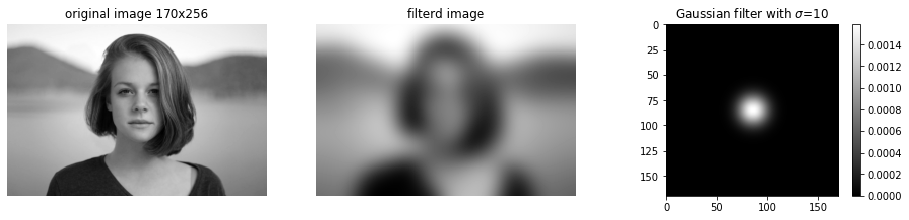

# ガウシアンフィルター

```python
import numpy as np

import matplotlib.pyplot as plt
%matplotlib inline
plt.gray();
from matplotlib.pyplot import imshow

import skimage
from skimage.io import imread, imsave
from skimage.transform import rotate, resize
from skimage.filters import gaussian
from skimage.transform import AffineTransform, ProjectiveTransform, warp

from ipywidgets import interact, interactive, fixed, RadioButtons
import ipywidgets as widgets
from IPython.display import display
```

```python
im = rgb2gray(imread('girl.jpg'))
# 計算の短縮のためフィルタサイズを縮小
im = resize(im, (im.shape[0]//5, im.shape[1]//5))

# インパルス信号の作成
# 画像の小さい値に合わせたサイズの中心に1点信号を入れます
size = min(im.shape[0], im.shape[1])
impuse_response = np.zeros((size, size))
impuse_response[size//2, size//2] = 1

vals = (val_start, val_end, val_step) = 1, 20, 1
val_default = 10

@interact(sigma=vals)
def g(sigma=val_default):
    
    fig = plt.figure(figsize=(13, 3))

    ax = fig.add_subplot(1, 3, 1)
    imshow(im)
    plt.axis('off')
    plt.title('original image {0}x{1}'.format(im.shape[0], im.shape[1]))

    ax = fig.add_subplot(1, 3, 2)
    # 畳み込みイメージは使用せずscikit-imageのガウスフィルタをかける関数を使用して計算を実施
    imshow(gaussian(im, sigma=sigma))
    plt.axis('off')
    plt.title('filterd image')

    ax = fig.add_subplot(1, 3, 3)
    # インパルス応答（ガウスフィルタの見え方）を表示
    imshow(gaussian(impuse_response, sigma=sigma))
    plt.colorbar()
    plt.tight_layout()
    plt.title('Gaussian filter with $\sigma$={}'.format(sigma))
    
    plt.show()
```



平均値フィルターと違い、フィルターを大きくしてもフィルターサイズが見えることはありません。
これは、フィルターが同心円状にボケているので形状が見えていません。
