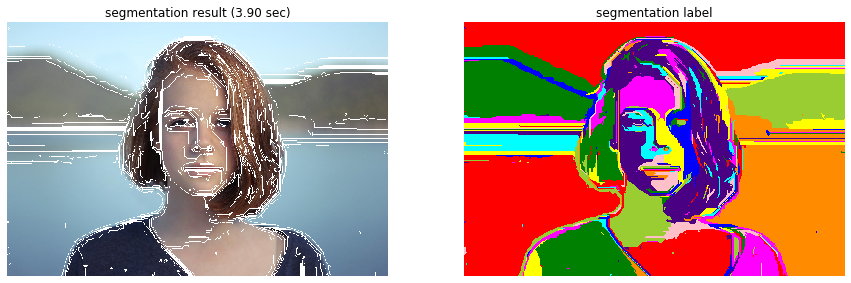
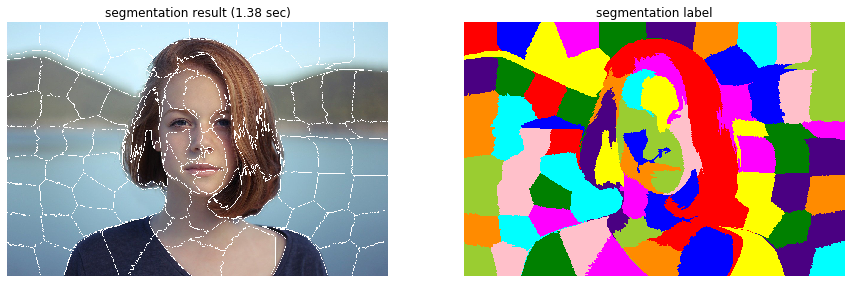
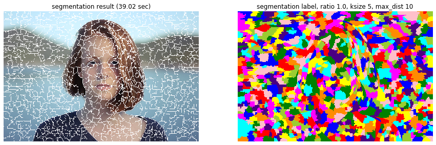
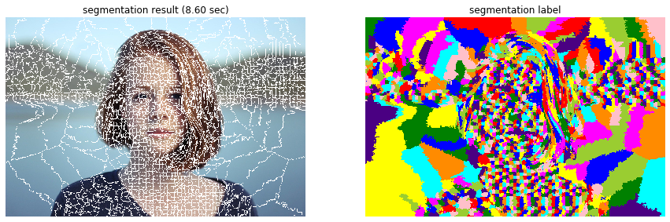

# 領域分割
```python
import numpy as np

import matplotlib.pyplot as plt
%matplotlib inline
plt.gray();
from matplotlib.pyplot import imshow
import matplotlib.colors as colors


import skimage
from skimage import color, data, filters, restoration, morphology, measure, segmentation
from skimage.io import imread, imsave
from skimage.color import rgb2gray, rgb2hsv
from skimage.transform import rotate, resize
from skimage.transform import AffineTransform, ProjectiveTransform, warp 
from skimage.transform import hough_line, hough_line_peaks
from skimage.filters import gaussian, gabor_kernel, gabor
from skimage.feature import canny, match_template
from skimage.feature import corner_harris, corner_fast, blob_dog, ORB
from skimage.feature import match_descriptors, corner_peaks, plot_matches, corner_subpix
from sklearn.cluster import KMeans, MeanShift
from skimage.measure import ransac
from skimage.segmentation import active_contour

import scipy as sp
from scipy import ndimage
from scipy import signal
from scipy import fft

from time import time

import cv2

from PIL import Image
from PIL.ExifTags import TAGS, GPSTAGS

from ipywidgets import interact, interactive, fixed, RadioButtons
import ipywidgets as widgets
from IPython.display import display

from tqdm.notebook import tqdm
```
- Felsenszwalb: RGB画像を格子グラフとみなして最小全域木（minimum spanning tree）で分割する手法 [https://scikit-image.org/docs/dev/api/skimage.segmentation.html#skimage.segmentation.felzenszwalb](https://scikit-image.org/docs/dev/api/skimage.segmentation.html#skimage.segmentation.felzenszwalb)


```python
img = imread('girl.jpg')

@interact(scale=(10, 150, 10))
def g(scale=50):

    st = time()
    # 領域分割の実行し、領域番号を取得
    img_seg = segmentation.felzenszwalb(img, scale=scale, sigma=3.0, min_size=20)
    et = time() - st

    fig = plt.figure(figsize=(15,5))

    fig.add_subplot(1, 2, 1)
    # 領域の境界線を表示
    imshow(segmentation.mark_boundaries(img, img_seg, color=(1, 1, 1))) # 領域分割結果を境界線で表示
    plt.axis('off')
    plt.title('segmentation result ({:.2f} sec)'.format(et))

    fig.add_subplot(1, 2, 2)
    imshow(color.label2rgb(img_seg)) # ラベリング結果をカラーで表示．
    plt.axis('off')
    plt.title('segmentation label')

    plt.show()
```




画像を格子グラフとして領域を分割します。

- slic (simple linear iterative clustering): XYZ色空間と座標をk-meansでクラスタリングしてsuperpixelを作成する手法 [https://scikit-image.org/docs/dev/api/skimage.segmentation.html#skimage.segmentation.slic](https://scikit-image.org/docs/dev/api/skimage.segmentation.html#skimage.segmentation.slic)


```python
img = imread('girl.jpg')

@interact(n_segments=(10, 300, 10),
          compactness=(1, 30, 1))
def g(n_segments=100, compactness=10):
    
    st = time()
    img_seg = segmentation.slic(img, n_segments=n_segments, compactness=compactness)
    et = time() - st

    fig = plt.figure(figsize=(15,5))

    fig.add_subplot(1, 2, 1)
    imshow(segmentation.mark_boundaries(img, img_seg, color=(1, 1, 1))) # 領域分割結果を境界線で表示
    plt.axis('off')
    plt.title('segmentation result ({:.2f} sec)'.format(et))

    fig.add_subplot(1, 2, 2)
    imshow(color.label2rgb(img_seg)) # ラベリング結果をカラーで表示．
    plt.axis('off')
    plt.title('segmentation label')


    plt.show()
```





- quickshift：XYZ色空間と座標をquickshiftでクラスタリングする手法 <br>[https://scikit-image.org/docs/dev/api/skimage.segmentation.html#skimage.segmentation.quickshift](https://scikit-image.org/docs/dev/api/skimage.segmentation.html#skimage.segmentation.quickshift)

クラスタリング手法です。

```python
img = imread('girl.jpg')

@interact(ratio=(0, 1, 0.1),
          kernel_size=(1, 30, 1),
          max_dist=(1, 30, 1))
def g(ratio=100, kernel_size=5, max_dist=10):
    
    st = time()
    img_seg = segmentation.quickshift(img, ratio=ratio, kernel_size=kernel_size, max_dist=max_dist)
    et = time() - st

    fig = plt.figure(figsize=(15,5))

    fig.add_subplot(1, 2, 1)
    imshow(segmentation.mark_boundaries(img, img_seg, color=(1, 1, 1))) # 領域分割結果を境界線で表示
    plt.axis('off')
    plt.title('segmentation result ({:.2f} sec)'.format(et))

    fig.add_subplot(1, 2, 2)
    imshow(color.label2rgb(img_seg)) # ラベリング結果をカラーで表示．
    plt.axis('off')
    plt.title('segmentation label, ratio {0:.1f}, ksize {1}, max_dist {2}'.format(ratio, kernel_size, max_dist))

    plt.show()
```





- watershed：画像の凹凸を山谷とみなして水の溜まる場所を見つけるwatershedを利用する手法 <br>[https://scikit-image.org/docs/dev/api/skimage.segmentation.html#skimage.segmentation.watershed](https://scikit-image.org/docs/dev/api/skimage.segmentation.html#skimage.segmentation.watershed)


```python
img = imread('girl.jpg')

@interact(markers=(0, 25000, 100),
          compactness=(0, 0.5, 0.1))
def g(markers=5000, compactness=0.1):
    
    st = time()
    markers = markers if markers > 0 else None
    img_seg = segmentation.watershed(img, markers=markers, compactness=compactness)[:, :, 0] # なぜか3チャンネルで返される
    et = time() - st

    fig = plt.figure(figsize=(15,5))

    fig.add_subplot(1, 2, 1)
    imshow(segmentation.mark_boundaries(img, img_seg, color=(1, 1, 1))) # 領域分割結果を境界線で表示
    plt.axis('off')
    plt.title('segmentation result ({:.2f} sec)'.format(et))

    fig.add_subplot(1, 2, 2)
    imshow(color.label2rgb(img_seg)) # ラベリング結果をカラーで表示．
    plt.axis('off')
    plt.title('segmentation label')

    plt.show()
```



