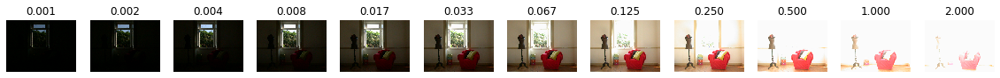
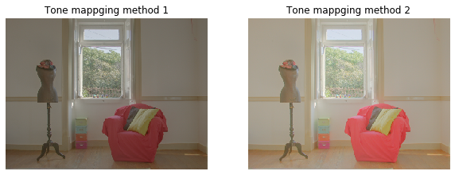

# HDR合成

```python
import numpy as np

import matplotlib.pyplot as plt
%matplotlib inline
plt.gray();
from matplotlib.pyplot import imshow
import matplotlib.colors as colors


import skimage
from skimage import color, data, filters, restoration, morphology, measure, segmentation
from skimage.io import imread, imsave
from skimage.color import rgb2gray, rgb2hsv
from skimage.transform import rotate, resize
from skimage.transform import AffineTransform, ProjectiveTransform, warp 
from skimage.transform import hough_line, hough_line_peaks
from skimage.filters import gaussian, gabor_kernel, gabor
from skimage.feature import canny, match_template
from skimage.feature import corner_harris, corner_fast, blob_dog, ORB
from skimage.feature import match_descriptors, corner_peaks, plot_matches, corner_subpix
from sklearn.cluster import KMeans, MeanShift
from skimage.measure import ransac
from skimage.segmentation import active_contour

import scipy as sp
from scipy import ndimage
from scipy import signal
from scipy import fft

from time import time

import cv2

from PIL import Image
from PIL.ExifTags import TAGS, GPSTAGS

from ipywidgets import interact, interactive, fixed, RadioButtons
import ipywidgets as widgets
from IPython.display import display

from tqdm.notebook import tqdm
```


```python
# Axel Jacobs (Photographer) - Axel Jacobs, WebHDR CC BY-SA 2.0
# https://commons.wikimedia.org/wiki/File:HDRI_Sample_Scene_Window_-_01.jpg
# ..
# https://commons.wikimedia.org/wiki/File:HDRI_Sample_Scene_Window_-_12.jpg
# 露出を変えた画像の取得
urls = \
['https://upload.wikimedia.org/wikipedia/commons/5/51/HDRI_Sample_Scene_Window_-_01.jpg',
'https://upload.wikimedia.org/wikipedia/commons/c/c1/HDRI_Sample_Scene_Window_-_02.jpg',
'https://upload.wikimedia.org/wikipedia/commons/5/5b/HDRI_Sample_Scene_Window_-_03.jpg',
'https://upload.wikimedia.org/wikipedia/commons/6/6e/HDRI_Sample_Scene_Window_-_04.jpg',
'https://upload.wikimedia.org/wikipedia/commons/d/d1/HDRI_Sample_Scene_Window_-_05.jpg',
'https://upload.wikimedia.org/wikipedia/commons/5/51/HDRI_Sample_Scene_Window_-_06.jpg',
'https://upload.wikimedia.org/wikipedia/commons/b/b6/HDRI_Sample_Scene_Window_-_07.jpg',
'https://upload.wikimedia.org/wikipedia/commons/f/f8/HDRI_Sample_Scene_Window_-_08.jpg',
'https://upload.wikimedia.org/wikipedia/commons/8/83/HDRI_Sample_Scene_Window_-_09.jpg',
'https://upload.wikimedia.org/wikipedia/commons/c/c0/HDRI_Sample_Scene_Window_-_10.jpg',
'https://upload.wikimedia.org/wikipedia/commons/6/6e/HDRI_Sample_Scene_Window_-_11.jpg',
'https://upload.wikimedia.org/wikipedia/commons/8/8b/HDRI_Sample_Scene_Window_-_12.jpg']

filenames = []

for i, url in enumerate(urls):
    filename = 'hdr_{:02d}.jpg'.format(i)
    print(url, filename)
#     download(url, filename)
    filenames.append(filename)
```

    https://upload.wikimedia.org/wikipedia/commons/5/51/HDRI_Sample_Scene_Window_-_01.jpg hdr_00.jpg
    https://upload.wikimedia.org/wikipedia/commons/c/c1/HDRI_Sample_Scene_Window_-_02.jpg hdr_01.jpg
    https://upload.wikimedia.org/wikipedia/commons/5/5b/HDRI_Sample_Scene_Window_-_03.jpg hdr_02.jpg
    https://upload.wikimedia.org/wikipedia/commons/6/6e/HDRI_Sample_Scene_Window_-_04.jpg hdr_03.jpg
    https://upload.wikimedia.org/wikipedia/commons/d/d1/HDRI_Sample_Scene_Window_-_05.jpg hdr_04.jpg
    https://upload.wikimedia.org/wikipedia/commons/5/51/HDRI_Sample_Scene_Window_-_06.jpg hdr_05.jpg
    https://upload.wikimedia.org/wikipedia/commons/b/b6/HDRI_Sample_Scene_Window_-_07.jpg hdr_06.jpg
    https://upload.wikimedia.org/wikipedia/commons/f/f8/HDRI_Sample_Scene_Window_-_08.jpg hdr_07.jpg
    https://upload.wikimedia.org/wikipedia/commons/8/83/HDRI_Sample_Scene_Window_-_09.jpg hdr_08.jpg
    https://upload.wikimedia.org/wikipedia/commons/c/c0/HDRI_Sample_Scene_Window_-_10.jpg hdr_09.jpg
    https://upload.wikimedia.org/wikipedia/commons/6/6e/HDRI_Sample_Scene_Window_-_11.jpg hdr_10.jpg
    https://upload.wikimedia.org/wikipedia/commons/8/8b/HDRI_Sample_Scene_Window_-_12.jpg hdr_11.jpg


```python
def get_exposure_time(fn):
    # EXIFから露光時間を取り出す
    im = Image.open(fn)
    exif = im._getexif()
    exposure_time = exif[33434]
    exposure_time = exposure_time[0] / exposure_time[1]
    return exposure_time
```

### 各画像の露光時間


```python
fig = plt.figure(figsize=(20, 2))

for i, fn in enumerate(filenames):
    fig.add_subplot(1, 12, i+1)
    im = imread(fn)
    imshow(im)
    plt.axis('off')
    plt.title('{:.03f}'.format(get_exposure_time(fn))) # 露光時間（秒）
plt.show()
```





```python
im_list = []
for fn in filenames:
    im = cv2.imread(fn)
    im = cv2.resize(im, (320, 240))
    im_list.append(im)
```

### HDR画像の合成


```python
merge_mertens = cv2.createMergeMertens()
hdr = merge_mertens.process(im_list)
```

### トーンマッピングによるLDR表示


```python
@interact(gamma=(0.1, 3, 0.1), saturation=(0.1, 5, 0.1))
def g(gamma=1, saturation=1):
    fig = plt.figure(figsize=(10, 4))

    fig.add_subplot(1, 2, 1)
    tonemap1 = cv2.createTonemap(gamma=gamma)
    ldr1 = tonemap1.process(hdr.copy())
    ldr1 = cv2.cvtColor(ldr1, cv2.COLOR_BGR2RGB)
    imshow(ldr1)
    plt.axis('off')
    plt.title('Tone mappging method 1')

    fig.add_subplot(1, 2, 2)
    tonemap2 = cv2.createTonemapDrago(gamma=gamma, saturation=saturation)
    ldr2 = tonemap2.process(hdr.copy())
    ldr2 = cv2.cvtColor(ldr2, cv2.COLOR_BGR2RGB)
    imshow(ldr2)
    plt.axis('off')
    plt.title('Tone mappging method 2')
    
    plt.show()
```

    Clipping input data to the valid range for imshow with RGB data ([0..1] for floats or [0..255] for integers).
    Clipping input data to the valid range for imshow with RGB data ([0..1] for floats or [0..255] for integers).




