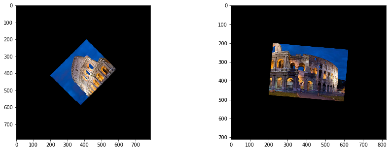

# パノラマ画像作成
```python
import numpy as np

import matplotlib.pyplot as plt
%matplotlib inline
plt.gray();
from matplotlib.pyplot import imshow
import matplotlib.colors as colors


import skimage
from skimage import color, data, filters, restoration, morphology, measure, segmentation
from skimage.io import imread, imsave
from skimage.color import rgb2gray, rgb2hsv
from skimage.transform import rotate, resize
from skimage.transform import AffineTransform, ProjectiveTransform, warp 
from skimage.transform import hough_line, hough_line_peaks
from skimage.filters import gaussian, gabor_kernel, gabor
from skimage.feature import canny, match_template
from skimage.feature import corner_harris, corner_fast, blob_dog, ORB
from skimage.feature import match_descriptors, corner_peaks, plot_matches, corner_subpix
from sklearn.cluster import KMeans, MeanShift
from skimage.measure import ransac
from skimage.segmentation import active_contour

import scipy as sp
from scipy import ndimage
from scipy import signal
from scipy import fft

from time import time

import cv2

from PIL import Image
from PIL.ExifTags import TAGS, GPSTAGS

from ipywidgets import interact, interactive, fixed, RadioButtons
import ipywidgets as widgets
from IPython.display import display

from tqdm.notebook import tqdm
```

```python
img1 = imread('Colosseum.jpg')
img2 = img1.copy()

img1 = img1[:250, :300]
img1 = rotate(img1, angle=45, resize=True)

img2 = img2[100:, 200:600]
img2 = rotate(img2, angle=-5, resize=True)

fig = plt.figure(figsize=(15,5))

fig.add_subplot(1, 2, 1)
imshow(img1)

fig.add_subplot(1, 2, 2)
imshow(img2)

plt.show()
```


```python
# # 実画像を重ね合わせてみるための画像の例はこちら．

# # Peter Haas CC BY-SA 3.0
# # https://commons.wikimedia.org/wiki/File:Notre-Dame_de_Paris_2013-07-24.jpg
# img1 = imread('https://upload.wikimedia.org/wikipedia/commons/thumb/a/af/Notre-Dame_de_Paris_2013-07-24.jpg/355px-Notre-Dame_de_Paris_2013-07-24.jpg')/255

# # Dietmar Rabich CC BY-SA 4.0
# # https://commons.wikimedia.org/wiki/File:Paris,_Notre_Dame_--_2014_--_1445.jpg
# img2 = imread('https://upload.wikimedia.org/wikipedia/commons/thumb/1/11/Paris%2C_Notre_Dame_--_2014_--_1445.jpg/301px-Paris%2C_Notre_Dame_--_2014_--_1445.jpg')/255
```

画像周囲を黒画素で拡張しておきます（後の処理を簡単にするため）


```python
def padding(im, pad=200):
    h, w = im.shape[:2]
    im_pad = np.zeros((h+2*pad, w+2*pad, 3))
    im_pad[pad:pad+h, pad:pad+w] = im
    return im_pad
    
img1 = padding(img1)
img2 = padding(img2)

fig = plt.figure(figsize=(15,5))

fig.add_subplot(1, 2, 1)
imshow(img1)

fig.add_subplot(1, 2, 2)
imshow(img2)

plt.show()
```





```python
# カラー画像はグレースケールに変換
img1g = rgb2gray(img1)
img2g = rgb2gray(img2)
```

scikit-imageのORB特徴量を使います


```python
# ORB特徴量を使います
descriptor_extractor = ORB(n_keypoints=1000)

# 画像1から特徴を検出
descriptor_extractor.detect_and_extract(img1g)
keypoints1 = descriptor_extractor.keypoints # 特徴点の(y,x)座標
descriptors1 = descriptor_extractor.descriptors # 特徴量ベクトル

# 画像2から特徴を検出
descriptor_extractor.detect_and_extract(img2g)
keypoints2 = descriptor_extractor.keypoints # 特徴点の(y,x)座標
descriptors2 = descriptor_extractor.descriptors # 特徴量ベクトル
```

別の特徴量を使うときには以下のコードをコメントアウトして使ってください


```python

# # BRISK特徴量を使います
# detector = cv2.BRISK_create()

# # AKAZE特徴量を使います
# detector = cv2.AKAZE_create()

# # 画像1から特徴を検出
# keypoints1, descriptors1 = detector.detectAndCompute((img1*255).astype(np.uint8), None)
# keypoints1 = np.array([(k.pt[1], k.pt[0]) for k in keypoints1]) # (x,y) --> (y,x)

# # 画像2から特徴を検出
# keypoints2, descriptors2 = detector.detectAndCompute((img2*255).astype(np.uint8), None)
# keypoints2 = np.array([(k.pt[1], k.pt[0]) for k in keypoints2]) # (x,y) --> (y,x)
```


```python
# 特徴量のマッチングをします
matches12 = match_descriptors(descriptors1, descriptors2, cross_check=True)
```


```python
# マッチング結果を表示します．対応する点が線で結ばれています．間違っているのもありますね．
plt.figure(figsize=(15,10))
ax = plt.axes()
plot_matches(ax,
             img1, img2, 
             keypoints1, keypoints2, 
             matches12)
ax.axis('off')
# ax.set_title('Correspondences')
plt.show()
```


RANSACという方法で，間違っている対応（誤対応）を除去します．

[http://scikit-image.org/docs/dev/auto_examples/plot_matching.html](http://scikit-image.org/docs/dev/auto_examples/plot_matching.html)


```python
# 対応点をsrcとdstに入れます
src = [] # img1
dst = [] # img2
for coord in matches12:
    src.append( keypoints1[coord[0]] )
    dst.append( keypoints2[coord[1]] )
src = np.array(src)
dst = np.array(dst)
```


```python
# RANSAC実行
model_robust, inliers = ransac((src, dst), 
#                                AffineTransform, min_samples=3,
                               ProjectiveTransform, min_samples=4,
                               residual_threshold=2, 
                               max_trials=2000)
inlier_idxs = np.nonzero(inliers)[0] # 正しい対応（インライア）
```

RANSAC後の対応点を見てみよう．誤対応が少なくなっていますね


```python
plt.figure(figsize=(15,10))
ax = plt.axes()
plot_matches(ax, 
             img1, img2,
             src, dst,
             np.column_stack((inlier_idxs, inlier_idxs)) )
ax.axis('off')
# ax.set_title('Correct correspondences')
plt.show()
```


```python
# それではあらためて，正しい対応（インライア）だけを使って変換パラメータを推定しなおします．

#src = src[inliers] # インライアだけを取り出す
#src = src[:, [1,0] ] # (y,x)座標ベクトルを(x,y)座標ベクトルに変換する
#
#dst = dst[inliers]
#dst = dst[:, [1,0] ]
#
#model_robust.estimate( src, dst )


#上と同じことを1行でやってます
model_robust.estimate( src[inliers][:, [1,0] ], dst[inliers][:, [1,0] ] )


#注釈：
# keypoint, ransac, plot_matchは(y,x)座標ベクトルを使っていますが，
# warpは(x,y)座標ベクトルを使います．だから，ここでxyを変化して推定しなおしています
```


    True


```python
# 推定された変換パラメータ
if type(model_robust) == AffineTransform:
    print("scale: ", model_robust.scale)
    print("translation [pixels]: ", model_robust.translation)
    print("rotaiton [radians]: ", model_robust.rotation)
print("Transform matrix:")
print(model_robust.params)
```

    Transform matrix:
    [[ 6.33258122e-01 -7.59828075e-01  2.22608953e+02]
     [ 7.54793036e-01  6.48205307e-01 -3.31093878e+02]
     [-3.77925838e-05  1.88896774e-05  1.01230225e+00]]


それでは画像2と1を合成


```python
fig = plt.figure(figsize=(15,5))

fig.add_subplot(1, 2, 1)
img_warped1 = warp( img1, model_robust.inverse )
imshow(img_warped1)

fig.add_subplot(1, 2, 2)
img_warped2 = img2
imshow(img_warped2)

plt.show()
```


2枚の画像のサイズが違うので同じサイズにします


```python
img_pano = np.zeros((max(img_warped1.shape[0], img_warped2.shape[0]),
                     max(img_warped1.shape[1], img_warped2.shape[1]), 3), dtype=np.float)

img_pano1 = img_pano.copy()
img_pano1[:img_warped1.shape[0], :img_warped1.shape[1]] = img_warped1

img_pano2 = img_pano.copy()
img_pano2[:img_warped2.shape[0], :img_warped2.shape[1]] = img_warped2


fig = plt.figure(figsize=(15,5))

fig.add_subplot(1, 2, 1)
imshow(img_pano1)

fig.add_subplot(1, 2, 2)
imshow(img_pano2)

plt.show()
```


足してパノラマを作製


```python
fig = plt.figure(figsize=(15,15))

img_pano = (img_pano1 + img_pano2) / 2
imshow( img_pano )
plt.axis('off')
plt.show()
```


画像の足し算ではいまいち．各画素のmaxをとる


```python
fig = plt.figure(figsize=(15,15))

img_pano = np.maximum(img_pano1 , img_pano2)
imshow( img_pano )
plt.axis('off')
plt.show()
```


