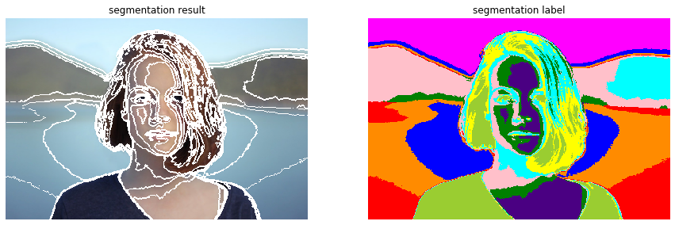

# k-meansクラスタリング
```python
import numpy as np

import matplotlib.pyplot as plt
%matplotlib inline
plt.gray();
from matplotlib.pyplot import imshow
import matplotlib.colors as colors


import skimage
from skimage import color, data, filters, restoration, morphology, measure, segmentation
from skimage.io import imread, imsave
from skimage.color import rgb2gray, rgb2hsv
from skimage.transform import rotate, resize
from skimage.transform import AffineTransform, ProjectiveTransform, warp 
from skimage.transform import hough_line, hough_line_peaks
from skimage.filters import gaussian, gabor_kernel, gabor
from skimage.feature import canny, match_template
from skimage.feature import corner_harris, corner_fast, blob_dog, ORB
from skimage.feature import match_descriptors, corner_peaks, plot_matches, corner_subpix
from sklearn.cluster import KMeans, MeanShift
from skimage.measure import ransac
from skimage.segmentation import active_contour

import scipy as sp
from scipy import ndimage
from scipy import signal
from scipy import fft

from time import time

import cv2

from PIL import Image
from PIL.ExifTags import TAGS, GPSTAGS

from ipywidgets import interact, interactive, fixed, RadioButtons
import ipywidgets as widgets
from IPython.display import display

from tqdm.notebook import tqdm
```


```python
im = imread('girl.jpg')
im = resize(im, (im.shape[0]//3, im.shape[1]//3))

clustering = KMeans(n_clusters=10)

X = im.reshape((-1, 3))
# clustering.fit(X[::1000, :]) # 画素数を1/1000に間引き
clustering.fit(X)


result = clustering.predict(X)
img_seg = result.reshape(im.shape[:2])
```


```python
fig = plt.figure(figsize=(15,5))

fig.add_subplot(1, 2, 1)   
imshow(segmentation.mark_boundaries(im, img_seg, color=(1, 1, 1))) # 領域分割結果を境界線で表示
plt.axis('off')
plt.title('segmentation result')

fig.add_subplot(1, 2, 2)
imshow(color.label2rgb(img_seg)) # ラベリング結果をカラーで表示．
plt.axis('off')
plt.title('segmentation label')

plt.show()
```



