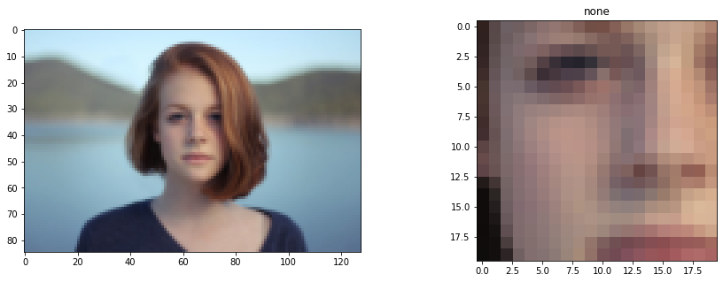
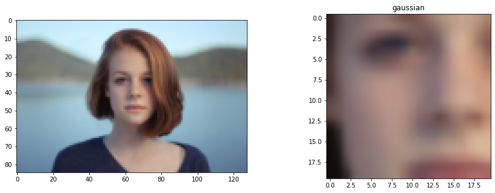

# 補間手法

```python
import numpy as np

import matplotlib.pyplot as plt
%matplotlib inline
plt.gray();
from matplotlib.pyplot import imshow

import skimage
from skimage.io import imread, imsave
from skimage.transform import rotate, resize
from skimage.filters import gaussian
from skimage.transform import AffineTransform, ProjectiveTransform, warp

from ipywidgets import interact, interactive, fixed, RadioButtons
import ipywidgets as widgets
from IPython.display import display
```


```python
im = imread('girl.jpg')
h, w = im.shape[:2]
# 画像の解像度を落とし、補間結果を確認できるようにする
# 画像を1/10する
im = resize(im, (h//10, w//10))
patch = im[30:50, 50:70]

# 補間方法リスト
methods = ['none', 'nearest', 'bilinear', 'bicubic',
           'spline16', 'spline36', 'hanning', 'hamming',
           'hermite', 'kaiser', 'quadric', 'catrom',
           'gaussian', 'bessel', 'mitchell', 'sinc', 'lanczos']

@interact(method=methods)
def g(method=methods[0]):

    fig = plt.figure(figsize=(15,5))

    fig.add_subplot(1, 2, 1)
    imshow(im)

    fig.add_subplot(1, 2, 2)
    imshow(patch, interpolation=method)
    plt.title(method)

    plt.show()
    
g(method=methods[12])
```






