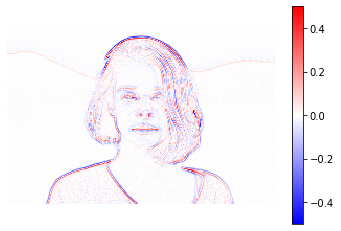
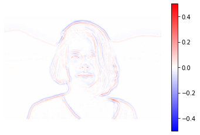

# ラプラシアンフィルター

2回微分でラプラシアン演算子を近似したものです。

```python
from scipy import ndimage
from scipy import signal
from scipy.misc import derivative


import skimage
from skimage.color import rgb2gray
from skimage.feature import canny
from skimage.filters import gaussian, gabor_kernel, sobel, sobel_h, sobel_v, prewitt, prewitt_h, prewitt_v, roberts, median
from skimage.io import imread, imsave
from skimage.restoration import denoise_bilateral, denoise_nl_means
from skimage.transform import rotate, resize
from skimage.morphology import square


import matplotlib.pyplot as plt
%matplotlib inline
plt.gray();
from matplotlib.pyplot import imshow
import matplotlib.mlab as mlab
import matplotlib.colors as colors

import numpy as np
from numpy.fft import fft

import wave

from time import time


import ipywidgets as widgets
from IPython.display import display
from ipywidgets import interact, interactive, fixed, RadioButtons

from tqdm.notebook import tqdm
```

```python
im = rgb2gray(imread('girl.jpg'))
im = resize(im, (im.shape[0]//5, im.shape[1]//5))
# 4近傍の設定を作成
# 中心に係数の4を置き
L4 = np.array([[0, 1, 0],
               [1,-4, 1],
               [0, 1, 0]])

# 画像にフィルタを適用
imshow(ndimage.convolve(im, L4), cmap="bwr", vmin=-0.5, vmax=0.5)
plt.axis('off')
plt.colorbar()

plt.show()
```



エッジ部分でラプラシアンフィルターの絶対値の値がよく出ているのが分かります。

これでは細かい部分が見えすぎてしまうので、
ラプラシアンフィルターを適用する前にガウスフィルターを適用します。
```python
# σ=1の設定でガウスフィルタを適用しラプラシアンフィルタを適用します。
imshow(ndimage.convolve(gaussian(im, sigma=1), L4), cmap="bwr", vmin=-0.5, vmax=0.5)
plt.axis('off')
plt.colorbar()

plt.show()
```



値が小さくなった結果、エッジ検出は薄くなりましたが、物体の大きな部位についての検出は変わらずきちんととれています。
