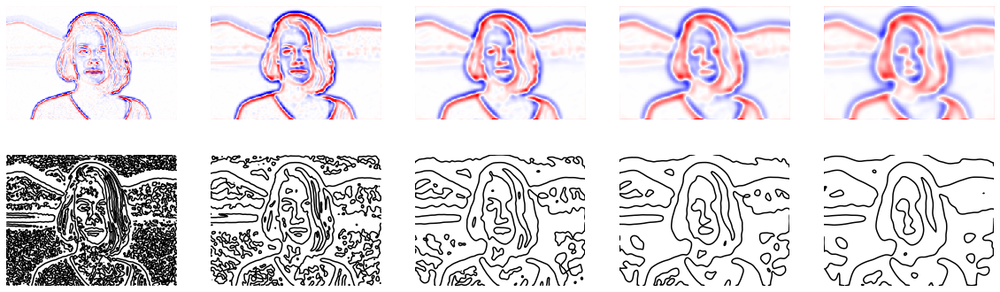
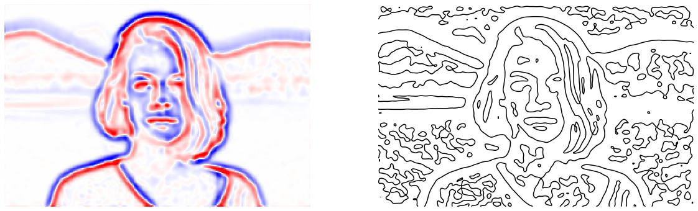

# Laplacian of Gaussian （LoG）とゼロ交差

```python
from scipy import ndimage
from scipy import signal
from scipy.misc import derivative


import skimage
from skimage.color import rgb2gray
from skimage.feature import canny
from skimage.filters import gaussian, gabor_kernel, sobel, sobel_h, sobel_v, prewitt, prewitt_h, prewitt_v, roberts, median
from skimage.io import imread, imsave
from skimage.restoration import denoise_bilateral, denoise_nl_means
from skimage.transform import rotate, resize
from skimage.morphology import square


import matplotlib.pyplot as plt
%matplotlib inline
plt.gray();
from matplotlib.pyplot import imshow
import matplotlib.mlab as mlab
import matplotlib.colors as colors

import numpy as np
from numpy.fft import fft

import wave

from time import time


import ipywidgets as widgets
from IPython.display import display
from ipywidgets import interact, interactive, fixed, RadioButtons

from tqdm.notebook import tqdm
```

```python
im = rgb2gray(imread('girl.jpg'))
im = resize(im, (im.shape[0]//5, im.shape[1]//5))
# 4近傍の設定を作成
# 中心に係数の4を置き
L4 = np.array([[0, 1, 0],
               [1,-4, 1],
               [0, 1, 0]])

fig = plt.figure(figsize=(20,6))

for i in range(5):

    ax = fig.add_subplot(2, 5, i+1)
    # LoGの実施　ガウシアン関数を畳みこんでL4フィルタを畳み込みます
    iml = ndimage.convolve(gaussian(im, sigma=i+1), L4)
    m = np.abs(iml).max() / 2
    imshow(iml, cmap="bwr", vmin=-m, vmax=m) 
    plt.axis('off')

    ax = fig.add_subplot(2, 5, i+1 + 5)
    # 等高線で値が0の部分を表示することで0と1の切り替わり地点が表示できます
    plt.contour(iml, levels=[0])
    plt.gca().invert_yaxis()
    plt.axis('off')


plt.show()
```



LoGの分散を変化させると結果は、細かいエッジはなくなり大まかなエッジが取り出せます。
ゼロ交差（値が正から負に切り替わっている部分）を取り出しても大まかなエッジが取り出せているのが分かります。

```python
# 上記のコードを手動切り替えできるようにする
@interact(sigma=(0.1,10,0.1))
def g(sigma=2):

    fig = plt.figure(figsize=(20,6))

    ax = fig.add_subplot(1, 2, 1)
    iml = ndimage.convolve(gaussian(im, sigma=sigma), L4)
    m = np.abs(iml).max() / 2
    imshow(iml, cmap="bwr", vmin=-m, vmax=m) 
    plt.axis('off')

    ax = fig.add_subplot(1, 2, 2)
    plt.contour(iml, levels=[0])
    plt.gca().invert_yaxis()
    plt.axis('off')

    plt.show()

```


