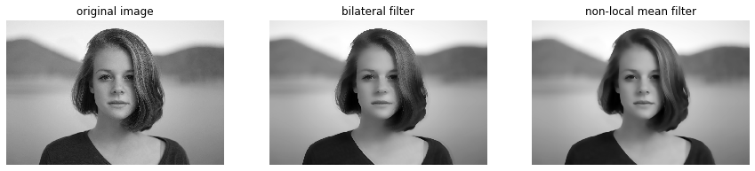

# 非線形フィルタ:バイラテラルフィルタ　ノンローカルミーンフィルタ
計算には時間がかかります。

```python
from scipy import ndimage
from scipy import signal
from scipy.misc import derivative


import skimage
from skimage.color import rgb2gray
from skimage.feature import canny
from skimage.filters import gaussian, gabor_kernel, sobel, sobel_h, sobel_v, prewitt, prewitt_h, prewitt_v, roberts, median
from skimage.io import imread, imsave
from skimage.restoration import denoise_bilateral, denoise_nl_means
from skimage.transform import rotate, resize
from skimage.morphology import square


import matplotlib.pyplot as plt
%matplotlib inline
plt.gray();
from matplotlib.pyplot import imshow
import matplotlib.mlab as mlab
import matplotlib.colors as colors

import numpy as np
from numpy.fft import fft

import wave

from time import time


import ipywidgets as widgets
from IPython.display import display
from ipywidgets import interact, interactive, fixed, RadioButtons

from tqdm.notebook import tqdm
```

```python
im = rgb2gray(imread('girl.jpg'))

fig = plt.figure(figsize=(15, 3))

ax = fig.add_subplot(1, 3, 1)

imshow(im)
plt.axis('off')
plt.title('original image')

ax = fig.add_subplot(1, 3, 2)
im_denoise = denoise_bilateral(im, sigma_spatial=5, sigma_color=0.1)
imshow(im_denoise)
plt.axis('off')
plt.title('bilateral filter')

ax = fig.add_subplot(1, 3, 3)
im_denoise = denoise_nl_means(im, patch_size=7, patch_distance=11)
imshow(im_denoise)
plt.axis('off')
plt.title('non-local mean filter')

plt.show()
```


ガウシアンフィルターだけではただボケてしまった画像が、バイラテラルフィルターを使用することで画素値方向のおかげでエッジが残っています。
画素値方向でどのくらい値が違っていたらフィルターを掛けるかを設定します。
バイラテラルフィルターの重みはその周辺での画素値の違いを使っています。
画素値が余りに大きければフィルタリングには使用しないという方法でフィルタリングします。
つまり、エッジ付近ではフィルタリングがされず、同じような画素値が続く画像領域ではガウシアンフィルターのようなぼかし処理が行われます。

ノンローカルミーンフィルターは近くの画素だけでなく遠くの画素値も見てその平均を取るぼかし方法です。
