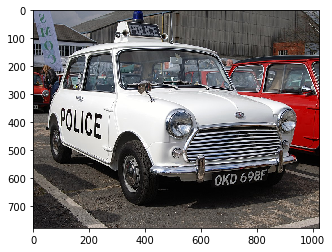

# HOG(Histograms of oriented gradients)とSVMによる物体検出


HOGを使用してエッジ方向のヒストグラムを特徴量として取得します。<br>それを学習データの特徴量とします。<br>SVMを使用してエッジの方向と画像のエッジの方向から物体の輪郭を検出します。


2005年に、マルチスケールの歩行者検出手法として[「HOG(Histograms of oriented gradients)特徴ベクトルとSupport Vector Machinesを用いた歩行者検](https://lear.inrialpes.fr/people/triggs/pubs/Dalal-cvpr05.pdf)]」が登場しています。


### Haar Cascadeではなく、HOGを使う理由
顔検出の場合、どんな顔でも目や鼻、口の周囲の明暗差が大きく変わりません。<br>そのため、Haar-like特徴が有効でした。<br>しかし人間全身の場合、体の向きや服装の違いによって、明暗差は大きく変わります。<br>人検出では明暗差よりも輪郭情報を捉えたほうが検出精度は良いとされています。<br>そのため、人検出はHaar-like特徴よりもHoG特徴をよく使います。<br>HoG(Histograms of Oriented Gradients)は、局所領域の画素値の勾配方向ヒストグラム化したものです。<br>そのヒストグラムを特徴量としたのが、Hog特徴量です。<br>
このように抽出した特徴をSVM分類します。

## フォルダ作成


```python
# ファイル作成
import os
# ファイルパス
data = './data/'
hog_svm = './data/HoG_SVM/'
# 訓練データ
car_path = './data/HoG_SVM/car/'
car_test_path = './data/HoG_SVM/car_test/'
ball_path = './data/HoG_SVM/ball/'
ball_test_path = './data/HoG_SVM/ball_test/'
scissors_path = './data/HoG_SVM/scissors/'
scissors_test_path = './data/HoG_SVM/scissors_test/'

# dataディレクトリの処理
if not os.path.exists(data):
    os.mkdir(data)
# hog_svmディレクトリの処理
if not os.path.exists(hog_svm):
    os.mkdir(hog_svm)

# car_pathディレクトリの処理
if not os.path.exists(car_path):
    os.mkdir(car_path)
    os.mkdir(car_test_path)

# ball_pathディレクトリの処理
if not os.path.exists(ball_path):
    os.mkdir(ball_path)
    os.mkdir(ball_test_path)
    
# scissors_pathディレクトリの処理
if not os.path.exists(scissors_path):
    os.mkdir(scissors_path)
    os.mkdir(scissors_test_path)
```

## 画像ダウンロード


```python
import requests
def download(url, filename):
    with open(filename, 'wb') as saveFile:
        saveFile.write(requests.get(url).content)

# car
# train
# 800px-Münster,_Parkhaus_am_Coesfelder_Kreuz,_BMW_Mini_--_2018_--_1457
# https://upload.wikimedia.org/wikipedia/commons/a/a3/M%C3%BCnster%2C_Parkhaus_am_Coesfelder_Kreuz%2C_BMW_Mini_--_2018_--_1457.jpg
download('https://upload.wikimedia.org/wikipedia/commons/thumb/a/a3/M%C3%BCnster%2C_Parkhaus_am_Coesfelder_Kreuz%2C_BMW_Mini_--_2018_--_1457.jpg/256px-M%C3%BCnster%2C_Parkhaus_am_Coesfelder_Kreuz%2C_BMW_Mini_--_2018_--_1457.jpg',
         './data/HoG_SVM/car/800px-Münster,_Parkhaus_am_Coesfelder_Kreuz,_BMW_Mini_--_2018_--_1457.jpg')
# Rover Mini Cooper 2000 (X411JOP).jpg
# 256px-Rover_Mini_Cooper_2000_(X411JOP).jpg
download('https://upload.wikimedia.org/wikipedia/commons/thumb/a/a4/Rover_Mini_Cooper_2000_%28X411JOP%29.jpg/256px-Rover_Mini_Cooper_2000_%28X411JOP%29.jpg',
         './data/HoG_SVM/car/256px-Rover_Mini_Cooper_2000_(X411JOP).jpg')
# Mini Sunshine 2019 Autorama Top 20 car.jpg
# 800px-Mini_Sunshine_2019_Autorama_Top_20_car.jpg
download('https://upload.wikimedia.org/wikipedia/commons/thumb/8/89/Mini_Sunshine_2019_Autorama_Top_20_car.jpg/1024px-Mini_Sunshine_2019_Autorama_Top_20_car.jpg',
         './data/HoG_SVM/car/800px-Mini_Sunshine_2019_Autorama_Top_20_car.jpg')
# Morris Mini-Minor 1959 (621 AOK).jpg
download('https://upload.wikimedia.org/wikipedia/commons/thumb/2/2f/Morris_Mini-Minor_1959_%28621_AOK%29.jpg/128px-Morris_Mini-Minor_1959_%28621_AOK%29.jpg',
         './data/HoG_SVM/car/128px-Morris_Mini-Minor_1959_(621_AOK).jpg')
# Mini police car (3906690187).jpg
download('https://upload.wikimedia.org/wikipedia/commons/thumb/0/0d/Mini_police_car_%283906690187%29.jpg/2048px-Mini_police_car_%283906690187%29.jpg',
         './data/HoG_SVM/car/2048px-Mini_police_car_(3906690187).jpg')
# test
# 1963 Austin Mini Cooper from The Italian Job.JPG
download('https://upload.wikimedia.org/wikipedia/commons/thumb/0/0e/1963_Austin_Mini_Cooper_from_The_Italian_Job.JPG/512px-1963_Austin_Mini_Cooper_from_The_Italian_Job.JPG',
         './data/HoG_SVM/car_test/512px-1963_Austin_Mini_Cooper_from_The_Italian_Job.jpg')
# Mini police car (3402031360).jpg
download('https://upload.wikimedia.org/wikipedia/commons/thumb/0/0d/Mini_police_car_%283402031360%29.jpg/1024px-Mini_police_car_%283402031360%29.jpg',
         './data/HoG_SVM/car_test/Mini_police_car_(3402031360).jpg')
# Blue Austin Mini Car (2621416772).jpg
download('https://upload.wikimedia.org/wikipedia/commons/thumb/4/42/Blue_Austin_Mini_Car_%282621416772%29.jpg/256px-Blue_Austin_Mini_Car_%282621416772%29.jpg',
         './data/HoG_SVM/car_test/Blue_Austin_Mini_Car_(2621416772).jpg')
# ball
# train
# Adidas_MLS_Tango_12_soccer_ball.jpg
download('https://upload.wikimedia.org/wikipedia/commons/thumb/9/92/Adidas_MLS_Tango_12_soccer_ball.jpg/512px-Adidas_MLS_Tango_12_soccer_ball.jpg',
         './data/HoG_SVM/ball/Adidas_MLS_Tango_12_soccer_ball.jpg')
# Soccerball1.png
download('https://upload.wikimedia.org/wikipedia/commons/archive/b/ba/20080721112844%21Soccerball1.png',
         './data/HoG_SVM/ball/Adidas_MLS_Tango_12_soccer_ball.jpg')
# Giant Soccer Ball.jpg
download('https://upload.wikimedia.org/wikipedia/commons/thumb/c/c3/Giant_Soccer_Ball.jpg/2048px-Giant_Soccer_Ball.jpg',
         './data/HoG_SVM/ball/Giant_Soccer_Ball.jpg')
# Soccer ball on ground.jpg
download('https://upload.wikimedia.org/wikipedia/commons/thumb/1/1e/Soccer_ball_on_ground.jpg/1024px-Soccer_ball_on_ground.jpg',
         './data/HoG_SVM/ball/1024px-Soccer_ball_on_ground.jpg')
# test
# Soccer ball.jpg
download('https://upload.wikimedia.org/wikipedia/commons/thumb/d/d5/Soccer_ball.jpg/512px-Soccer_ball.jpg',
         './data/HoG_SVM/ball_test/512px-Soccer_ball.jpg')
# Indonesian participant learns ball handling skills at soccer clinic. (5445151473).jpg
download('https://upload.wikimedia.org/wikipedia/commons/2/2f/Indonesian_participant_learns_ball_handling_skills_at_soccer_clinic._%285445151473%29.jpg',
         './data/HoG_SVM/ball_test/Indonesian_participant_learns_ball_handling_skills_at_soccer_clinic._(5445151473).jpg')
# Sports portal bar icon.png
download('https://upload.wikimedia.org/wikipedia/commons/2/2f/Indonesian_participant_learns_ball_handling_skills_at_soccer_clinic._%285445151473%29.jpg',
         './data/HoG_SVM/ball_test/Sports_portal_bar_icon.png')
# Soccer (122717889).jpeg
download('https://upload.wikimedia.org/wikipedia/commons/thumb/1/13/Soccer_%28122717889%29.jpeg/1024px-Soccer_%28122717889%29.jpeg',
         './data/HoG_SVM/ball_test/1024px-Soccer_(122717889).jpg')
# Soccer in Space (7678543936).jpg
download('https://upload.wikimedia.org/wikipedia/commons/e/e9/Soccer_in_Space_%287678543936%29.jpg',
         './data/HoG_SVM/ball_test/Soccer_in_Space_(7678543936).jpg')
# Scissors
# train
# Scissors (PSF).png
download('https://upload.wikimedia.org/wikipedia/commons/thumb/f/f5/Scissors_%28PSF%29.png/256px-Scissors_%28PSF%29.png',
         './data/HoG_SVM/scissors/211px-Scissors_(PSF).png')
# Scissors 1.jpg
download('https://upload.wikimedia.org/wikipedia/commons/thumb/4/47/Scissors_1.jpg/4096px-Scissors_1.jpg',
         './data/HoG_SVM/scissors/Scissors_1.jpg')
# Stainless Steel Scissors.jpg
download('https://upload.wikimedia.org/wikipedia/commons/thumb/c/cb/Stainless_Steel_Scissors.jpg/2048px-Stainless_Steel_Scissors.jpg',
         './data/HoG_SVM/scissors/800px-Stainless_Steel_Scissors.jpg')
# Surgical instruments3.JPG
download('https://upload.wikimedia.org/wikipedia/commons/thumb/d/d7/Surgical_instruments3.JPG/512px-Surgical_instruments3.JPG',
         './data/HoG_SVM/scissors/800px-Surgical_instruments3.jpg')
# Delicate dissecting scissors.png
download('https://upload.wikimedia.org/wikipedia/commons/thumb/0/01/Metzenbaum_scissors_04.jpg/1024px-Metzenbaum_scissors_04.jpg',
         './data/HoG_SVM/scissors/800px-Metzenbaum_scissors_04.jpg')
# test
# Pair of scissors with black handle, 2015-06-07.jpg
download('https://upload.wikimedia.org/wikipedia/commons/thumb/7/76/Pair_of_scissors_with_black_handle%2C_2015-06-07.jpg/1024px-Pair_of_scissors_with_black_handle%2C_2015-06-07.jpg',
         './data/HoG_SVM/scissors_test/719px-Pair_of_scissors_with_black_handle,_2015-06-07.jpg')
# Delicate dissecting scissors.png
download('https://upload.wikimedia.org/wikipedia/commons/3/38/Delicate_dissecting_scissors.png',
         './data/HoG_SVM/scissors_test/Delicate_dissecting_scissors.png')
# Rock paper scissors-no.jpg
download('https://upload.wikimedia.org/wikipedia/commons/c/cf/Rock_paper_scissors-no.jpg',
         './data/HoG_SVM/scissors_test/Rock_paper_scissors-no.jpg')
```


```python
import glob
# generateimage array
def create_images_array(load_img_paths, bin_n=32):
    hists = []
    # 画像群の配列を生成
    for load_img_path in load_img_paths:
        # 画像をロード, グレースケール変換
        # 色反転, 64*64にリサイズ, HoG特徴を計算
        img = cv2.imread(load_img_path)
        gray = cv2.cvtColor(img, cv2.COLOR_BGR2GRAY)
        gray = cv2.resize(gray, (64, 64))
        # ソーベルフィルタで縦・横方向のエッジ画像を生成
        gx = cv2.Sobel(gray, cv2.CV_32F, 1, 0)
        gy = cv2.Sobel(gray, cv2.CV_32F, 0, 1)
        # エッジ勾配の角度と大きさを算出
        mag, ang = cv2.cartToPolar(gx, gy)
        # 勾配方向の量子化(16方向)
        bins = np.int32(bin_n*ang/(2*np.pi))
        # 勾配方向ヒストグラムを計算
        hist = np.bincount(bins.ravel(), mag.ravel(), bin_n)
        hists.append(hist)
    return np.array(hists, np.float32)
```


```python
import cv2
import numpy as np
# 学習用の画像ファイルの格納先（0～2の3種類）
LOAD_TRAIN_IMG0S_PATH = './data/HoG_SVM/ball/*'
LOAD_TRAIN_IMG1S_PATH = './data/HoG_SVM/car/*'
LOAD_TRAIN_IMG2S_PATH = './data/HoG_SVM/scissors/*'

# 作成した学習モデルの保存先
SAVE_TRAINED_DATA_PATH = './data/HoG_SVM/svm_trained_data.xml'

# 検証用の画像ファイルの格納先（0～2の3種類）
LOAD_TEST_IMG0S_PATH = './data/HoG_SVM/ball_test/*'
LOAD_TEST_IMG1S_PATH = './data/HoG_SVM/car_test/*'
LOAD_TEST_IMG2S_PATH = './data/HoG_SVM/scissors_test/*'

# 学習用の画像ファイルのパスを取得
load_img0_paths = glob.glob(LOAD_TRAIN_IMG0S_PATH)
load_img1_paths = glob.glob(LOAD_TRAIN_IMG1S_PATH)
load_img2_paths = glob.glob(LOAD_TRAIN_IMG2S_PATH)

# 学習用の画像ファイルをロード
imgs0 = create_images_array(load_img0_paths)
imgs1 = create_images_array(load_img1_paths)
imgs2 = create_images_array(load_img2_paths)
imgs = np.r_[imgs0, imgs1, imgs2]

# 正解ラベルを生成
labels0 = np.full(len(load_img0_paths), 0, np.int32)
labels1 = np.full(len(load_img1_paths), 1, np.int32)
labels2 = np.full(len(load_img2_paths), 2, np.int32)
labels = np.array([np.r_[labels0, labels1, labels2]])

# SVMで学習モデルの作成（カーネル:LINEAR 線形, gamma:1, C:1）
svm = cv2.ml.SVM_create()
svm.setType(cv2.ml.SVM_C_SVC)
svm.setKernel(cv2.ml.SVM_LINEAR)
svm.setGamma(1)
svm.setC(1)
svm.setTermCriteria((cv2.TERM_CRITERIA_COUNT, 100, 1.e-06))
svm.train(imgs, cv2.ml.ROW_SAMPLE, labels)

# 学習結果を保存
svm.save(SAVE_TRAINED_DATA_PATH)

# 学習モデルを検証
# 0～2のテスト用画像を入力し、画像に書かれた数字を予測
test_img0_paths = glob.glob(LOAD_TEST_IMG0S_PATH)
test_img1_paths = glob.glob(LOAD_TEST_IMG1S_PATH)
test_img2_paths = glob.glob(LOAD_TEST_IMG2S_PATH)
test_imgs0 = create_images_array(test_img0_paths)
test_imgs1 = create_images_array(test_img1_paths)
test_imgs2 = create_images_array(test_img2_paths)
test_imgs = np.r_[test_imgs0, test_imgs1, test_imgs2]

# 正解ラベルを生成
test_labels0 = np.full(len(test_img0_paths), 0, np.int32)
test_labels1 = np.full(len(test_img1_paths), 1, np.int32)
test_labels2 = np.full(len(test_img2_paths), 2, np.int32)
test_labels = np.array([np.r_[test_labels0, test_labels1, test_labels2]])

svm = cv2.ml.SVM_load(SAVE_TRAINED_DATA_PATH)
predicted = svm.predict(test_imgs)

# 正解ラベル、予想値、正解率を表示
print('test labels:', test_labels)
print('predicted:', predicted[1].T)
score = np.sum(test_labels == predicted[1].T)/len(test_labels[0])
print('Score:', score)
```

    test labels: [[0 0 0 0 0 1 1 1 2 2 2]]
    predicted: [[2. 2. 0. 1. 0. 1. 1. 1. 0. 2. 0.]]
    Score: 0.5454545454545454


```python
import matplotlib.pyplot as plt
%matplotlib inline

# 検出対象画像の指定
test_img_path = './data/HoG_SVM/car_test/Mini_police_car_(3402031360).jpg'
img = cv2.imread(test_img_path)
plt.imshow(cv2.cvtColor(img, cv2.COLOR_BGR2RGB))

svm = cv2.ml.SVM_load(SAVE_TRAINED_DATA_PATH)

test_img_paths = glob.glob(test_img_path)
test_imgs = create_images_array(test_img_paths)

predicted = svm.predict(test_imgs)

print('predicted:', predicted[1])
```

    predicted: [[1.]]





1なので車と予測しました。

物体検出は、予測対象の画像に対して以下のように動作させればできる（でしょ？）
1. 予測対象の画像の一部分を判定するように設定
2. strideしながら予測確率を出力（probのmaxを出力）
3. 確率が8割を超えた時の予測実行範囲を描画
