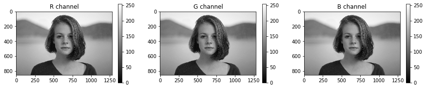

# RGBチャネル表示

```python
import cv2

import skimage
from skimage.io import imread, imsave

from skimage.color import rgb2gray
from skimage.transform import resize
from skimage.filters import threshold_otsu, threshold_local
from skimage.exposure import histogram, adjust_gamma
from skimage.morphology import square
from skimage import measure, color, morphology
# 警告の非表示
import warnings
warnings.filterwarnings('ignore')
im = imread('girl.jpg')

# カラー画像の表示
imshow(im)
plt.title("original RGB image")
plt.show()

# RGBチャネルの取得
r_chan = im[:, :, 0]
g_chan = im[:, :, 1]
b_chan = im[:, :, 2]

# RGBチャネルの表示
fig = plt.figure(figsize=(15, 3))

# i番目の画像を表示する
for i, c in zip(range(3), 'RGB'):
    ax = fig.add_subplot(1, 3, i+1)
    imshow(im[:, :, 1], vmin=0, vmax=255)    # vmin, vmaxで表示最大と最小を指定
    plt.colorbar()    # カラーバーの表示
    plt.title('{} channel'.format(c))

plt.show()
```



