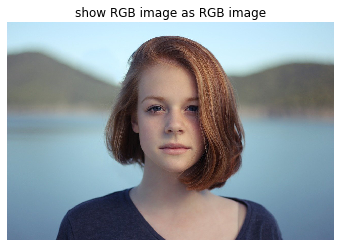
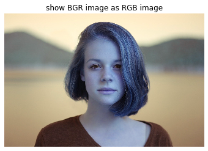

# BGRとRGBの変換

```python
im_BGR = cv2.imread('girl.jpg') # OpenCV
im_RGB = imread('girl.jpg') # scikit-image

imshow(im_RGB) # matplotlibのimshowはRGBを仮定
plt.title('show RGB image as RGB image')
plt.axis('off')
plt.show()

imshow(im_BGR) # matplotlibのimshowはRGBを仮定
plt.title('show BGR image as RGB image')
plt.axis('off')
plt.show()
```



opencvで画像を読み込むとBGR形式で読み込まれるので色が反転します。
これをふせぐには以下のようにコード書きます。

```python
im_BGR_to_RGB = cv2.cvtColor(im_BGR, cv2.COLOR_BGR2RGB)
imshow(im_BGR_to_RGB)
plt.title('show RGB-converted BGR image as RGB image')
plt.axis('off')
plt.show()
```
または
```python
im_BGR_to_RGB = im_BGR[:, :, ::-1]    # 第三引数のチャネルを変転
imshow(im_BGR_to_RGB)
plt.title('show RGB-converted BGR image as RGB image')
plt.axis('off')
plt.show()
```
同じ内容を別な書き方で表すなら
```python
im_BGR_to_RGB = np.zeros_like(im_BGR)

im_BGR_to_RGB[:, :, 0] = im_BGR[:, :, 2]
im_BGR_to_RGB[:, :, 1] = im_BGR[:, :, 1]
im_BGR_to_RGB[:, :, 2] = im_BGR[:, :, 0]

imshow(im_BGR_to_RGB)
plt.title('show RGB-converted BGR image as RGB image')
plt.axis('off')
plt.show()
```

