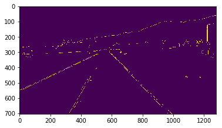
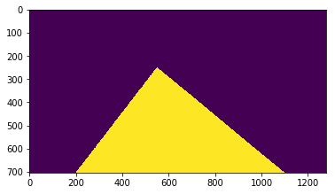
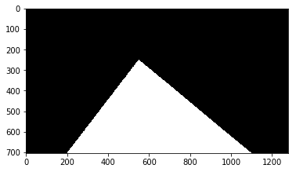
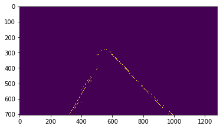
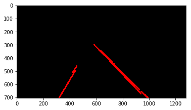
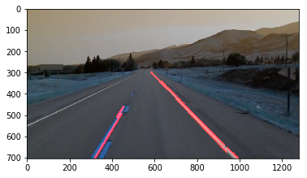
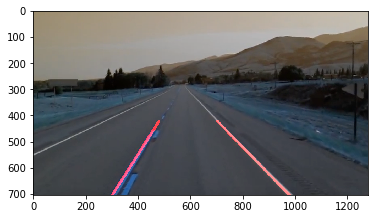

# 関心領域　特定の領域に多くの符号量を割り当てる

[参考リンク](https://jp.mathworks.com/help/images/roi-based-processing.html)

```python
def region_of_interest(image):
    '''
    関心領域
    Region of Interest - 
    関心領域（対象領域）画像の圧縮において、
    特定の領域に多くの符号量を割り当てる
    '''
    height = image.shape[0]    # 画像の高さ取得（行）
    triangle = np.array([
        [(200, height), (1100, height), (550, 250)]
    ])    # 強調する領域を指定(底辺左、底辺右、高さ)
    
    mask = np.zeros_like(image)    # 元の配列と同じ形状のゼロ
    cv2.fillPoly(mask, triangle, 255)    # 強調領域をマスク
    return mask
```

### 例

```python
import cv2

image = cv2.imread('./data/test_image.jpg')

def canny(image):
    # グレースケール
    gray = cv2.cvtColor(image, cv2.COLOR_RGB2GRAY)
    # ガウシアンフィルタ
    blur = cv2.GaussianBlur(gray, (5, 5), 0)
    # Canny法
    canny = cv2.Canny(blur, 50, 150)
    return canny

canny = canny(image)

plt.imshow(canny)
plt.show()
```




```python
import numpy as np

def region_of_interest(image):
    '''
    関心領域
    Region of Interest - 
    関心領域（対象領域）画像の圧縮において、
    特定の領域に多くの符号量を割り当てる
    '''
    height = image.shape[0]    # 画像の高さ取得（行）
    triangle = np.array([
        [(200, height), (1100, height), (550, 250)]
    ])    # 強調する領域を指定(底辺左、底辺右、高さ)
    
    mask = np.zeros_like(image)    # 元の配列と同じ形状のゼロ
    cv2.fillPoly(mask, triangle, 255)    # 強調領域をマスク
    return mask

plt.imshow(region_of_interest(canny))
plt.show()
```


```python
plt.imshow(cv2.cvtColor(region_of_interest(canny), cv2.COLOR_BGR2RGB))
plt.show()
```




```python
def region_of_interest(image):
    '''
    関心領域
    Region of Interest - 
    関心領域（対象領域）画像の圧縮において、
    特定の領域に多くの符号量を割り当てる
    '''
    height = image.shape[0]    # 画像の高さ取得（行）
    triangle = np.array([
        [(200, height), (1100, height), (550, 250)]
    ])    # 強調する領域を指定(底辺左、底辺右、高さ)
    
    mask = np.zeros_like(image)    # 元の配列と同じ形状のゼロ
    cv2.fillPoly(mask, triangle, 255)    # 強調領域をマスク
    masked_image = cv2.bitwise_and(image, mask)    # マスク後の画像の取得
    return masked_image
```

```python
cropped_image = region_of_interest(canny)
plt.imshow(cropped_image)
plt.show()
```


```python

"""
ハフ変換による直線の検出
"""

def display_lines(image, lines):
    line_image = np.zeros_like(image)
    # 画像が空でなければ, 4つの要素を持つ1次元配列に再形成
    if lines is not None:
        for line in lines:
            x1, y1, x2, y2 = line.reshape(4)
            cv2.line(line_image, (x1, y1), (x2, y2), (255, 0, 0), 10)
    return line_image

lines = cv2.HoughLinesP(
    cropped_image,
    2,
    np.pi/180,
    100, 
    np.array([]),       # 保存配列
    minLineLength=40,   # 検出する直線の最小の長さを表します
    maxLineGap=5        # 二つの線分を一つの直線とみなす時に許容される最大の長さを表します．この値より小さいギャップを持つ日本の直線は一つの直線とみなされます．
)
line_image = display_lines(image, lines)

plt.imshow(line_image)
plt.show()
```



```python
combo_image = cv2.addWeighted(image, 0.8, line_image, 1, 1)

plt.imshow(combo_image)
plt.show()
```



## 最終画像エッジ検出コード

```python
def make_points(image, line):
    slope, intercept = line
    y1 = int(image.shape[0])# bottom of the image
    y2 = int(y1*3/5)         # slightly lower than the middle
    x1 = int((y1 - intercept)/slope)
    x2 = int((y2 - intercept)/slope)
    return [[x1, y1, x2, y2]]
 
def average_slope_intercept(image, lines):
    left_fit    = []
    right_fit   = []
    if lines is None:
        return None
    for line in lines:
        for x1, y1, x2, y2 in line:
            fit = np.polyfit((x1,x2), (y1,y2), 1)
            slope = fit[0]
            intercept = fit[1]
            if slope < 0: # y is reversed in image
                left_fit.append((slope, intercept))
            else:
                right_fit.append((slope, intercept))
    # add more weight to longer lines
    left_fit_average  = np.average(left_fit, axis=0)
    right_fit_average = np.average(right_fit, axis=0)
    left_line  = make_points(image, left_fit_average)
    right_line = make_points(image, right_fit_average)
    averaged_lines = [left_line, right_line]
    return averaged_lines
 
def canny(img):
    gray = cv2.cvtColor(img, cv2.COLOR_RGB2GRAY)
    kernel = 5
    blur = cv2.GaussianBlur(gray,(kernel, kernel),0)
    canny = cv2.Canny(gray, 50, 150)
    return canny
 
def display_lines(img,lines):
    line_image = np.zeros_like(img)
    if lines is not None:
        for line in lines:
            for x1, y1, x2, y2 in line:
                cv2.line(line_image,(x1,y1),(x2,y2),(255,0,0),10)
    return line_image
 
def region_of_interest(canny):
    height = canny.shape[0]
    width = canny.shape[1]
    mask = np.zeros_like(canny)
 
    triangle = np.array([[
    (200, height),
    (550, 250),
    (1100, height),]], np.int32)
 
    cv2.fillPoly(mask, triangle, 255)
    masked_image = cv2.bitwise_and(canny, mask)
    return masked_image

lane_image = np.copy(image)
lane_canny = canny(lane_image)
cropped_canny = region_of_interest(lane_canny)
lines = cv2.HoughLinesP(cropped_canny, 2, np.pi/180, 100, np.array([]), minLineLength=40,maxLineGap=5)
averaged_lines = average_slope_intercept(image, lines)
line_image = display_lines(lane_image, averaged_lines)
combo_image = cv2.addWeighted(lane_image, 0.8, line_image, 1, 0)

plt.imshow(combo_image)
plt.show()
```



```python
cap = cv2.VideoCapture('./data/test2.mp4')
while(cap.isOpened()):
    _, frame = cap.read()
    canny_image = canny(frame)
    cropped_canny = region_of_interest(canny_image)
    lines = cv2.HoughLinesP(cropped_canny, 2, np.pi/180, 100, np.array([]), minLineLength=40,maxLineGap=5)
    averaged_lines = average_slope_intercept(frame, lines)
    line_image = display_lines(frame, averaged_lines)
    combo_image = cv2.addWeighted(frame, 0.8, line_image, 1, 1)
    cv2.imshow("result", combo_image)
    if cv2.waitKey(1) & 0xFF == ord('q'):
        break
cap.release()
```