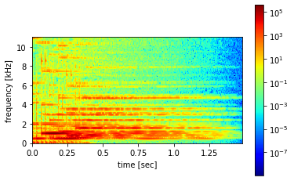

# 短時間フーリエ変換によるスペクトログラムの表示

```python
from scipy import ndimage
from scipy import signal
from scipy.misc import derivative


import skimage
from skimage.color import rgb2gray
from skimage.feature import canny
from skimage.filters import gaussian, gabor_kernel, sobel, sobel_h, sobel_v, prewitt, prewitt_h, prewitt_v, roberts, median
from skimage.io import imread, imsave
from skimage.restoration import denoise_bilateral, denoise_nl_means
from skimage.transform import rotate, resize
from skimage.morphology import square


import matplotlib.pyplot as plt
%matplotlib inline
plt.gray();
from matplotlib.pyplot import imshow
import matplotlib.mlab as mlab
import matplotlib.colors as colors

import numpy as np
from numpy.fft import fft

import wave

from time import time


import ipywidgets as widgets
from IPython.display import display
from ipywidgets import interact, interactive, fixed, RadioButtons

from tqdm.notebook import tqdm
```

```python
sr = 22000 # sampling rate
# スペクトログラムを出力
B, F, T = mlab.specgram(audio_data[0], # left channel
                        Fs=sr)
# スペクトログラムの表示
imshow(B,
       norm=colors.LogNorm(),
       cmap='jet')


def find_closest_val(T, t):
    X = np.abs(T - t)
    idx = np.where(X == X.min())
    return idx[0][0]

yticks = np.arange(0, 11, 2) # 0, 2, 4, ..., 11 kHz for x-axis
yidx = [find_closest_val(F/1000, f) for f in yticks]

xticks = np.arange(0, 1.4, 0.25) # 0, 0.25, 0.5, ..., 1.25 sec for y-axis
xidx = [find_closest_val(T, t) for t in xticks]

plt.yticks(yidx, yticks)
plt.xticks(xidx, xticks)

plt.xlabel('time [sec]')
plt.ylabel('frequency [kHz]')
plt.gca().invert_yaxis()
plt.colorbar()
plt.show()
```



周波数領域の高いところが赤く、低いところは青く表示されます。
時間方向に対してどのくらいの周波数を持っているかを2次元グラフをスペクトルグラムといいます。
