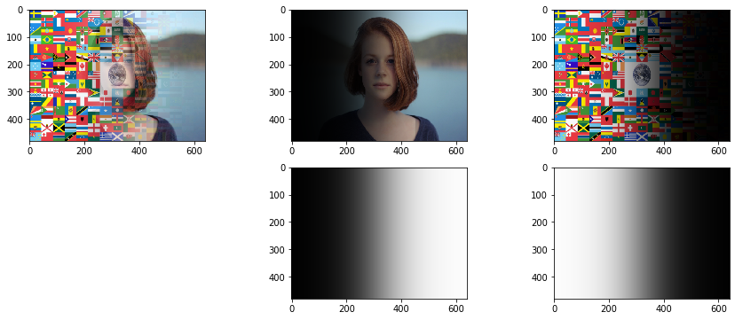

# アルファブレンディング

```python
vals = (val_start, val_end, val_step) = 0, 640, 20
val_default = 320

im1 = imread('girl.jpg')
im2 = imread('flag.png')[:, :, :3] # alphaチャンネルを除去

im1 = resize(im1, (480, 640, 3))
im2 = resize(im2, (480, 640, 3))

@interact(center=vals)
def g(center=val_default):
    
    alpha_mask = np.zeros((480, 640, 3))
    for y in range(480):
        for x in range(640):
            alpha_mask[y, x, :] = 1 / (1 + np.exp(-(x - center) * 0.015))
    
    im1_a = im1 * alpha_mask
    im2_a = im2 * (1 - alpha_mask)
    
    fig = plt.figure(figsize=(15, 6))
    
    ax = fig.add_subplot(2, 3, 1)
    im_weighted_ave = im1_a + im2_a
    imshow(im_weighted_ave)
    
    ax = fig.add_subplot(2, 3, 2)
    imshow(im1_a)
   
    ax = fig.add_subplot(2, 3, 3)
    imshow(im2_a)

    ax = fig.add_subplot(2, 3, 5)
    imshow(alpha_mask)
   
    ax = fig.add_subplot(2, 3, 6)
    imshow(1 - alpha_mask)

    plt.show()
```

