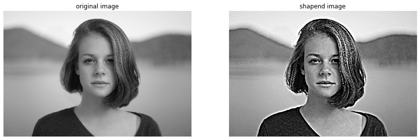
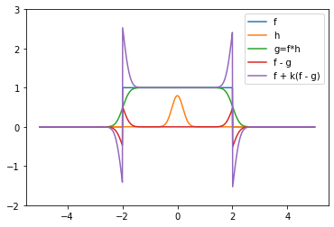

# アンシャープマスキング

```python
from scipy import ndimage
from scipy import signal
from scipy.misc import derivative


import skimage
from skimage.color import rgb2gray
from skimage.feature import canny
from skimage.filters import gaussian, gabor_kernel, sobel, sobel_h, sobel_v, prewitt, prewitt_h, prewitt_v, roberts, median
from skimage.io import imread, imsave
from skimage.restoration import denoise_bilateral, denoise_nl_means
from skimage.transform import rotate, resize
from skimage.morphology import square


import matplotlib.pyplot as plt
%matplotlib inline
plt.gray();
from matplotlib.pyplot import imshow
import matplotlib.mlab as mlab
import matplotlib.colors as colors

import numpy as np
from numpy.fft import fft

import wave

from time import time


import ipywidgets as widgets
from IPython.display import display
from ipywidgets import interact, interactive, fixed, RadioButtons

from tqdm.notebook import tqdm
```

```python
im = rgb2gray(imread('girl.jpg'))

@interact(sigma=(0, 10, 1), k=(1,10,1))
def g(sigma=7, k=3):
    """
    Param:
    sigma: ガンマ関数の分散
    k: 何倍するか
    """
    fig = plt.figure(figsize=(15, 5))
    # 画像をガウスフィルタで平滑化
    im_s = gaussian(im, sigma=sigma)

    # 平滑化したものを元画像と引き算してk倍かして足しこんでいます（結果、値が1以上0以下になる可能性があります）
    img1 = im + (im - im_s) * k
    # 値の範囲設定
    img1[img1 > 1] = 1
    img1[img1 < 0] = 0

    ax = fig.add_subplot(1, 2, 1)
    imshow(im)
    plt.axis('off')
    plt.title('original image')
    
    ax = fig.add_subplot(1, 2, 2)
    imshow(img1)
    plt.axis('off')
    plt.title('shapend image')
    
    plt.show()
```



以下に1次元で変換を確認します。

```python
def box(x, th=2):
    return 1 if np.abs(x) < th else 0

def gauss(x, sigma=1):
    return np.exp(- x**2 / 2 / sigma**2) / 2 / np.pi / sigma


@interact(sigma=(0, 2, 0.1), k=(0.1,3,0.1),
         show_f=True, show_h=True, show_g=True, show_fg=True, show_result=True )
def g(sigma=0.2, k=3, show_f=True, show_h=True, show_g=True, show_fg=True, show_result=True):
    
    x = np.arange(-5, 5, 0.01)
    f = np.array([box(i) for i in x])
    h = gauss(x, sigma=sigma)

    if show_f: plt.plot(x, f, label="f")
    if show_h: plt.plot(x, h, label="h")
    g = signal.convolve(f, h, mode='same') / sum(h)
    if show_g: plt.plot(x, g, label='g=f*h')
    if show_fg: plt.plot(x, f - g, label='f - g')
    if show_result: plt.plot(x, f + k * (f - g), label='f + k(f - g)')
    plt.ylim(-2, 3)
    plt.legend()
    plt.show()
```



青色のfは1次元表現した画像に対してアンシャープマスキングを行い、エッジのコントラストが上がっています。

アンシャープマスキングの流れ
- hはガウスカーネルです。
- これでフィルタリングを行いスムーズにしたものが緑のg=f*hです。
- フィルタリングした緑のg=f*hと元画像の青色のf差を取ります。
結果は赤色のf-gになります。
エッジがあり、ぼかされたところが抽出できます。
- 赤色のf-gを何倍かして強調し、元画像の値と合計したものが紫のf+k(f-g)です。

この操作によりエッジ部分をより強調します。
