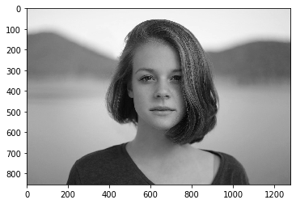
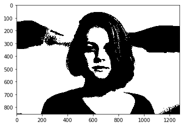
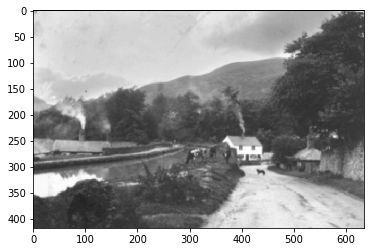
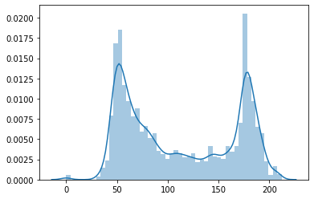
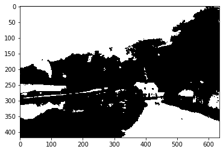
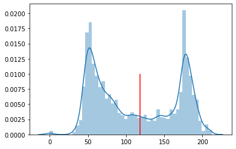
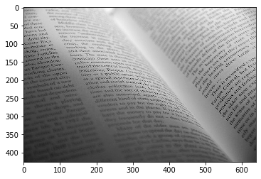
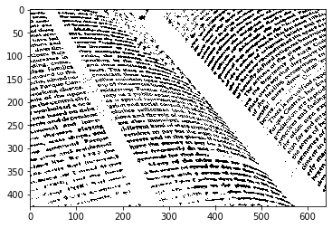

# OpenCVによる二値化

- 単純に閾値を指定して2値化
- 大津の2値化（Otsu's binarization）
- Adaptive Thresholding<br>小さいウィンドウを設けてそのウィンドウの中の閾値で2値化する方法


```python
import cv2
import numpy as np
import matplotlib.pyplot as plt
import seaborn as sns
%matplotlib inline
```


```python
im = cv2.imread('../../data/girl.jpg')
im.shape
```


    (853, 1280, 3)


```python
# 白黒　(gray scale)
gray = cv2.cvtColor(im, cv2.COLOR_RGB2GRAY)
plt.imshow(gray, cmap='gray')
```


    <matplotlib.image.AxesImage at 0x7f90ee405310>





## cv2.threshold()

閾値を指定して二値化を行います。


```python
# 127より小さければ0、大きければ255を設定 cv2.THRESH_BINARYが値を2つ返す
# tupleの結果は`retval, dist`と取得することでunpackされる
retval, dist = cv2.threshold(gray, 127, 255, cv2.THRESH_BINARY)
```


```python
retval
```


    127.0


```python
dist
```


    array([[255, 255, 255, ..., 255, 255, 255],
           [255, 255, 255, ..., 255, 255, 255],
           [255, 255, 255, ..., 255, 255, 255],
           ...,
           [255, 255, 255, ...,   0,   0,   0],
           [255, 255, 255, ...,   0,   0,   0],
           [255, 255, 255, ...,   0,   0,   0]], dtype=uint8)


```python
plt.imshow(dist, cmap='gray')
```


    <matplotlib.image.AxesImage at 0x7f90ec309890>





## Otsu's binarization 大津の二値化

- 閾値を自動で決定する
- 輝度値（ピクセル値）が双峰性（bimodal）ヒストグラム（山が二つあるヒストグラム・最頻値が二つある）に使用できる
- 線形判別分析法（LDA: Linear Discriminant Analysis）を画像に適用したアルゴリズム


```python
im = cv2.imread('../../data/bimodal_sample.png')
print(im.shape)
gray = cv2.cvtColor(im, cv2.COLOR_BGR2GRAY)
plt.imshow(gray, cmap='gray')
```

    (418, 635, 3)


    <matplotlib.image.AxesImage at 0x7f90ee3b2f90>





```python
# 輝度値のヒストグラム
sns.distplot(gray.flatten())
```


    <matplotlib.axes._subplots.AxesSubplot at 0x7f90ee38bf50>





ヒストグラムを見てみると大津の二値化が使用できそうです。


```python
retval, dist = cv2.threshold(gray, 0, 255, cv2.THRESH_BINARY+cv2.THRESH_OTSU)
```


```python
retval
```


    118.0


```python
dist
```


    array([[  0,   0,   0, ...,   0,   0,   0],
           [255, 255, 255, ..., 255, 255, 255],
           [255, 255, 255, ..., 255, 255, 255],
           ...,
           [  0,   0,   0, ..., 255, 255, 255],
           [  0,   0,   0, ..., 255, 255, 255],
           [  0,   0,   0, ..., 255, 255, 255]], dtype=uint8)


```python
plt.imshow(dist, cmap='gray')
```


    <matplotlib.image.AxesImage at 0x7f90ee2399d0>





輝度値のヒストグラムに大津の二値化で算出した閾値を追加してみます。


```python
# 輝度値のヒストグラム
sns.distplot(gray.flatten())
# 閾値の記載
plt.vlines(retval, 0, 0.01, 'r')
```


    <matplotlib.collections.LineCollection at 0x7f90ee384910>





## Adaptive Thresholding

- 小さいwindowの中での平均輝度値を閾値にして二値化することを画像全体に対して行う
- 平均を閾値にすると文字がない場所でうまくいかないので、実際は閾値から定数を引いた値を使用します
- 光の条件が画像内で異なる場合に使用されます。
- OCR（文字認識アルゴリズム）と組み合わせることもあります

## cv2.adaptiveThreshold()


```python
im = cv2.imread('../../data/text.jpg')
print(im.shape)
gray = cv2.cvtColor(im, cv2.COLOR_BGR2GRAY)
plt.imshow(gray, cmap='gray')
```

    (426, 640, 3)


    <matplotlib.image.AxesImage at 0x7f90ec28b190>





```python
# Adaptive Thresholdingの実行
# 二値化したあとの最大値
# window内の平均を使用します
# windowの大きさは近傍ピクセルで指定します15
# 平均値からの差分は4としてます
dist = cv2.adaptiveThreshold(gray, 255, cv2.ADAPTIVE_THRESH_MEAN_C, cv2.THRESH_BINARY, 15, 4)
plt.imshow(dist, cmap='gray')
```


    <matplotlib.image.AxesImage at 0x7f90de32e950>




