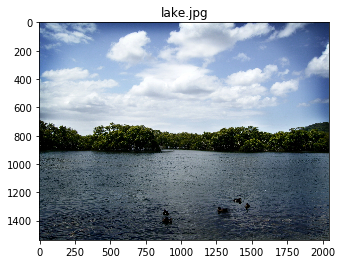
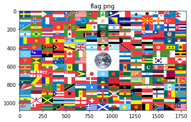
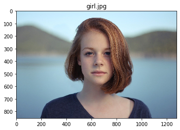
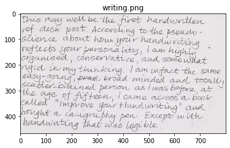

# 統計量


```python
import skimage
from skimage.io import imread, imsave

from skimage.color import rgb2gray
from skimage.transform import resize
from skimage.filters import threshold_otsu, threshold_local
from skimage.exposure import histogram, adjust_gamma
from skimage.morphology import square
from skimage import measure, color, morphology
# 警告の非表示
import warnings
warnings.filterwarnings('ignore')

# 表示する画像リスト
im_files = ['lake.jpg', 'flag.png', 'girl.jpg', 'writing.png']

for file in im_files:
    im = imread(file)[:,:,:3]  # RGBAの場合はRGBだけ取り出す
    imshow(im)
    plt.title(file)
    plt.show()
    
    # 統計量計算のためにグレースケール
    im = rgb2gray(im)
    print('mean: ', im.mean())
    print('std: ', im.std())
    print('median: ', np.median(im))
    print('max: ', im.max())
    print('min: ', im.min())
    # コントラスト表示
    print('contrast: ', (im.max() - im.min()) / (im.max() + im.min()) ) # Michelson contrast
    print('contrast: ', im.max() / im.min() if im.min() > 0 else np.nan ) # contrast ratio
    print('contrast: ', im.max() - im.min() ) # contrast difference
    print()
```


    mean:  0.5037081347778416
    std:  0.2841620496427796
    median:  0.45636941176470586
    max:  1.0
    min:  0.0
    contrast:  1.0
    contrast:  nan
    contrast:  1.0



    mean:  0.5482135267447418
    std:  0.28582684534902325
    median:  0.4293698039215686
    max:  1.0
    min:  0.0
    contrast:  1.0
    contrast:  nan
    contrast:  1.0



    mean:  0.5493684053323187
    std:  0.22662058572863766
    median:  0.5669650980392157
    max:  0.9775
    min:  0.0
    contrast:  1.0
    contrast:  nan
    contrast:  0.9775



    mean:  0.8507730295933578
    std:  0.11681077843745835
    median:  0.8940949019607843
    max:  0.9324772549019609
    min:  0.26213411764705885
    contrast:  0.5611390889612472
    contrast:  3.557252536495313
    contrast:  0.670343137254902
