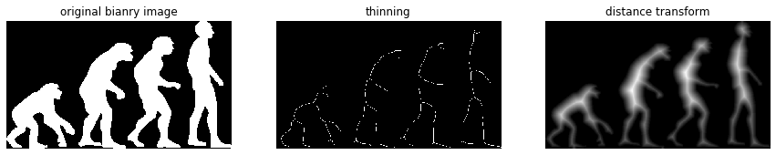

# 細線化

```python
img = (imread('evol.png')[:,:,3] > 1).astype(int) # 実はRGBA画像なので，まずRGB値を使ってboolへ変換

fig = plt.figure(figsize=(15, 3))

ax = fig.add_subplot(1, 3, 1)
imshow(img)
plt.title('original bianry image')
plt.axis('off')

ax = fig.add_subplot(1, 3, 2)
# 細線化
thin_img = morphology.skeletonize(img)
imshow(thin_img)
plt.title('thinning')
plt.axis('off')


ax = fig.add_subplot(1, 3, 3)
_, dist = morphology.medial_axis(img, return_distance=True)
imshow(dist) # 距離変換画像．これを使って細線化を行っているはず
plt.title('distance transform')
plt.axis('off')

plt.show()
```

