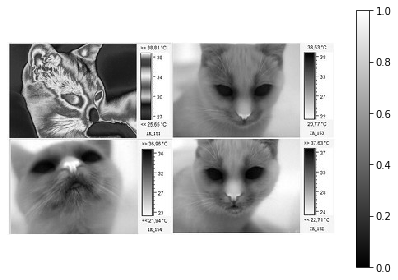

## 疑似カラー表示

カラーマップを使用して画素を変換します。

```python
im = rgb2gray(imread('IR_cat.jpg'))

cmaps = ['gray', 'gray_r', 
         'jet', 'jet_r',
         'rainbow', 'rainbow_r',
         'hsv', 'hsv_r',
         'terrain', 'terrain_r'
       ]

@interact(cmap=RadioButtons(options=cmaps))
def g(cmap='gray'):
    
    imshow(im, cmap=cmap)
    plt.colorbar()
    plt.axis('off')
    plt.tight_layout()
    plt.show()
```



