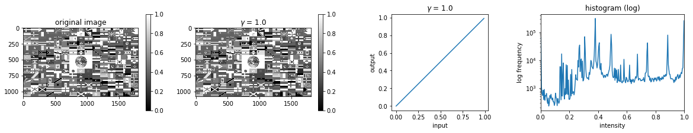

# ガンマ変換

画素値をべき乗で変換する
画像の明るさ調整

```python
files = ['flag.png', 'lake.jpg', 'girl.jpg']

# スライドバーの設定
@interact(gamma=(0.1, 10, 0.1),
          file=files)

def g(gamma=1.0, file=files[0]):
    """
    Param:
    gamma:float
    調整したい数値（ガンマの値）
    file:object
    画像ファイルリスト
    """
    im = rgb2gray(imread(file)[:,:,:3])  # RGBAの場合はRGBだけ取り出す
    
    fig = plt.figure(figsize=(20, 3))

    ax = fig.add_subplot(1, 4, 1)
    imshow(im, vmin=0, vmax=1)
    plt.colorbar()
    plt.title('original image')
    
    ax = fig.add_subplot(1, 4, 2)
    im_gamma = adjust_gamma(im, gamma)
    imshow(im_gamma, vmin=0, vmax=1)
    plt.colorbar()
    plt.title('$\gamma$ = {}'.format(gamma))
    
    ax = fig.add_subplot(1, 4, 3)
    x = np.arange(0, 1, 0.01)
    plt.plot(x, x ** gamma)
    ax.set_aspect('equal')
    ax.set_xlabel('input')
    ax.set_ylabel('output')
    plt.title('$\gamma$ = {}'.format(gamma))

    ax = fig.add_subplot(1, 4, 4)  
    freq, bins = histogram(im_gamma)
    plt.plot(bins, freq)
    plt.xlim(0, 1)
    plt.xlabel("intensity")
    plt.ylabel("log frequency")
    plt.yscale('log')
    plt.title('histogram (log)')

    plt.show()
```
