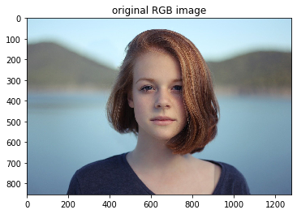
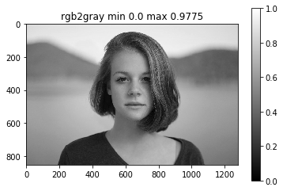
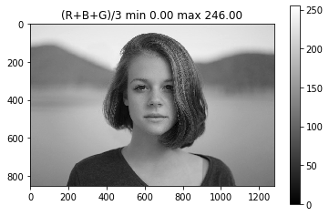
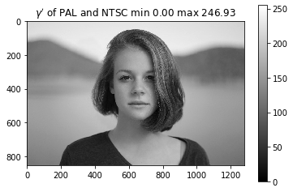
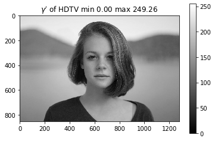

# グレースケールへの変換

グレースケールを作る方法には何パターン化の選択肢がありデータとしての範囲が異なるのでグレースケールの変換を行う前に確認を行う必要があります。


```python
# im = imread('flag.png')[:,:,:3]  # RGBAの場合はRGBだけ取り出す
im = imread('girl.jpg')

imshow(im)
plt.title("original RGB image")
plt.show()

# 組み込みのrgb2gray関数を使う gray = 0.2125 R + 0.7154 G + 0.0721 B
im_gray1 = rgb2gray(im)
imshow(im_gray1, vmin=0, vmax=1) # 型はfloat，範囲は[0,1]になる
plt.colorbar()
plt.title("rgb2gray min {0} max {1}".format(im_gray1.min(), im_gray1.max() ))
plt.show()

# RGBの平均をグレースケール画像とする．最初にfloatに変換し（範囲は[0,255]になる），表示のときにuint8に変換する
im_gray2 = (im[:,:,0].astype(float) +
            im[:,:,1].astype(float) + 
            im[:,:,2].astype(float)) / 3
imshow(im_gray2, vmin=0, vmax=255)
plt.colorbar()
plt.title("(R+B+G)/3 min {0:.2f} max {1:.2f}".format(im_gray2.min(), im_gray2.max() ))
plt.show()


# RGBの重み付き平均をグレースケール画像とする．
# https://en.wikipedia.org/wiki/Grayscale#Luma_coding_in_video_systems
im_gray3 = (0.299 * im[:,:,0].astype(float) +
            0.587 * im[:,:,1].astype(float) + 
            0.114 * im[:,:,2].astype(float))
imshow(im_gray3, vmin=0, vmax=255)
plt.colorbar()
plt.title("$\gamma'$ of PAL and NTSC min {0:.2f} max {1:.2f}".format(im_gray3.min(), im_gray3.max() ))
plt.show()

# RGBの重み付き平均をグレースケール画像とする．その2．規格によって重み係数は異なる
# https://en.wikipedia.org/wiki/Grayscale#Luma_coding_in_video_systems
# rgb2gray()はこれを使っている．http://scikit-image.org/docs/dev/api/skimage.color.html#skimage.color.rgb2gray
im_gray4 = (0.2126 * im[:,:,0].astype(float) +
            0.7152 * im[:,:,1].astype(float) + 
            0.0722 * im[:,:,2].astype(float))
imshow(im_gray4, vmin=0, vmax=255)
plt.colorbar()
plt.title("$\gamma'$ of HDTV min {0:.2f} max {1:.2f}".format(im_gray4.min(), im_gray4.max() ))
plt.show()
```






