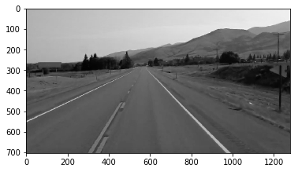

# グレースケール

```python
# グレースケール
gray = cv2.cvtColor(image, cv2.COLOR_RGB2GRAY)
```

### 例

```python
import cv2

image = cv2.imread('./data/test_image.jpg')

import matplotlib.pyplot as plt
%matplotlib inline

# グレースケール
gray = cv2.cvtColor(image, cv2.COLOR_RGB2GRAY)

plt.imshow(cv2.cvtColor(gray, cv2.COLOR_BGR2RGB))
```




```python
cv2.imshow('result', gray)
cv2.waitKey(0)
```
