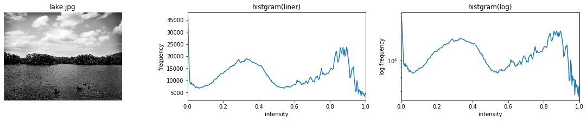
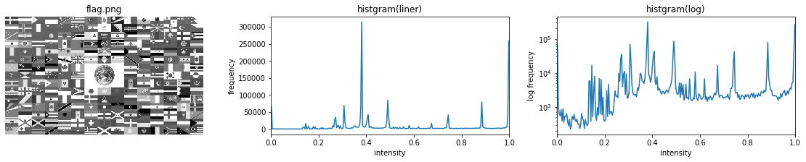
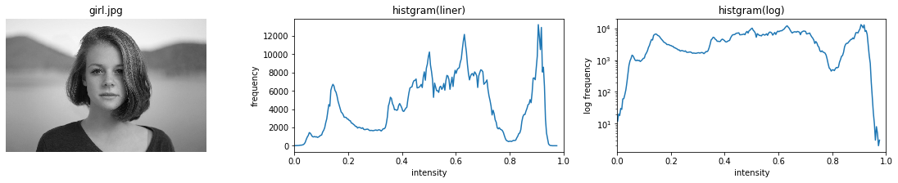
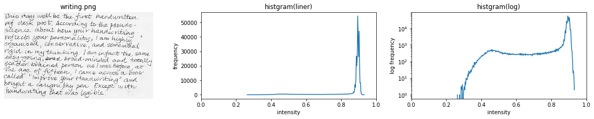

# ヒストグラム計算

```python
import skimage
from skimage.io import imread, imsave

from skimage.color import rgb2gray
from skimage.transform import resize
from skimage.filters import threshold_otsu, threshold_local
from skimage.exposure import histogram, adjust_gamma
from skimage.morphology import square
from skimage import measure, color, morphology
# 警告の非表示
import warnings
warnings.filterwarnings('ignore')

# それぞれの画像についてヒストグラムを表示
# 表示する画像リスト
im_files = ['lake.jpg', 'flag.png', 'girl.jpg', 'writing.png']

for file in im_files:
    im = imread(file)[:,:,:3]  # RGBAの場合はRGBだけ取り出す
    
    im = imread(file)    # 画像ファイルの読み込み
    # sklearn-imageの組み込みのrgb2gray関数 gray = 0.2125 R + 0.7154 G + 0.0721 B
    im_gray1 = rgb2gray(im)    # 範囲[0, 1]
    
    # 可視化
    fig = plt.figure(figsize=(20,3))
    
    ax = fig.add_subplot(1, 3, 1)
    
    # 画像の表示
    imshow(im)
    plt.title(file)
    plt.axis('off')
    
    bins = 256
    
    # 可視化
    ax = fig.add_subplot(1, 3, 2)
    
    # ヒストグラムの表示
    bins, freq = histogram(im)    # sklearn-imageのヒストグラム
    plt.plot(freq, bins)
    plt.xlabel('intensity')
    plt.ylabel('frequency')
    plt.title('histgram(liner)')
    plt.xlim(0, 1)
    
    # 可視化
    ax = fig.add_subplot(1, 3, 3)
    
    # ヒストグラムの表示
    bins, freq = histogram(im)    # sklearn-imageのヒストグラム
    plt.plot(freq, bins)
    plt.xlabel('intensity')
    plt.ylabel('log frequency')
    plt.title('histgram(log)')
    plt.xlim(0, 1)

    plt.show()
```






それぞれの画像に対してヒストグラムを表示しています。
縦軸が頻度、横軸が輝度値です。
ヒストグラムは左の画像が普通のスケールで表示したもの、右の画像が対数表示したものになります。
