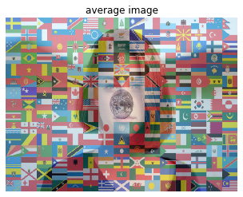
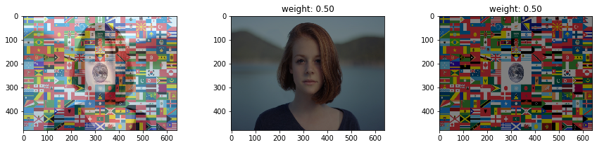

# 画像の演算（平均と重み付き平均）

## 平均

```python
im1 = imread('girl.jpg')
im2 = imread('flag.png')[:,:,:3] # alphaチャンネルを除去

im1 = resize(im1, (480, 640, 3))
im2 = resize(im2, (480, 640, 3))

im_ave = (im1 + im2) / 2
imshow(im_ave)
plt.axis('off')
plt.title('average image')
plt.show()
```



## 重み付き平均

```python
vals = (val_start, val_end, val_step) = 0.0, 1, 0.1
val_default = 0.5

im1 = imread('girl.jpg')
im2 = imread('flag.png')[:,:,:3] # alphaチャンネルを除去

im1 = resize(im1, (480, 640, 3))
im2 = resize(im2, (480, 640, 3))

@interact(alpha=vals)
def g(alpha=val_default):
    
    fig = plt.figure(figsize=(15, 3))

    ax = fig.add_subplot(1, 3, 1)
    im_weighted_ave = alpha * im1 + (1 - alpha) * im2
    imshow(im_weighted_ave)
    
    ax = fig.add_subplot(1, 3, 2)
    imshow(alpha * im1)
    plt.title('weight: {:.2f}'.format(alpha))
    
    ax = fig.add_subplot(1, 3, 3)
    imshow((1 - alpha) * im2)
    plt.title('weight: {:.2f}'.format(1 - alpha))

    plt.show()
```


